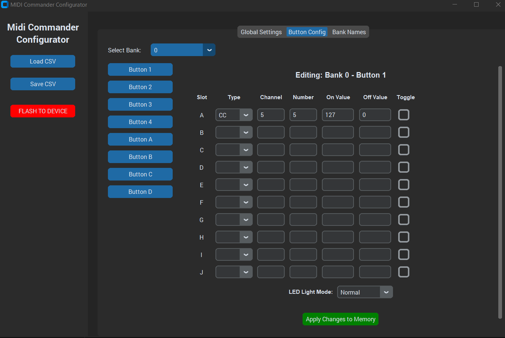
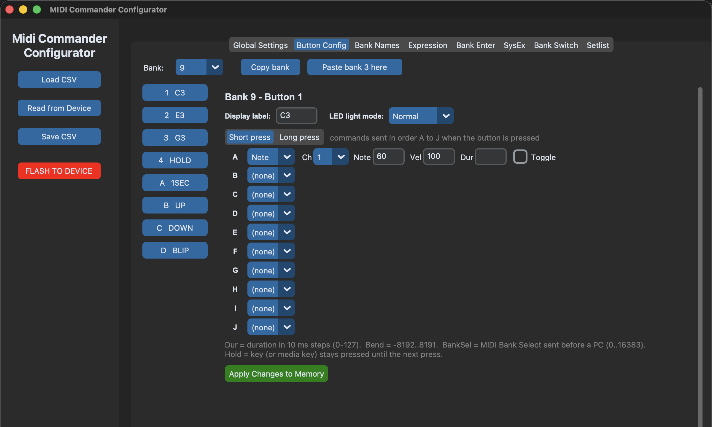
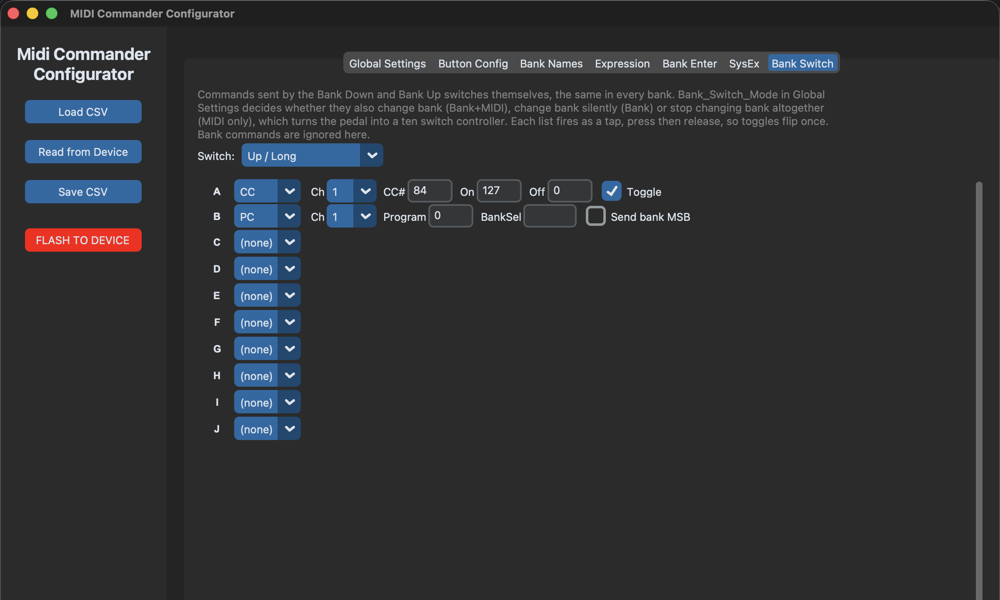

# Midi Commander Custom Firmware

Custom firmware and configuration tools for the **MeloAudio Midi Commander** foot controller, sold in Europe as the **Harley Benton MP-100**: 32 banks of eight buttons, up to ten MIDI commands per press plus ten more on a long press, tap tempo and MIDI clock, USB keyboard and media keys, two calibrated expression pedals, button labels on the display, USB-to-DIN MIDI thru, and a desktop configurator that talks to the pedal over USB.

This repository is a fork of [arasan95/midi-commander-custom](https://github.com/arasan95/midi-commander-custom), which in turn builds on the original project by [harvie256](https://github.com/harvie256/midi-commander-custom). None of this would exist without their work and that of the other contributors listed in the [Acknowledgements](#acknowledgements). Thank you all.

The firmware replaces the stock MeloAudio one but never touches its bootloader, so you can always flash the vendor image back. Its configuration lives in the microcontroller's own flash, so the stock configuration stored in the external EEPROM is left untouched.

---

## Contents

1. [Features](#features)
2. [Getting started](#getting-started)
3. [The configurator](#the-configurator)
4. [Configuration reference](#configuration-reference)
5. [The display](#the-display)
6. [Command line tools](#command-line-tools)
7. [Building and flashing from source](#building-and-flashing-from-source)
8. [Changelog](#changelog)
9. [Still to come](#still-to-come)
10. [Acknowledgements](#acknowledgements)

---

## Features

- **32 banks × 8 buttons.** A short press on Bank Up / Bank Down steps one bank, a long press jumps a configurable number of banks, and both wrap around. A `Bank` command can also jump straight to a given bank, so one bank can act as a setlist index. Each bank has a name shown on the display.
- **The Bank Up / Down switches send MIDI too.** Each has its own command list for a short and a long press, the same in every bank. `Bank_Switch_Mode` chooses whether they also change bank, or stop changing bank altogether, which turns the pedal into a plain ten switch controller.
- **Up to 10 commands per button press**, sent in order. Any mix of Program Change (with optional Bank Select), Control Change, Note, Pitch Bend, Start, Stop, USB keyboard keys and media keys, each MIDI command on its own channel.
- **Long press.** A second set of up to 10 commands fires when a button is held past a configurable time (default 500 ms). Buttons without long press commands react instantly, as before.
- **Momentary or toggle** behaviour per command, and timed auto-release (up to 1.27 s) for Notes, Pitch Bend and keys.
- **Button labels on the display.** Each button has a 4 character label; the screen shows the current bank and a 2×4 grid mirroring the pedal, with toggle buttons drawn inverted while on.
- **LED modes** per button: Normal, Reverse (lit when off) or AlwaysOn (blinks while active). The Bank Up / Down LEDs have the same options. Global brightness for lit LEDs and, separately, for LEDs lit at rest, so an active button stands out from an idle one.
- **Tap tempo and MIDI clock.** A button sets the tempo by tapping and another starts or stops a 24 PPQN MIDI clock on both USB and the DIN output, so a delay or looper follows your foot. The tempo shows on the display as you tap.
- **Relative CC.** A button can nudge a CC value up or down by a step on each press, optionally wrapping, for setting a parameter with your foot. The value it lands on shows on the display for a moment, so you are not adjusting blind.
- **Scenes.** One press puts the toggle buttons of the bank into a chosen combination, delay on and chorus off for instance, pressing for you only the ones that are not already there.
- **Panic.** A command that sends All Sound Off and All Notes Off on all sixteen channels, to USB and the DIN output, for the stuck note or runaway sound in the middle of a set.
- **Custom SysEx.** Up to sixteen SysEx messages can be stored and sent from a button, for devices that are only controllable that way.
- **USB keyboard and media keys (HID).** A command can press a key with Ctrl / Shift / Alt / Cmd modifiers, tap it, hold it or release it, or send a media key (play/pause, next, previous, stop, volume, mute, record) to the computer.
- **Two expression pedals** with per-pedal CC number, MIDI channel, calibrated end points, response curve and direction, calibrated live from the configurator. Each can also act as a switch: reaching the toe, or returning to the heel, taps a button of the current bank.
- **Follows the host's clock.** With `Clock_Follow` on, the pedal measures MIDI clock arriving over USB, adopts that tempo and flashes it on the display for 1.5 seconds, and keeps its own clock out of the way while the host's is running. If the host's clock stops, the pedal's carries on at the same tempo.
- **Setlist.** Bank Up / Down can follow an order of your choosing instead of the bank numbers, so the night's songs come up one after another whatever banks they live in. Relative Bank commands follow it too; jumping to an exact bank still works as before.
- **Idle sleep.** After a configurable number of minutes with nobody touching it, the display and the LEDs switch off. Any press or expression pedal movement brings them back, and the press that wakes it still does its job, so nothing is lost on stage. It matters on batteries, where there is no host to suspend the USB bus.
- **Survives Active Sensing.** Some hosts, the Kemper Profiler Player among them, send an Active Sensing byte every 300 ms. A controller that never reads it lets its USB buffer fill until the link stalls, which is what makes the stock firmware drag the host down to a crawl. Here every incoming USB MIDI event is consumed and the endpoint is always re-armed, so the stream cannot back up.
- **USB-to-DIN MIDI thru.** Optionally forward everything received over USB to the MIDI OUT jack, so the pedal doubles as a USB MIDI interface for the device behind it. Clock / Start / Continue / Stop have their own switch.
- **Commands on entering a bank.** Each bank can send a set of commands when you switch to it, typically a Program Change that selects its patch, so no button is spent on it.
- **Bank changes from incoming MIDI.** A Program Change or a Control Change arriving over USB can select a bank, so a DAW or another pedal can drive this one.
- **Remember state.** Optionally power up in the last bank with every toggle exactly as you left it, journaled across several flash pages so wear is not a concern.
- **Sleep mode.** When the computer suspends, LEDs and display switch off; they come back when it wakes.
- **Configuration over USB.** Flash a configuration to the pedal and read it back, from the GUI or the command line, over ordinary USB MIDI SysEx. No special driver.
- Firmware updates through the stock DFU bootloader with `dfu-util`.

---

## Getting started

You need the pedal, a USB cable, Python 3 and, to update the firmware, `dfu-util`.

### 1. Flash the firmware

The quickest way in is the [latest release](https://github.com/Charles5150/midi-commander-custom/releases/latest), which carries a ready built `.dfu` image. Build it yourself instead if you prefer; both routes end in the same place.

Released images are attached to the [releases](https://github.com/Charles5150/midi-commander-custom/releases); older ones are also kept in `artifacts/` for reference.

1. Install `dfu-util` (macOS: `brew install dfu-util`; Linux: your package manager; Windows: [dfu-util.sourceforge.net](https://dfu-util.sourceforge.net/)).
2. With the pedal off, hold **Bank Down** and **D** (the two bottom-right buttons) and switch it on. The display stays dark and LED 3 lights up: the pedal is in DFU mode.
3. Connect it over USB and check it is seen:

   ```text
   $ dfu-util --list
   Found DFU: [0483:df11] ... alt=0, name="@Internal Flash  /0x08000000/06*002Ka,250*002Kg", ...
   ```

4. Flash, using `--alt 0` (the internal flash entry above):

   ```bash
   dfu-util -d 0483:df11 --alt 0 --download midi-commander-custom-<version>.dfu
   ```

5. Power cycle the pedal. The firmware version shows on the display for a moment, then the first bank.

Flashing firmware does not erase your configuration. When a release changes the configuration format the [changelog](#changelog) says so; re-flash your configuration with the updated tools in that case.

### 2. Install the Python tools

```bash
git clone https://github.com/Charles5150/midi-commander-custom.git
cd midi-commander-custom
python3 -m venv .venv
.venv/bin/pip install -r python/requirements.txt
```

On macOS with Homebrew Python, the GUI also needs Tk: `brew install python-tk`.

### 3. Configure the pedal

```bash
.venv/bin/python python/gui_configurator.py
```

Connect the pedal in normal mode (not DFU), click **Read from Device** to load what it currently holds, edit, then **FLASH TO DEVICE**. The next section walks through the configurator.

---

## The configurator

`python/gui_configurator.py` edits a configuration CSV and exchanges it with the pedal over USB MIDI.



**Sidebar**

- **Load CSV** opens a configuration file. `python/demo-all-features.csv` is loaded at start, so every feature is there to look at straight away.
- **Read from Device** pulls the configuration stored on the connected pedal into a CSV you choose, and loads it.
- **Save CSV** writes the current settings to the open file.
- **FLASH TO DEVICE** saves the CSV, transfers it to the pedal and reboots it.

**Global Settings** — MIDI channel, config name, expression pedal CC numbers, bank LED modes, realtime passthrough, USB MIDI thru, remember state and the long press time. Bounded settings are drop-downs or check boxes; numbers are limited to their valid range. See the [reference](#global_settings).

**Button Config** — pick a bank, then a button. At the top you set its **display label** and **LED light mode**; below, ten command slots A–J. Choose a slot's command type and only the fields that type uses appear. **Short press / Long press** switches the slots between the two command sets of the button. Edits are kept in memory automatically when you switch button, bank or tab. **Copy bank** and **Paste bank** duplicate a whole bank onto another: labels, LED modes, short and long press commands and the commands sent on entering the bank. The target becomes identical to the source, so anything it had that the source does not is removed, and its name is kept, since a copy is usually the start of a variant. Pasting asks for confirmation first.



**Bank Names** — the 4 character name and 8 character info line of each bank.

**Bank Enter** — the commands each bank sends when you switch to it. **SysEx** — the sixteen stored SysEx messages, with the byte count or a parse warning as you type.

**Bank Switch** — the command lists of the Bank Down and Bank Up switches, one per switch and press length. Combine it with `Bank_Switch_Mode` in Global Settings.

**Setlist** — the order Bank Up / Down follow when `Setlist_Mode` is on, one drop-down per position listing every bank by number and name. The list ends at the first empty row.



**Expression** — per pedal: end points, response curve, invert, channel. **Connect live view** shows the pedal position and the CC being sent, read from the pedal in real time. To calibrate: press **Calibrate**, sweep the pedal slowly from heel to toe and back a couple of times, press **Done**; the end points are filled in with a small margin so 0 and 127 are always reached.

---

## Configuration reference

A configuration is a CSV with several sections, each introduced by a line starting with `*` and the section name. Lines containing `#` are comments. The configurator reads and writes this format, and you can also edit it in a spreadsheet.

**`python/demo-all-features.csv`** is the reference: a configuration that uses every feature, with one bank per feature and button labels that say what each one does. Load it in the configurator to see how anything is set up, or flash it to try the whole firmware on the pedal.

| Bank | What it shows |
|---|---|
| 0 | An index of `Bank` commands jumping to the other banks |
| 1 | A looper layout: CC toggles, and a long press on one button |
| 2 | The three LED modes side by side, and momentary versus toggle |
| 3 | Program Changes, with and without Bank Select, and a patch selected on entry |
| 4 | Keyboard keys: plain, with modifiers, held, and a Down/Up combination |
| 5 | Media keys |
| 6 | Tap tempo, clock start/stop, and transport |
| 7 | Relative CC, up and down, with and without wrapping |
| 8 | Stored SysEx messages, including an empty entry that sends nothing |
| 9 | Notes and pitch bend, with durations and toggles |
| 10 | Bank navigation from buttons, absolute and relative |
| 11 | Several commands chained on one button, and short versus long press |
| 12–31 | A setlist: each bank selects its patch on entry and has looper controls |

Both expression pedals are configured, one linear and one logarithmic and inverted, with the toe and heel acting as switches. Regenerate the file with `python3 python/make_demo_config.py` after adding a feature, so it keeps covering everything.

(`python/MeloConfig_10_Cmds - RC-600.csv` is a real-world configuration for a Boss RC-600. The original project's Google Sheets template is no longer online, and it predated several columns anyway; start from one of the CSVs instead.)

### Global_Settings

`Label,Value` rows.

| Label | Values | Meaning |
|---|---|---|
| `MIDI_Channel` | 1–16 | Channel used by the expression pedals (unless a pedal sets its own). Buttons use the channel of each command. |
| `RealTime_Passthrough` | Y / N | Forward MIDI Clock, Start, Continue and Stop received over USB to the DIN output. |
| `USB_MIDI_Thru` | Y / N | Forward every other MIDI message received over USB (notes, CC, PC, pitch bend, system common, other devices' SysEx) to the DIN output. |
| `ConfigName` | up to 16 chars | Shown on the display at boot. |
| `Exp1_CC`, `Exp2_CC` | 1–127 | CC number sent by each expression pedal. Defaults 11 and 4. |
| `Bank_Up_LED_Mode`, `Bank_Down_LED_Mode` | Normal / Reverse / AlwaysOn | LED behaviour of the bank buttons (see [LED modes](#led-modes)). |
| `Remember_State` | Y / N | Power up in the last bank with all toggles as they were. |
| `Long_Press_ms` | 100–2500 | Hold time that turns a press into a long press, on the command buttons and on Bank Up / Down. Default 500. |
| `LED_Brightness` | 1–100 | Brightness of a lit LED, in percent. Default 100. Configurations written before 0.9 read as 100. |
| `LED_Rest_Brightness` | 1–100 | Brightness of LEDs lit at rest by the Reverse and AlwaysOn modes. Default 100; set it lower to tell an active button from an idle one. |
| `Bank_Jump_Step` | 1–31 | Banks skipped by a long press on Bank Up / Down. Default 8. |
| `Bank_Change_Mode` | Off / PC / CC | Let an incoming Program Change, or Control Change, select a bank. |
| `Bank_Change_Channel` | Any / 1–16 | Channel the pedal listens on for those messages. |
| `Bank_Change_CC` | 0–127 | CC number that selects a bank, when the mode is CC. Its value is the bank. |
| `Clock_Follow` | Y / N | Measure MIDI clock arriving over USB, over two beats, and adopt its tempo; the display shows it as `EXT` and a tempo for 1.5 seconds when the clock is picked up or its tempo changes by two BPM or more. While that clock keeps arriving the pedal sends no clock of its own: with `RealTime_Passthrough` on the host's clock already reaches the DIN output, and with it off the pedal re-clocks the DIN output at the host's tempo. Half a second without a clock counts as stopped, and the pedal's own clock, if running, continues at the adopted tempo. Default N. |
| `Setlist_Mode` | Y / N | Bank Up / Down, and relative `Bank` commands, follow the order in the `Setlist` section instead of the bank numbers. From a bank that is not in the list, Up enters at its first entry and Down at its last. `GoTo` and bank selection from incoming MIDI still go to the exact bank. Default N. |
| `Sleep_After_Min` | 0–60 | Minutes of inactivity before the display and LEDs go out. 0 turns it off. A press or a moved expression pedal wakes it and still does what it was asked to. |
| `Bank_Switch_Mode` | Bank / Bank+MIDI / MIDI only | What the Bank Up / Down switches do. `Bank` is the original behaviour, they only change bank. `Bank+MIDI` also sends their commands from `BankSwitch_Settings`. `MIDI only` stops them changing bank, leaving a ten switch controller. Default `Bank`. |

### Bank_Naming

One row per bank, `Bank_Number` 0–31: `Bank_Name_Large` (4 characters, big font) and `Bank_Info_Small` (8 characters, small font).

### Button_Settings

One row per button, 256 rows in bank order and, within a bank, in the order `1, 2, 3, 4, A, B, C, D` (top row of the pedal, then bottom row). Columns:

- `Bank_Number`, `Button_Identifier`
- `Label` — up to 4 characters shown on the display. Empty shows the button identifier.
- `Light_Mode` — Normal / Reverse / AlwaysOn.
- Ten command slots, prefixed `A_` to `J_`, each with the fields below.

#### Command fields

| Field | PC | CC | Note | PB | Key | Meaning |
|---|---|---|---|---|---|---|
| `CommandType` | | | | | | `PC`, `CC`, `CCInc`, `Note`, `PB`, `Key`, `Media`, `Bank`, `SysEx`, `Tap`, `Start`, `Stop`, or empty for none |
| `Channel_(PC/CC/Note/PB)` | ✓ | ✓ | ✓ | ✓ | | MIDI channel 1–16 |
| `Number_(PC/CC/Note)` | ✓ | ✓ | ✓ | | ✓ | PC: program 0–127. CC: controller number. Note: note number. Key: modifier mask |
| `OnValue_(CC/PB)` | | ✓ | | ✓ | ✓ | CC: value on press (0–127). PB: −8192..8191. Key: key name. Media: media key name |
| `OffValue_(CC)` | | ✓ | | | | CC: value on release / toggle off (0–127) |
| `BankSelect_(PC)` | ✓ | | | | | 0–16383, sent as CC#32 (LSB) before the PC |
| `BankSelectHighByte_(PC)` | ✓ | | | | | Y: also send CC#0 (MSB) |
| `Toggle_(CC/PB/Note)` | | ✓ | ✓ | ✓ | ✓ | Y: alternate on / off on successive presses. Key / Media: hold until the next press |
| `Velocity_(Note)` | | | ✓ | | | 0–127 |
| `Duration_(Note/PB)` | | | ✓ | ✓ | ✓ | In 10 ms steps, 0–127 (max 1.27 s). Media: same as Key |
| `KeyMode_(Key)` | | | | | ✓ | Normal / Down / Up |

`Start` and `Stop` take no parameters; they send MIDI Start (0xFA) / Stop (0xFC) over USB and DIN.

**When the "off" is sent**

- `Toggle = N`, `Duration = 0`: on when pressed, off when released (momentary).
- `Toggle = N`, `Duration > 0`: on when pressed, off automatically after the duration, even if still held. Notes, pitch bend and keys only; CC ignores the duration.
- `Toggle = Y`: the first press sends on, the next sends off, and so on. Toggle state is kept per button and per bank, and drives the LED.

**Keyboard keys.** `Number` is the sum of the modifiers: 1 Ctrl, 2 Shift, 4 Alt, 8 Cmd/Win (3 = Ctrl+Shift). `OnValue` is a single character (`a`, `7`) or one of `enter`, `esc`, `tab`, `space`, `backspace`, `minus`, `equal`, `leftbr`, `rightbr`, `backslash`, `semicolon`, `quote`, `grave`, `comma`, `dot`, `slash`, `f1`–`f12`. `KeyMode`: **Normal** taps the key (held for `Duration` if set); **Down** presses and leaves it pressed, **Up** releases it, both after a `Duration` delay, so one button can build combinations across several slots. `Toggle` holds the key until the next press.

**Relative CC.** `CommandType` `CCInc` sends a CC whose value moves on every press instead of being fixed. `Number` is the CC, `OnValue` the value it starts from at power on, `OffValue` the step, `KeyMode` the direction (`Up` or `Down`) and `Toggle` enables wrapping past the ends instead of sticking at 0 and 127. The running value lives in memory, one per command slot, and resets to the start value when the pedal is switched off.

**Tap tempo.** `CommandType` `Tap` with `KeyMode` `Tap` measures the tempo from the interval between presses, averaging the last four and ignoring anything outside 30–300 BPM. With `KeyMode` `Clock` the button starts or stops the clock instead, sending MIDI Start or Stop and then 24 clock bytes per quarter note to USB and DIN while it runs. Either action shows the tempo on the display for a moment, with a leading `*` while the clock is running. The tempo is not saved; it starts at 120 BPM each time the pedal is switched on.

**Scenes.** `CommandType` `Scene` sets the toggle buttons of the current bank to a chosen state. `OnValue` holds eight characters, one per button in the order `1234ABCD`: `+` to switch it on, `-` to switch it off, and `.` or anything else to leave it alone, so `+-+..-..` turns 1 and 3 on and 2 and B off. Each affected button that is not already in the wanted state is pressed as if by foot, so its own commands, LED and display cell follow; buttons already there are not touched, so recalling the same scene twice sends nothing the second time. Buttons without a toggle command have no state and are skipped. A scene cannot trigger another scene. The configurator shows it as eight drop-downs, and the demo puts three on the long presses of the LED modes bank.

**Panic.** `CommandType` `Panic` sends All Sound Off (CC 120) and All Notes Off (CC 123) on all sixteen channels, to both USB and the DIN output. It takes no parameters. The 32 messages go out packed into two USB packets and two serial buffers, so a panic cannot itself run out of transmit buffers. It does not reset toggle states or controllers. A long press is a good place for it, where it cannot be hit by accident; the demo puts it on a long press of STOP in the tempo bank.

**Custom SysEx.** `CommandType` `SysEx` sends one of the messages stored in the `SysEx_Strings` section; `Number` selects which, 0 to 15. Nothing else in the command is used. The message goes to both USB and the DIN output.

**Bank changes.** `CommandType` `Bank` switches bank. `KeyMode` selects the action: `GoTo` jumps to the bank number in `OnValue` (0–31), `Up` and `Down` move by the number of banks in `OnValue`, wrapping around. The change is applied after the button's remaining commands have been sent, so a button can send MIDI and then move to another bank. Nothing else in the command is used.

**Media keys.** `CommandType` `Media` sends a USB consumer-control key to the computer, the same ones a keyboard's media buttons send, so they work in any player or DAW without MIDI mapping. `OnValue` is one of `play_pause`, `play`, `pause`, `stop`, `next`, `prev`, `record`, `fast_forward`, `rewind`, `eject`, `mute`, `vol_up`, `vol_down`, or a raw usage number (`0xE9`). The key is tapped on press and released on release, held for `Duration` if set, or held until the next press with `Toggle`. `Number` and `Channel` are unused.

#### LED modes

- **Normal**: lit while the button is active, off otherwise.
- **Reverse**: lit at rest, off while active.
- **AlwaysOn**: lit at rest, blinking while active.

"Active" means physically pressed for a momentary button, or toggled on when any of the button's commands is a toggle. A lit LED uses `LED_Brightness`; "lit at rest" uses `LED_Rest_Brightness`. LEDs are dimmed by software PWM at 500 Hz, so there is no visible flicker.

### LongPress_Settings

Optional. Same columns as `Button_Settings` minus `Label` and `Light_Mode`. Rows may be missing or in any order; a button without a row has no long press commands and reacts instantly on press. Long press commands have their own toggle state.

Rows are optional in `Button_Settings` and `Bank_Naming` too: a configuration that only defines the first few banks, including one written for the 8 bank firmware, flashes unchanged and leaves the rest empty. The configurator always shows all 32 banks and writes them all when you save.

### SysEx_Strings

Optional; sixteen rows with an `Index` (0–15) and `Bytes`. Write the bytes in hexadecimal as the device manual shows them, separated by spaces or commas, with an optional `0x` prefix. A leading `F0` and trailing `F7` are optional and added when sending. Up to 23 data bytes, each `00`–`7F`. A line that cannot be parsed is stored empty and the command sends nothing, rather than sending a malformed message. Edit it in the configurator's **SysEx** tab, which shows the byte count or a warning as you type.

### BankEnter_Settings

Optional; one row per bank with the same ten command slots as a button, minus the button columns. These commands are sent once when the bank is entered, from any source: the bank switches, a `Bank` command or an incoming MIDI message. No release is sent, and `Bank` commands are ignored so entering a bank cannot chain into another one. Edit it in the configurator's **Bank Enter** tab.

### BankSwitch_Settings

Optional; four rows, one per switch and press length: `Switch` `Down` or `Up`, `Press` `Short` or `Long`, then the same ten command slots as a button. Rows may be missing or in any order.

These lists are global, not per bank, because the switches are navigation and should behave the same wherever you are. Each list fires as a tap, press then release, so a `Toggle` command flips once per press and keeps its own state. `Bank` commands are ignored here; where you end up is decided by the switch itself and by `Bank_Switch_Mode`. Nothing is sent while the mode is `Bank`. Edit it in the configurator's **Bank Switch** tab.

### Setlist

Optional; rows of `Position` and `Bank_Number` (0–31). Up to 32 entries, ordered by `Position`, so rows may be in any order and positions may skip numbers; invalid bank numbers are dropped. It only takes effect while `Setlist_Mode` is on, so you can keep a list stored and switch it off. A bank may appear more than once, but stepping from it always continues from its first appearance. Edit it in the configurator's **Setlist** tab.

### Expression_Settings

Optional; two rows, `Pedal` 1 and 2.

| Column | Values | Meaning |
|---|---|---|
| `Min_ADC`, `Max_ADC` | 0–4095 | Calibrated heel and toe readings. Defaults 80 and 3900. |
| `Curve` | Linear / Log / Exp | Log is fast at the start of the travel, Exp is slow at the start. |
| `Invert` | Y / N | Swap heel and toe. |
| `Channel` | Global or 1–16 | Global uses `MIDI_Channel`. |
| `Toe_Button` | None or 1–4, A–D | Button tapped when the pedal reaches the toe. |
| `Toe_Level` | 1–127 | Value the pedal must reach for that. Default 120. |
| `Heel_Button` | None or 1–4, A–D | Button tapped when the pedal returns to the heel. |
| `Heel_Level` | 0–127 | Value it must fall to for that. Default 7. |

Used as a switch, the pedal taps a button of the **current bank**, sending whatever that button is configured to send, including its toggle state and LED. Each direction re-arms only after the pedal moves back past its level by a margin, so resting on the edge does not retrigger.

Both 1/4" jacks are read through the ADC every millisecond, with the pin pulled down between readings to prevent crosstalk between the two inputs, smoothed with an adaptive filter and a small hysteresis so a resting pedal does not chatter. A CC is sent only when the 7-bit value changes.

If a pedal produces no CC, open the Expression tab and press **Connect live view**: if the raw value does not follow the pedal, the problem is the cable or jack; if it does but no CC reaches your MIDI monitor, check the channel and CC number.

---

## The display

The 128×64 OLED shows, on the top line, the bank's large 4 character name and its 8 character info. Below it, a 2×4 grid laid out like the pedal: buttons **1 2 3 4** on the top row, **A B C D** on the bottom. Each cell shows the button's label, or its identifier when it has none, and cells of toggle buttons are drawn inverted while the toggle is on, so the state of the whole bank is visible at a glance.

---

## Command line tools

Everything the GUI does is available from the terminal, from the repository root:

```bash
# Flash a configuration to the pedal (normal mode, connected over USB)
.venv/bin/python python/CSV_to_Flash.py my-config.csv

# Read the configuration stored on the pedal into a CSV
.venv/bin/python python/Flash_to_CSV.py current-config.csv
```

The tools find the pedal by its USB MIDI name (`MIDI Commander Custom`), check the firmware version, and exchange the configuration as SysEx messages under manufacturer ID `0x7D`: erase (52), write 16-byte chunk (54), read chunk (56), version (58), reset (60), pedal readings (62). The read-back commands need firmware 0.2 or later; the tools tell you if the pedal is older.

To watch what the pedal sends, use any MIDI monitor (MIDI Monitor on macOS, MIDI-OX on Windows, `aseqdump -p 'MIDI Commander Custom'` on Linux).

---

## Building and flashing from source

The firmware is built with [PlatformIO](https://platformio.org/) (`pip install platformio`, `pipx install platformio` or the VS Code extension). All sources live under `firmware/`; the first build downloads the ARM toolchain.

```bash
platformio run -e midi_dfu      # DFU image, linked at 0x08003000 behind the stock bootloader
platformio run -e midi_debug    # ST-Link image at 0x08000000 (for SWD debugging, replaces the bootloader)
```

`midi_dfu` also packages the binary as a DfuSe container through `scripts/post_build_dfuse.py` and `tools/bin_to_dfuse.py`, writing `artifacts/dfu/platformio-<timestamp>.dfu` and a stable `artifacts/dfu/platformio-latest.dfu`. Flash it as in [Getting started](#1-flash-the-firmware), or let PlatformIO drive `dfu-util`:

```bash
platformio run -e midi_dfu -t upload
```

The raw binary can also be flashed directly: `dfu-util --alt 0 -s 0x08003000 --download .pio/build/midi_dfu/firmware.bin`.

The Python tools have round-trip tests for the configuration packers:

```bash
.venv/bin/python -m unittest discover -s python/tests
```

GitHub Actions builds both firmware images and runs these tests on every push and pull request. See `CONTRIBUTING.md` for the repository layout and what to keep in sync when changing the configuration format.

Hardware notes (MCU, pinout, I²C addresses) are in `HardwareNotes.txt`; `backup/` holds a dump of the original firmware and EEPROM.

---

## Changelog

Firmware versions are shown on the display at boot and reported by the tools.

- **0.23 — Scenes.** New `Scene` command type: one press sets any of the bank's toggle buttons on or off, pressing only those that are not already in the wanted state, so their commands, LEDs and display follow as if pressed by foot and a repeated scene is silent. Stored in two bytes of the command, written in the CSV as eight characters, `+`, `-` or `.`. A scene cannot recurse into another, and a bank change queued by the scene's own button is held until it finishes. The configuration layout is unchanged.
- **Configurator: copy and paste banks.** Copy bank and Paste bank in the Button Config tab duplicate everything that belongs to a bank onto another one, except its name, after a confirmation. The logic lives in `python/lib/bankClipboard.py` and is covered by tests that pack the result and check the target bank's bytes match the source and nothing outside it moved. No firmware change.
- **0.22 — See relative CC values.** A `CCInc` button used to change a value nobody could see. The CC number and the value just sent now replace the bank's info line for a second and a half, as `CC7=69`, or `C120=127` for three digit CC numbers so it still fits. Firmware only: the configuration is unchanged.
- **0.21 — Panic.** New `Panic` command type: All Sound Off and All Notes Off on all sixteen channels, to USB and DIN, packed into two USB packets and two serial buffers so a single press cannot exhaust the transmit buffers. A command type only, so the configuration layout is unchanged and 0.20 configurations need no re-flash.
- **0.20 — Follow the host's clock.** `Clock_Follow` makes the pedal measure the MIDI clock arriving over USB over two beats and adopt its tempo, shown on the display as `EXT` and a tempo for 1.5 seconds when it is picked up or changes. While the host's clock runs the pedal never adds a second clock to the stream: it stays silent when realtime passthrough already forwards the host's clock to DIN, and re-clocks DIN at the host's tempo when it does not. When the host's clock stops, the pedal's own clock, if running, carries on at the tempo it adopted, so a looper behind it keeps time. A single byte in the global settings area, so nothing moves and configurations from 0.19 need no re-flash.
- **0.19 — Setlist.** `Setlist_Mode` and the new `Setlist` section make Bank Up / Down, and relative `Bank` commands, step through a stored order of banks instead of their numbers, wrapping at both ends, with a Setlist tab in the configurator. Absolute jumps are unchanged. The section is appended after everything else, so nothing moves: a configuration written for 0.18 still reads correctly, with the setlist empty and switched off. The configuration grows by 32 bytes to 24080, within the same 12 flash pages.
- **0.18 — Idle sleep.** `Sleep_After_Min` switches the display and the LEDs off after a set number of minutes without a press or a pedal movement, and anything you do brings them back without losing the press that did it. The firmware already had a sleep path, but only for USB suspend, which never fires on batteries because there is no host. The main loop now waits for an interrupt instead of spinning, so the processor is stopped most of every millisecond even while awake. An expression pedal only counts as activity once it has moved several steps: a connected pedal sitting still was measured drifting one unit either side of its resting value, several times a minute, which was enough to hold off sleep for ever. The CC is still sent on every change, it is only the activity marker that is filtered. **Configuration format change:** the global area was full, 16 bytes of settings and 16 of name, so it grows to 48 and every section after it moves; the configuration goes to 24048 bytes, still within the same 12 flash pages. Re-flash your configuration after updating, or the pedal will read it shifted.
- **0.17 — MIDI from the bank switches, and no more freeze.** The Bank Down and Bank Up switches have their own command lists for a short and a long press (`BankSwitch_Settings`, Bank Switch tab), and `Bank_Switch_Mode` decides whether they also change bank or stop changing bank altogether, which makes the pedal a ten switch controller. A full MIDI transmit buffer no longer calls `Error()`, which disabled interrupts and spun forever: the pedal froze until it was power cycled. The message is dropped instead, and the number of buffers goes from 20 to 32 so it rarely comes to that. These answer two long-standing requests in the original project, [#39](https://github.com/harvie256/midi-commander-custom/issues/39) and [#40](https://github.com/harvie256/midi-commander-custom/issues/40). A new test parses the firmware's own `CFG_*` macros and compares every section offset with the Python tools, so the two can no longer drift apart. A Program Change with an empty Bank Select no longer sends one: the packer wrote a 0 into the byte the firmware reads, so **every** Program Change sent an unwanted Bank Select LSB of 0, which selects a bank on devices that listen to it. An explicit `0` still sends it, and a `Bank_Select` with `BankSelectHighByte` set still sends both bytes. This one is a tooling fix rather than a firmware one, so re-flash the configuration to pick it up. **Configuration format change:** it grows by 160 bytes to 24032, still within the same 12 flash pages; re-flash after updating.
- **Active Sensing, verified.** Not a code change in 0.17, but worth recording: hosts that send Active Sensing every 300 ms, notably the Kemper Profiler Player, stall the stock firmware because it never drains what arrives over USB. The receive path here walks every 4 byte event, handles or discards each one, and re-arms the endpoint unconditionally, so nothing accumulates. Measured on the pedal with 3599 messages, including Active Sensing at the host's own rate, a 2000 message burst and a mixed stream; the pedal answered a SysEx version request after every phase.
- **0.16 — Journal wear.** The saved-state journal now spans four flash pages instead of one, so a fill-and-erase cycle absorbs 124 saves and the journal is good for over a million of them. This replaces the idea of moving it to the external EEPROM: the EEPROM shares the I2C bus with the DMA-driven display and holds only 896 free bytes, so it would have meant coordinating blocking writes with screen updates for no practical gain, while spare flash costs nothing.
- **0.15 — Expression pedals as switches.** Reaching the toe, or returning to the heel, taps a button of the current bank (`Toe_Button`, `Toe_Level`, `Heel_Button`, `Heel_Level`), so a pedal gives you two more footswitches while still sending its CC. Stored in bytes that were already reserved in each pedal's record, so the configuration does not grow.
- **0.14 — Tap tempo and MIDI clock.** New `Tap` command type, in Tap or Clock mode. The clock is generated from the millisecond tick with fractional accumulation, so its average tempo is exact and it does not drift, and the bytes are emitted from the main loop rather than an interrupt. USB MIDI transmission was rewritten around a queue: it used to busy-wait for the previous packet, which made sending from an interrupt impossible and could hang for good if the USB interrupt never ran.
- **0.13 — Relative CC and custom SysEx.** New `CCInc` command type nudges a CC value by a step per press, with optional wrapping and a per-slot running value. New `SysEx` command type sends one of sixteen stored messages from the new `SysEx_Strings` section, to both USB and DIN, with a SysEx tab in the configurator that validates the bytes as you type.
- **0.12 — Bank automation.** Each bank can send commands when entered (`BankEnter_Settings`, Bank Enter tab), typically a Program Change for its patch. An incoming Program Change or Control Change over USB can select a bank (`Bank_Change_Mode`, `Bank_Change_Channel`, `Bank_Change_CC`), so a DAW or another pedal drives this one. **Configuration format change:** it grows to 23 kB over 12 flash pages; re-flash after updating.
- **0.11 — 32 banks and bank navigation.** Banks go from 8 to 32. A short press on Bank Up / Down steps one bank and a long press jumps `Bank_Jump_Step` banks (default 8), both wrapping around. A new `Bank` command type jumps to a given bank or moves relative to it, applied after the button's other commands, so one bank can act as a setlist index. **Configuration format change:** the configuration grows to 22 kB over 11 flash pages and takes about 13 seconds to transfer; re-flash it after updating. Configurations written for 8 banks still flash, leaving the new banks empty. The per-bank toggle bitmasks and the saved-state journal widened accordingly.
- **0.10 — Media keys.** New `Media` command type sends USB consumer-control keys (play/pause, next, previous, stop, volume, mute, record, ...). The HID interface now carries two reports with IDs (keyboard and consumer control) on a 16-byte endpoint, and gets the USB packet-memory allocation it had always been missing.
- **0.9 — LED brightness.** `LED_Brightness` and `LED_Rest_Brightness` (percent) dim the LEDs with a 500 Hz software PWM on TIM2; the rest level lets Reverse/AlwaysOn buttons look different when idle and when active.
- **0.8 — Expression pedal calibration.** `Expression_Settings` section and Expression tab with live view and one-click calibration: per pedal end points, curve, invert and channel. SysEx `GET_PEDALS` (62).
- **0.7 — Long press.** Second command set per button (`LongPress_Settings`), `Long_Press_ms`, separate toggle state, Short/Long switch in the editor.
- **0.6 — Button labels on the display.** `Label` column, 2×4 grid mirroring the pedal, inverted cells for active toggles. Flash page size corrected to the real 2 kB (configuration area is 6 kB).
- **0.5 — Remember state.** `Remember_State` restores the last bank and toggles at power on, journaled in a dedicated flash page. GitHub Actions CI added.
- **0.4 — USB-to-DIN MIDI thru.** `USB_MIDI_Thru` forwards channel, system common and foreign SysEx messages to the DIN output. The USB receive parser was rewritten to walk 4-byte USB MIDI events, fixing a buffer overflow on long SysEx from other devices.
- **0.3 — LED modes moved to their own table.** Previously `Light_Mode` was encoded in bit 7 of two bytes of the button's first command, which corrupted that command depending on its type (a CC with AlwaysOn never sent its off value, a Note got a long duration, a Key became a toggle or sent the wrong key, a PC without Bank Select MSB read as Reverse). **Configuration format change:** re-flash your configuration after updating.
- **GUI rework.** Bounded fields as drop-downs and check boxes, range-checked numbers, type-aware command editor with the previously missing Bank Select, Bank Select MSB, Velocity, Start and Stop fields, automatic apply, save before flash.
- **0.2 — Configuration read-back.** `Flash_to_CSV.py` and **Read from Device**; SysEx `READ_FLASH` (56) and `GET_VERSION` (58).
- **0.1B fixes.** Spurious Note Off after a timed pitch bend (missing `break`); global `MIDI_Channel` was 0-based while every other channel field is 1-based; `customtkinter` added to `requirements.txt`; round-trip tests added.
- **0.1B Sleep and earlier** (arasan95, harvie256 and contributors): GUI configurator, LED modes, HID keyboard, dual expression pedals with pull-down switching, sleep mode, PlatformIO build, DMA display driver, 10 commands per button, flash-based configuration and the SysEx flashing tool.

---

## Still to come

- Battery management has not been considered; battery operation is untested.

Ideas and bug reports are welcome through the [issues](https://github.com/Charles5150/midi-commander-custom/issues/new/choose) and [discussions](https://github.com/Charles5150/midi-commander-custom/discussions).

---

## Acknowledgements

- @harvie256: project founder, original firmware, flash-based configuration and SysEx flashing tool
- @eliericha: expansion to 10 commands per button, Python tooling and macOS documentation
- @redcloud80: DMA and interrupt driven display driver
- @BenjaminJensen: the info on expression pedals
- Ivaylo Milanov: PlatformIO migration, DFU packaging workflow and expression pedal ADC pin map
- @arasan95: GUI configurator, LED light modes, HID keyboard output, dual expression pedal filtering and sleep mode
