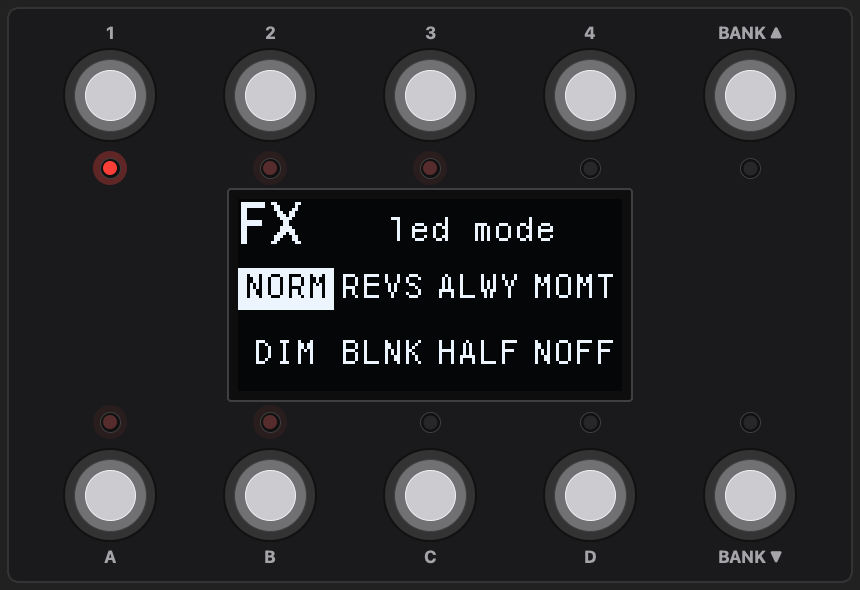

# Midi Commander Custom Firmware

Custom firmware and configuration tools for the **MeloAudio Midi Commander** foot controller, sold in Europe as the **Harley Benton MP-100**. It turns a budget pedal into a controller that stands up to the big names: 32 banks of eight buttons, three command lists per button, a setlist, tap tempo and MIDI clock, two expression pedals, labels on the display, and a configurator, on the desktop or in the browser, that talks to the pedal over USB.

**[Read the user manual](docs/manual/en/README.md)** · **[Manual de usuario en español](docs/manual/es/README.md)**

This repository is a fork of [arasan95/midi-commander-custom](https://github.com/arasan95/midi-commander-custom), which in turn builds on the original project by [harvie256](https://github.com/harvie256/midi-commander-custom). None of this would exist without their work and that of the other contributors listed in the [Acknowledgements](#acknowledgements). Thank you all.

The firmware replaces the stock MeloAudio one but never touches its bootloader, so you can always flash the vendor image back. Its configuration lives in the microcontroller's own flash, so the stock configuration stored in the external EEPROM is left untouched.

---

## What it does

The [full list](docs/manual/en/01-what-it-does.md) has every feature; in brief:

- **Banks and songs.** 32 banks of eight buttons, each with a name. Bank Up / Down step through them or through a setlist of your own, whose place and next song the display can show, can preview a bank before going there, and send MIDI of their own; two presses reach any bank. A bank sends a patch as you enter it and switches things off as you leave. A second page doubles a song's buttons, and four complete configurations live on one pedal. → [Banks](docs/manual/en/04-banks.md)
- **Buttons that do more.** Up to ten commands on a short press, ten on a long press and ten on a double press, and two switches pressed together run a list of their own; hold a Reveal button and the display shows what each hold does. Toggles, latch-or-momentary, exclusive groups like an amp's channel buttons, scenes you can save with your feet, cycle buttons that step through states, and global buttons that are the same in every bank. → [Buttons](docs/manual/en/05-buttons.md)
- **Anything a rig understands.** Program Change with Bank Select, CC, NRPN and RPN, notes, pitch bend, channel pressure, SysEx, MMC transport, Song Select, USB keyboard and media keys, relative CC and next / previous preset, on one channel or several at once. Pauses between commands, CC ramps, values and conditions for a shift layer, and macros stored once and called from anywhere. → [Commands](docs/manual/en/06-commands.md)
- **In time.** Tap tempo and a MIDI clock on USB and DIN, a tempo per song, or the host's clock followed. Tap LEDs flash on the beat, the display counts bars and a count-in, and LFOs and step sequences run in time with it, at a speed an expression pedal can set. → [Tempo](docs/manual/en/07-tempo.md)
- **Two expression pedals.** Calibrated from the configurator, with curves, output ranges, a target per bank or per button, Pitch Bend and 14-bit CC, toe and heel switches, auto-engage wah, the position sent on entering a bank, scrolling lyrics or a score on the computer, and a box of three more switches in place of a pedal. → [Expression pedals](docs/manual/en/08-expression.md)
- **A display that tells you things.** The bank and a label for every button, toggles drawn inverted, tempo and values as you change them, the song name sent by the computer, and a banner at power on. → [The display](docs/manual/en/09-the-display.md)
- **Talks to the computer, to a Kemper and to a GT-1000.** LEDs that follow a DAW, or what a looper reports on another CC, switches the computer can press, USB-to-DIN MIDI thru with a MIDI map that translates what comes in for the device on the DIN cable, and two way with a Kemper Profiler: the rig name on the display, the effect modules lighting their buttons and the amp's tuner on the pedal's screen; and with a Boss GT-1000: the patch name on the display and the effects its ASSIGNs switch lighting their buttons. Ready-made templates for the Fractal FM3, Line 6 HX Stomp, Neural DSP Quad Cortex, Eventide H90, Strymon TimeLine, BigSky, Volante and Iridium, Meris Enzo X, LVX and MercuryX, Hotone Ampero II, Boss RC-600 and Kemper Player, and for MainStage, Gig Performer, Cantabile and Ableton Live on the computer. → [Templates and devices](docs/manual/en/11-devices.md)
- **Built for the stage.** An editor on the pedal's own screen for the wrong patch found at soundcheck, safe mode, idle sleep, running from a phone charger, and presses that reach MIDI in a quarter of a millisecond. → [Editing on the pedal](docs/manual/en/10-editing-on-the-pedal.md)

---

## Quick start

**In the browser, nothing to install:** open the [web configurator](https://charles5150.github.io/midi-commander-custom/) in Chrome, Edge or Opera. It edits, reads and writes configurations, shows the pedal live and updates the firmware, the first flash included. No pedal yet? **Try without a pedal** runs its firmware in the page. → [In the browser](docs/manual/en/14-in-the-browser.md)

**With the desktop tools:**

1. **Flash the firmware.** Download the `.dfu` from the [latest release](https://github.com/Charles5150/midi-commander-custom/releases/latest). Switch the pedal on holding **Bank Down** and **D**, then flash it with `dfu-util -d 0483:df11 --alt 0 --download midi-commander-custom-<version>.dfu` and switch it off and on. From then on, updates need nothing held.
2. **Install the tools.** Download [the repository as a ZIP](https://github.com/Charles5150/midi-commander-custom/archive/refs/heads/main.zip) and unzip it, and install [Python 3.12](https://www.python.org/downloads/).
3. **Configure it.** Double click **Start Configurator.command** on macOS or **Start Configurator.bat** on Windows, or run `./start-configurator.sh` on Linux: the first time it sets up the tools, then opens the configurator. Click **Read from Device**, edit and **Flash to Device**. The configurator opens on a demo configuration that uses every feature, worth a look first.

The whole story, step by step, is in [Getting started](docs/manual/en/02-getting-started.md).

---

## More

- [User manual](docs/manual/en/README.md): every feature, the configurator, the CSV format and the command line tools.
- [Changelog](CHANGELOG.md): what changed in each version, and when a configuration has to be flashed again.
- [Contributing](CONTRIBUTING.md): building the firmware, the tests, and what to keep in sync.

## Still to come

- Battery management has not been considered; battery operation is untested.

Ideas and bug reports are welcome through the [issues](https://github.com/Charles5150/midi-commander-custom/issues/new/choose) and [discussions](https://github.com/Charles5150/midi-commander-custom/discussions).

## Acknowledgements

- @harvie256: project founder, original firmware, flash-based configuration and SysEx flashing tool
- @eliericha: expansion to 10 commands per button, Python tooling and macOS documentation
- @redcloud80: DMA and interrupt driven display driver
- @BenjaminJensen: the info on expression pedals
- Ivaylo Milanov: PlatformIO migration, DFU packaging workflow and expression pedal ADC pin map
- @arasan95: GUI configurator, LED light modes, HID keyboard output, dual expression pedal filtering and sleep mode
