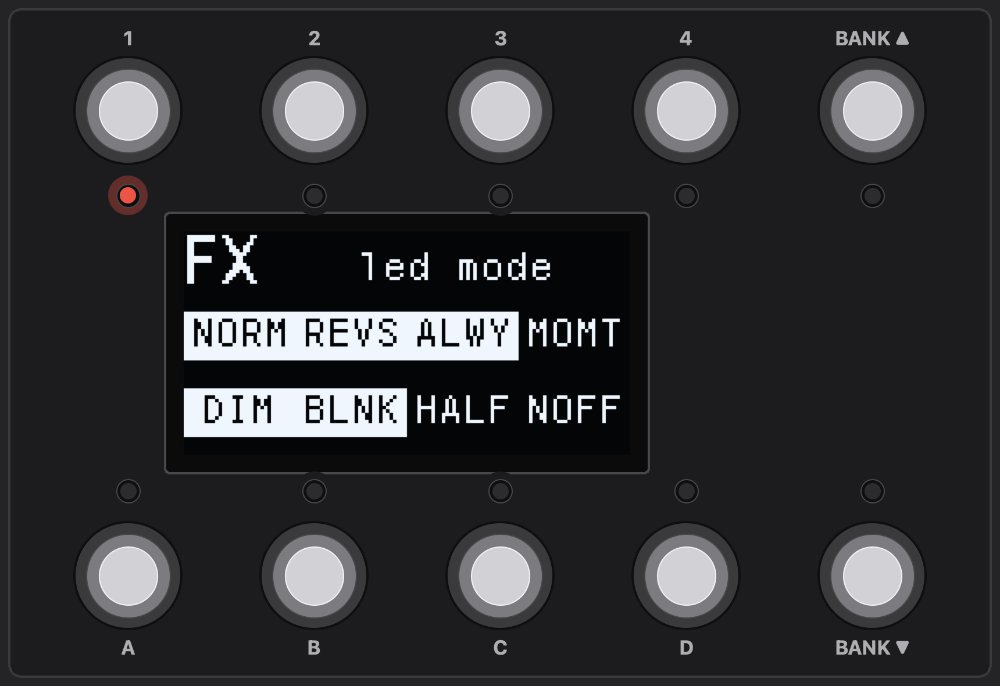

# The configurator

**English** · [Español](../es/03-the-configurator.md)

The configurator, `python/gui_configurator.py`, is where a configuration is built: it edits a configuration CSV and exchanges it with the pedal over USB MIDI, with no special driver. Start it from the repository root:

```bash
.venv/bin/python python/gui_configurator.py
```


On the left is the sidebar, with the file and the pedal. On the right are the tabs, in the order a configuration is usually built. Each tab starts with a one line summary; the **?** next to it opens the details.

## Sidebar

Two groups, FILE and PEDAL, with the name of the open file at the bottom.

**FILE**

- **Load CSV…** opens a configuration file. `python/demo-all-features.csv` is loaded at start, so every feature is there to look at straight away.
- **Save CSV** writes the current settings to the open file.

**PEDAL**

- **Slot** chooses which of the four [configuration slots](04-banks.md#four-configurations) the two buttons below it use. `Active` means the one the pedal is running. Flashing one slot never touches the others.
- **Read from Device** pulls that configuration from the connected pedal into a CSV you choose, and loads it.
- **Flash to Device**, the one red button, saves the CSV, sends it to the pedal and restarts the pedal.
- **Back Up All Slots…** reads every slot that holds a configuration into a new dated folder, one CSV per slot.
- **Restore Backup…** writes such a folder back, each file to its own slot, after showing which slots it will replace. See [Backups](13-command-line-tools.md#backups).
- **Update Firmware…** flashes a `.dfu` file, with nothing held on firmware 0.58 or later. See [Getting started](02-getting-started.md#updating-the-firmware-later).
- **Banner Text…** reads the [banner's own text](09-the-display.md#the-banners-own-text) from the pedal, and stores, clears or keeps it.

## Buttons

Where each button's commands are set. See [Buttons](05-buttons.md) and [Commands](06-commands.md).

1. Pick a bank, then a button from the eight laid out as on the pedal: 1 to 4 on top, A to D below. The one being edited is highlighted.
2. At the top, set its **display label**, **LED light mode** and **exclusive group**, and tick **Momentary when held**, **Flash at the tempo**, **Global** or **Reset on bank change**.
3. Below are ten command slots, A to J. Choose a slot's command type and only the fields that type uses appear.
4. **Short press / Long press / Double press** switches the slots between the button's three command lists.

Edits are kept in memory automatically when you switch button, bank or tab.

**Copy bank** and **Paste bank** duplicate a whole bank onto another: labels, LED modes, groups, the short, long and double press commands, and the commands sent on entering the bank. The target becomes identical to the source, so anything it had that the source does not is removed. Its name is kept, since a copy is usually the start of a variant. Pasting asks for confirmation first.

**Copy button** and **Paste button** do the same for a single button: pick the button to copy, press **Copy button**, pick the one to replace, in the same bank or another, and press **Paste button**. Its label, LED mode, group, the four boxes and its short, long and double press commands all become the copied button's. Pasting asks for confirmation first.

### MIDI learn

Rather than look up which CC a knob sends, let the configurator hear it. Press **Learn** beside a slot's command type, the button turns orange and reads **Stop**, then move the knob or press the button on the device. The first Program Change, Control Change, Note or Pitch Bend that arrives fills the slot: its type, channel and number, and its value if the slot had none, so a button learned from a device that sends 127 sends 127. The slot says what arrived and from which port.

The configurator listens on every MIDI input the computer has: a device plugged in over USB, a DAW's virtual port, or the pedal itself, whose own presses can be learned too. Clock, SysEx and the like are passed over. A slot that is already a `CCInc` or a `PCInc` keeps its type and takes the channel and the CC number, and a [`Listen`](06-commands.md#listening-on-another-cc) takes the CC and the value the device reports. Press **Stop**, or wait 15 seconds, to give up; learning another slot stops the first. It also works in the Bank Enter and Bank Switch tabs.


## Banks

Each bank's 4 character name and 8 character info line, and where the expression pedals send while it is selected. See [Bank_Naming](04-banks.md#bank_naming) and [BankExpression_Settings](08-expression.md#bankexpression_settings).

For each pedal:

- a CC and a channel, each `Default` to keep the pedal's own, or `Off` for the CC to silence the pedal in that bank;
- the lowest and highest value it sends there, left empty to keep the pedal's own range.

### Moving a bank

The arrows at the start of each row move a bank one place up or down. **Move bank … to place …** takes a bank anywhere in one go: moving bank 12 to place 3 puts it at 3 and shifts banks 3 to 11 one place down, as dragging a row in a list would.

Everything the bank owns goes with it: its name, its buttons with all three command lists, its Bank Enter and leave commands and its expression pedal settings. And everything that names a bank by number is renumbered to follow it, so the configuration behaves exactly as before:

- `Bank` commands in `GoTo` and `Page` modes (`Up`, `Down` and `Back` are relative and stay as they are);
- `If` commands testing `Bank is` or `Bank is not`;
- `Macro` commands, which name the bank of the list they run;
- the [setlist](04-banks.md#setlist), the [global buttons bank](05-buttons.md#global-buttons) and the [combinations](05-buttons.md#two-switches-together).

A host that changes banks by number, with **Change bank from MIDI** (`Bank_Change_Mode`) in the Global tab, is outside the configuration: if it names a bank you moved, change it there too.

## Bank Enter

The commands each bank sends when you switch to it, and, below a `Leave` command, when you leave it. See [BankEnter_Settings](04-banks.md#bankenter_settings).

## Bank Switch

The command lists of the Bank Down and Bank Up switches, one per switch and press length. They only go out when **Bank switches** (`Bank_Switch_Mode`) in the Global tab says so. See [BankSwitch_Settings](04-banks.md#bankswitch_settings).


## Combos

Two switches pressed together, one combination a row: the two switches, the bank it counts in or all banks, and the list it runs, named by bank, button and short, long or double press. How long a switch waits for the other one is **Two switches together within** in the Global tab. See [Combo_Settings](05-buttons.md#combo_settings).

## Setlist

The order Bank Up / Down follow when **Follow the setlist** (`Setlist_Mode`) is on: one drop-down per position, listing every bank by number and name. The list ends at the first empty row. See [Setlist](04-banks.md#setlist).

## Expression

Everything about the two expression pedals, per pedal: end points, response curve, invert, channel, the toe and heel switches, the output range, what it sends (CC, Pitch Bend or 14-bit CC) and auto-engage. See [Expression pedals](08-expression.md).

**Connect live view** shows the pedal position and the CC being sent, read from the pedal in real time.

To calibrate a pedal:

1. Press **Calibrate**.
2. Sweep the pedal slowly from heel to toe and back, a couple of times.
3. Press **Done**.

The end points are filled in with a small margin, so 0 and 127 are always reached.

## SysEx

The sixteen stored SysEx messages, with the byte count, or a warning when a line cannot be read, as you type. See [SysEx_Strings](06-commands.md#sysex_strings).

## Global

The settings of the whole pedal, in groups: Configuration, Presses, LEDs, Banks, USB MIDI and Power. Each setting has a plain name, a short hint and, in small print, its label in the CSV, which is the name the [reference](12-configuration-file.md#global_settings) uses. Settings with a few choices are drop-downs or check boxes, and numbers are held to their valid range.

## Virtual Pedal

The pedal as it is right now, to try a configuration without standing on it.

- It is laid out like the pedal: five switches a row, with Bank Up and Bank Down at the right.
- Each LED shows at its real brightness, blinking and dimmed ones included.
- Between the rows is the pedal's screen, mirrored pixel for pixel, so overlays and inverted toggle cells show exactly as on the pedal.

Click **Connect**, then click a switch to tap it, hold the mouse button for a long press, or click twice quickly for a double press. The press goes through exactly the same path as a foot, so long and double presses, the bank switches and everything they send behave as on the pedal. A switch held here lets go by itself after 10 seconds. Under the pedal are the eight values that `Value` commands keep.

It shares the Expression tab's connection.

*Needs firmware 0.27 or later.*



---

[← Getting started](02-getting-started.md) · [Contents](README.md) · [Banks →](04-banks.md)
