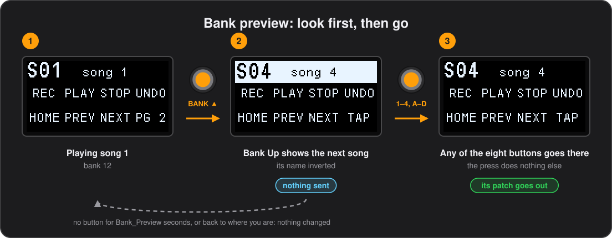

# Banks

The pedal holds 32 banks of eight buttons. This chapter is about moving between them and what a bank does when you get there.

## Bank_Naming

One row per bank, `Bank_Number` 0–31: `Bank_Name_Large` (4 characters, big font) and `Bank_Info_Small` (8 characters, small font).

## Bank changes

`CommandType` `Bank` switches bank. `KeyMode` selects the action: `GoTo` jumps to the bank number in `OnValue` (0–31), `Up` and `Down` move by the number of banks in `OnValue`, wrapping around. The change is applied after the button's remaining commands have been sent, so a button can send MIDI and then move to another bank. Nothing else in the command is used.

## Back to the bank you came from

`KeyMode` `Back` returns to the bank the last bank change left, whoever asked for it: a button, a `Bank` command, the setlist, Bank Up / Down or the computer. It takes no value. A utility bank — a tuner, a set of solo boosts — is then one button away and one button back, wherever you were, and since going back records the bank you left, a `Back` button in each of two banks flips between them. Showing a second page is not a bank change, so `Back` on a page returns to the bank the page's bank was reached from, not to the page's own bank; leaving a bank from its page counts as leaving the bank. The pedal forgets it when the configuration changes, and after a power cycle, so a `Back` pressed before any bank change does nothing. Stored as low nibble 6 of the `Bank` command. Needs firmware 0.49; older firmware takes it as `GoTo` bank 0. The demo's bank 10 button B, PREV, is one.

## Second page

`KeyMode` `Page` shows the bank in `OnValue` in place of the current one, as its second page: its eight buttons, labels, names, LED modes and press types take over the switches, like a shift key. Pressing a `Page` button again, on the page, goes back; the page's own `Page` button usually sits on the same switch, with the first bank in its `OnValue`, and stays lit while the page is shown. The page is a bank like any other and could be used on its own, but reached this way it belongs to the bank it came from:

- Nothing of the bank is sent again on coming back: its enter commands went out when you entered it.
- The page's enter commands go out when it is shown, and its leave commands when you go back, so a page can switch something on the device and off again. Leave them empty for a page that only changes the switches.
- Bank Up / Down, relative `Bank` commands and the setlist move on from the bank, not the page, and leave the page on the way.
- The expression pedals keep the bank's `BankExpression_Settings` and whatever `Exp` commands set. Their toe, heel and auto-engage buttons press the button of the page shown.
- Text the computer wrote until the bank changes stays on the display.
- After a power cycle with `Remember_State`, the pedal comes back on the bank, not on its page. Each page keeps its own toggle states, like any bank.
- `GoTo`, a bank change from incoming MIDI or a configuration switch leave the page too, sending its leave commands and then the bank's.

## Configuration slots

Two more `Bank` command modes switch configuration instead of bank. `Config` switches to the slot in `OnValue`, 1 to 4, and `NextConfig` moves to the next slot that holds a configuration, wrapping round. The switch waits until every switch is released, sends any timed release still pending so nothing is left hanging, and starts the new configuration from bank 0 with every toggle off, showing its number and name full screen. Asking for an empty slot, or for the next one when no other holds a configuration, shows a short notice instead. The active slot is remembered across power cycles whatever `Remember_State` says; the bank and toggles are only restored when the configuration being started asks for them. A slot holds a configuration when its `ConfigName` is sixteen printable characters, which the tools always write.

## BankEnter_Settings

Optional; one row per bank with the same ten command slots as a button, minus the button columns. These commands are sent once when the bank is entered, from any source: the bank switches, a `Bank` command or an incoming MIDI message. No release is sent, and `Bank` commands are ignored so entering a bank cannot chain into another one. Edit it in the configurator's **Bank Enter** tab.

### Commands on leaving a bank

A `Leave` command, which takes no fields, splits the list in two: the commands above it are sent on entering the bank, those below it on leaving it. A bank that switches a delay on as it is entered, for instance, has `CC 59 127`, `Leave`, `CC 59 0`, and the delay goes off again whichever way you leave. The leaving commands go out just before those of the bank being entered, whatever took you there, a bank switch, a `Bank` command or incoming MIDI, and also when you change configuration, before the new one's first bank is entered. They are sent straight through: a `Wait` among them is skipped, so the two lists never overlap, and a `Wait` at the top of the next bank's list is how to space them out. The ten slots are shared by both parts and the `Leave` takes one of them; the tools refuse a second `Leave`, or one anywhere else than a bank's list. Like `Wait`, a `Leave` is marked by the low nibble of the empty command type, 4, so the layout is unchanged. Needs firmware 0.40; older firmware sends both parts on entering.

## BankSwitch_Settings

Optional; four rows, one per switch and press length: `Switch` `Down` or `Up`, `Press` `Short` or `Long`, then the same ten command slots as a button. Rows may be missing or in any order.

These lists are global, not per bank, because the switches are navigation and should behave the same wherever you are. Each list fires as a tap, press then release, so a `Toggle` command flips once per press and keeps its own state. `Bank` commands are ignored here; where you end up is decided by the switch itself and by `Bank_Switch_Mode`. Nothing is sent while the mode is `Bank`. Edit it in the configurator's **Bank Switch** tab.

## Bank preview

With `Bank_Preview` set to a number of seconds in the [global settings](12-configuration-file.md#global_settings), Bank Up and Bank Down stop changing bank straight away. They show the bank they would go to, its name inverted, and send nothing; one of the eight buttons takes you there. A bank switch brushed in the middle of a song cannot change the patch, and a preview left alone goes away by itself.

## Setlist

Optional; rows of `Position` and `Bank_Number` (0–31). Up to 32 entries, ordered by `Position`, so rows may be in any order and positions may skip numbers; invalid bank numbers are dropped. It only takes effect while `Setlist_Mode` is on, so you can keep a list stored and switch it off. A bank may appear more than once, but stepping from it always continues from its first appearance. Edit it in the configurator's **Setlist** tab.

---

[← The configurator](03-the-configurator.md) · [Contents](README.md) · [Buttons →](05-buttons.md)
