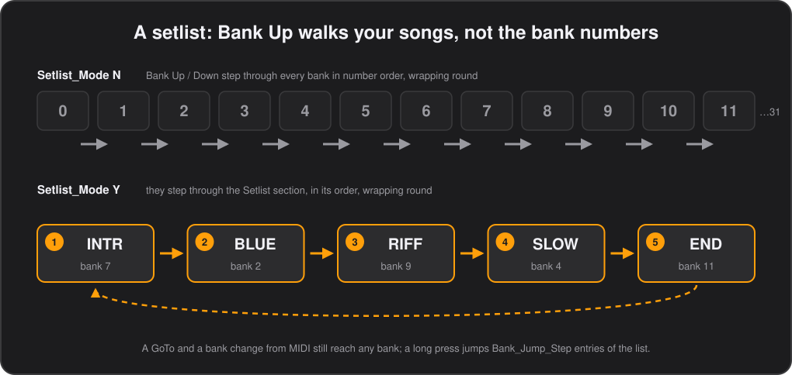

# Banks

**English** · [Español](../es/04-banks.md)

The pedal holds 32 banks of eight buttons, numbered 0 to 31. A bank is usually a song, or a patch, or a set of controls you want under your feet together. This chapter covers:

- how you move between banks: Bank Up and Bank Down, a setlist, a preview before you commit, and buttons that jump;
- what a bank does when you get there and when you leave: the commands it sends on entry and on leaving;
- second pages, which double the buttons of a song;
- the four complete configurations one pedal can hold, and how to switch between them.

## Bank names

Each bank has a name the display shows in large letters, 4 characters, and an info line beside it in small ones, 8 characters: `S01` and `song 1`, `FX` and `led mode`. Set them in the configurator's **Banks** tab.

### `Bank_Naming`

One row per bank, `Bank_Number` 0–31: `Bank_Name_Large` (4 characters, big font) and `Bank_Info_Small` (8 characters, small font). Rows may be missing: a configuration that only defines the first few banks, including one written for the 8 bank firmware, flashes unchanged and leaves the rest empty.

## Bank Up and Bank Down

The two switches on the right step through the banks. A short press on **Bank Up** or **Bank Down** moves one bank, and acts when you let go. Held past `Long_Press_ms` (500 ms unless set), it jumps several banks at once, as soon as that time is reached; how many is **Long press jumps** in the configurator's **Global** tab, `Bank_Jump_Step` in the CSV, 1 to 31, 8 unless set. Both wrap around, from 31 to 0 and from 0 to 31.

What they do can be changed with **Bank switches** in the **Global** tab, `Bank_Switch_Mode`:

| `Bank_Switch_Mode` | What Bank Up / Down do |
|---|---|
| `Bank` | Change bank, and nothing else. The default. |
| `Bank+MIDI` | Change bank, and also send their own commands (see [What the bank switches send](#what-the-bank-switches-send)). |
| `MIDI only` | Send their own commands and never change bank, which turns the pedal into a plain ten switch controller. |

Held together for two seconds, Bank Down and Bank Up open the [editor on the pedal](10-editing-on-the-pedal.md) instead.

## Setlist

For a gig you rarely want banks 12, 13, 14 in number order: you want tonight's songs, in tonight's order, wherever they live. A setlist makes Bank Up and Bank Down walk that order instead of the bank numbers.

In the configurator, put the banks in order in the **Setlist** tab, one drop-down per position, and tick **Follow the setlist** in the **Global** tab. The list ends at its first empty row.

- Bank Up / Down, their long press and relative `Bank` commands follow the list, and wrap round at both ends. A long press jumps `Bank_Jump_Step` entries of the list.
- From a bank that is not in the list, Up enters it at its first entry and Down at its last.
- A bank may appear more than once, but stepping from it always continues from its first appearance.
- A `GoTo` and a bank change from incoming MIDI still go to the exact bank asked for.
- The list only counts while **Follow the setlist** is on, so you can keep one stored and switch it off.

### In the CSV

`Setlist_Mode` `Y` in `Global_Settings` turns it on, `N` (the default) off. The `Setlist` section is optional: rows of `Position` and `Bank_Number` (0–31). Up to 32 entries, ordered by `Position`, so rows may be in any order and positions may skip numbers; invalid bank numbers are dropped.

## Bank preview

In the middle of a song, a foot that brushes Bank Up changes the patch, and the song with it. With the bank preview on, Bank Up and Bank Down only *show* the bank they would go to and send nothing; one of the eight buttons takes you there.

Turn it on with **Preview banks** in the **Global** tab, `Bank_Preview` in the CSV: the number of seconds a preview waits for you, 1 to 60. 0 is off, the default. On the pedal's own editor it is `PREVIEW`.

- A press, or a long press, on Bank Up / Down moves the bank shown as it would have moved the bank itself, setlist included. The display shows that bank's name inverted, white with black letters, over its button labels.
- Nothing is sent while you look: neither the banks' commands nor the bank switches' own.
- The first of the eight buttons to go down confirms it. The pedal goes there as Bank Up / Down would have, the leave and enter commands included, and that press does nothing else, nor does its release. A button that was already down when the preview began finishes its own press as usual.
- The bank switches' own commands (`Bank+MIDI`) are not sent when you confirm either.
- Stepping back to the bank you are in drops the preview, and so does leaving it alone for the seconds set: the display goes back to the bank you are in, and nothing has changed.
- A bank change from MIDI, a configuration switch or the editor opening drop it too.
- Tempo readouts and texts from the computer wait until the preview is over.
- With **Bank switches** at `MIDI only` the bank switches do not change bank, so there is nothing to preview.

*Firmware 0.66 or later.*

## Buttons that change bank

Any button can move you between banks with a `Bank` command, alongside whatever else it sends. In the configurator choose `Bank` as the command type and an **Action**:

| Action | What it does |
|---|---|
| `GoTo` | Jumps to the bank given, 0–31. One bank full of `GoTo` buttons makes an index of your songs. |
| `Up`, `Down` | Moves that many banks, 1–31, wrapping around, and following the setlist while it is on. |
| `Back` | Returns to the bank you came from, see below. |
| `Page` | Shows another bank as this one's [second page](#second-page). |
| `Config`, `NextConfig` | Switches to another [configuration](#four-configurations). |

The change happens after the button's remaining commands have been sent, so a button can send MIDI and then move to another bank. In the CSV it is `CommandType` `Bank`, with the action in `KeyMode` and the bank or the number of banks in `OnValue`; nothing else in the command is used.

### Back to the bank you came from

A utility bank — a tuner, a set of solo boosts — is most useful one button away and one button back, wherever you were. `Back` returns to the bank the last bank change left, whoever made it: a button, a `Bank` command, the setlist, Bank Up / Down or the computer. It takes no value.

- Going back is itself a bank change, so it records the bank you left: a `Back` button in each of two banks flips between them.
- Showing a second page is not a bank change, so `Back` on a page returns to the bank the page's bank was reached from, not to the page's own bank. Leaving a bank from its page counts as leaving the bank.
- The pedal forgets where you came from when the configuration changes and after a power cycle, so a `Back` pressed before any bank change does nothing.

The demo's bank 10 button B, PREV, is one.

*Firmware 0.49 or later.*

Under the hood

Stored as low nibble 6 of the `Bank` command. Firmware before 0.49 takes it as `GoTo` bank 0.

## Second page

Eight buttons are not always enough for a song. A `Page` button shows another bank in place of the current one, as its second page: that bank's eight buttons, labels, names, LED modes and press types take over the switches, like a shift key. Pressing a `Page` button again, on the page, goes back.

Set it up with a `Bank` command, **Action** `Page`, naming the page's bank. On the page, put a `Page` button on the same switch naming the first bank, so the same switch goes there and back; a button holding `Page` stays lit while the page is shown.

The page is a bank like any other and could be used on its own, but reached this way it belongs to the bank it came from:

- Nothing of the bank is sent again on coming back: its enter commands went out when you entered it.
- The page's enter commands go out when it is shown, and its leave commands when you go back, so a page can switch something on the device and off again. Leave them empty for a page that only changes the switches.
- Bank Up / Down, relative `Bank` commands and the setlist move on from the bank, not the page, and leave the page on the way.
- The expression pedals keep the bank's `BankExpression_Settings` and whatever `Exp` commands set. Their toe, heel and auto-engage buttons press the button of the page shown.
- Text the computer wrote until the bank changes stays on the display.
- After a power cycle with `Remember_State`, the pedal comes back on the bank, not on its page. Each page keeps its own toggle states, like any bank.
- `GoTo`, a bank change from incoming MIDI or a configuration switch leave the page too, sending its leave commands and then the bank's.

In the demo, song 1 (bank 12) has PG 2 on D, which shows bank 31.

*Firmware 0.47 or later.*

## Commands on entering and leaving a bank

Most rigs want the same thing every time you reach a song: its patch. Each bank can send up to ten commands of its own as you enter it, typically a Program Change, so no button is spent on it, and more as you leave it, to switch off what it switched on.

Edit them in the configurator's **Bank Enter** tab. The list takes the same commands as a button.

- The commands are sent once when the bank is entered, whatever took you there: the bank switches, a `Bank` command or an incoming MIDI message. No release is sent.
- `Bank` commands are ignored here, so entering a bank cannot chain into another one.

### Commands on leaving a bank

A `Leave` command, which takes no fields, splits the list in two: the commands above it are sent on entering the bank, those below it on leaving it. A bank that switches a delay on as it is entered, for instance, has `CC 59 127`, `Leave`, `CC 59 0`, and the delay goes off again whichever way you leave.

- The leaving commands go out just before those of the bank being entered, whatever took you there, a bank switch, a `Bank` command or incoming MIDI, and also when you change configuration, before the new one's first bank is entered.
- They are sent straight through: a `Wait` among them is skipped, so the two lists never overlap. A `Wait` at the top of the next bank's list is how to space them out.
- The ten slots are shared by both parts and the `Leave` takes one of them. The tools refuse a second `Leave`, or one anywhere else than a bank's list.

The demo's bank 11 sends CC 59 127 as it is entered and CC 59 0 as it is left.

*Firmware 0.40 or later for `Leave`.*

Under the hood

Like `Wait`, a `Leave` is marked by the low nibble of the empty command type, 4, so the layout is unchanged. Firmware before 0.40 sends both parts on entering.

### `BankEnter_Settings`

Optional; one row per bank with the same ten command slots as a button, minus the button columns.

## What the bank switches send

Bank Up and Bank Down can send MIDI of their own, for a device that wants to hear about it — a looper's next track, a DAW's next marker — or, with the bank change switched off, to be two more footswitches. Each switch has a list for a short press and one for a long press.

Edit them in the configurator's **Bank Switch** tab, and choose in the **Global** tab whether they are sent: with **Bank switches** at `Bank`, the default, nothing is sent; at `Bank+MIDI` they are sent along with the bank change; at `MIDI only` they are all the switches do. See [Bank Up and Bank Down](#bank-up-and-bank-down).

- The lists are the same in every bank, because the switches are navigation and should behave the same wherever you are.
- Each list fires as a tap, press then release, so a `Toggle` command flips once per press and keeps its own state.
- `Bank` commands are ignored here: where you end up is decided by the switch itself and by `Bank_Switch_Mode`.

*Firmware 0.17 or later.*

### `BankSwitch_Settings`

Optional; four rows, one per switch and press length: `Switch` `Down` or `Up`, `Press` `Short` or `Long`, then the same ten command slots as a button. Rows may be missing or in any order.

## Four configurations

One pedal can hold four complete configurations, one per band or venue for instance, each with its own 32 banks and settings. The configurator's **Slot** selector chooses which one **Read from Device** and **Flash to Device** act on; flashing one never touches the others.

To switch between them from the pedal, give a button a `Bank` command with **Action** `Config`, naming the slot, 1 to 4, or `NextConfig`, which moves to the next slot that holds a configuration, wrapping round.

- The switch waits until every switch is released, and sends any timed release still pending, so nothing is left hanging.
- The new configuration starts from bank 0 with every toggle off, and the display shows its number and name full screen.
- Asking for an empty slot, or for the next one when no other holds a configuration, shows a short notice instead.
- While a tool is writing a slot, and for 10 seconds after its last write, a switch is refused and the display says `UPLOAD`: the upload goes on into the slot it started on (firmware 0.79 or later).
- The pedal comes back on the active slot after a power cycle, whatever `Remember_State` says; the bank and toggles are only restored when the configuration being started asks for them.
- A slot holds a configuration when its `ConfigName` is sixteen printable characters, which the tools always write.

*Firmware 0.24 or later.*

---

[← The configurator](03-the-configurator.md) · [Contents](README.md) · [Buttons →](05-buttons.md)
