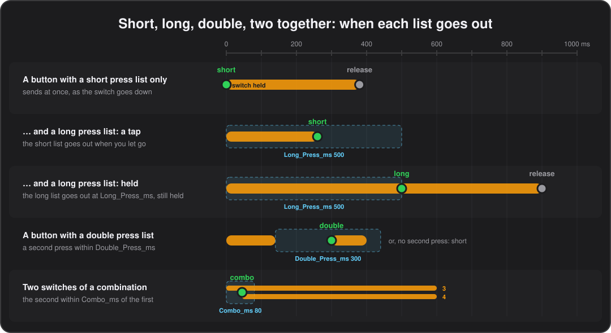

# Buttons

**English** · [Español](../es/05-buttons.md)

Every button has three command lists, a short, a long and a double press, a label on the display, a light and a few options that change how it behaves.

In the configurator all of this is the **Buttons** tab: pick a bank, then a button from the eight laid out as on the pedal. At the top of the editor are its **display label**, **LED light mode** and **exclusive group**, and the **Momentary when held**, **Flash at the tempo** and **Global** boxes; below them, ten command slots, and **Short press / Long press / Double press** to switch between the three lists.

## Short, long and double press

A button can do three different things: one on a tap, another when held, a third on two quick taps. A delay on a tap, the tuner when held, and the looper on a double tap, all under one foot.

- **Short press.** The list every button has. A button with nothing else to wait for sends it the moment the switch goes down.
- **Long press.** A second list of up to ten commands, sent once the button has been held past **Long press after** (`Long_Press_ms`, 500 ms unless set, from 100 to 2500) in the Global tab. It goes out at that moment, while you are still holding. A button that has long press commands sends its short press when you let go instead, as long as that happens before the time is up.
- **Double press.** A third list, sent by two presses within **Double press within** (`Double_Press_ms`, 300 ms unless set, from 100 to 1000). It goes out as the second press goes down.

Only buttons that have double press commands in the current bank change behaviour: a single tap on them waits for that window before sending its short press, and holding them still gives the long press, or the short press when there is none. Buttons without long or double press commands react instantly, exactly as before.

Long and double press commands each have their own toggle state, apart from the short press's. Copy / Paste bank in the configurator carries all three lists.

*Double press: firmware 0.26 or later.*

Under the hood

`CSV_to_Flash.py` leaves the double press commands out, with a warning, when the pedal runs firmware older than 0.26.

## Two switches together

Pressing a pair of switches at once, 3 and 4 with one foot for instance, runs a list of its own instead of what either switch does alone, the way Boss and Morningstar controllers reach the tuner or the looper.

Set it up in the configurator's **Combos** tab, one row per combination, up to twelve: the two switches, the bank it counts in or all banks, and the list it runs. How long a switch waits for the other one is **Two switches together within** (`Combo_ms`) in the Global tab.

- **What it runs.** A combination has no commands of its own: it runs a list stored on a button, any button's short, long or double press, named the way a [`Macro`](06-commands.md#macros) names one. Keep those lists on a button of a bank you keep spare, the global bank for instance, where they can also be tried by pressing that button.
- **Which bank.** A combination counts in one bank or in all of them. A combination of the bank showing wins over an all-banks one for the same pair, which is how one bank gives a pair another job.
- **Timing.** A switch that belongs to a combination in the current bank does not fire at once: it waits `Combo_ms`, 80 ms unless changed, for the other one, which one foot on two switches comfortably makes. If the other comes in time, the pair runs the combination and neither switch sends its own. If it does not, the press carries on as it would have, into a short, long or double press, the wait counted in, and a tap let go inside the window is still a tap.
- **Everything else answers at once.** Switches in no combination, and every switch in a bank without any, answer at once as before.
- **Release.** The list runs on the press with a toggle state of the combination's own, and its release, the momentary offs, goes out when the first of the two switches lets go. `Wait`, `If`, `Macro` and the rest work in it as anywhere else.
- Two presses of the same switch are still a double press, not a combination, and the two bank switches keep their own gesture, the [on-pedal editor](10-editing-on-the-pedal.md).

In the demo, 3+4 toggles a tuner in every bank and clears the looper on song 1.

*Firmware 0.59 or later.*

Under the hood

A combination costs four bytes rather than ten commands: there was no room left for a list of its own. The firmware reads the table from the last 48 bytes of the configuration slot; older firmware ignores it and the two switches do what they do alone.

## Toggles and when the "off" is sent

Most commands have an "on" and an "off": a CC's `OnValue` and `OffValue`, a note on and off. Whether a button is momentary, timed or a toggle decides when the off goes out:

| `Toggle` | `Duration` | What happens |
|---|---|---|
| N | 0 | On when pressed, off when released: momentary. |
| N | more than 0 | On when pressed, off automatically after the duration, even if still held. Notes, pitch bend and keys only; a CC ignores the duration. |
| Y | | The first press sends on, the next sends off, and so on. |

Toggle state is kept per button and per bank, and drives the LED and the display cell.

## The light and the label

Each button has a label of up to 4 characters on the display, in a grid laid out like the pedal; a button without one shows its identifier. Cells of toggle buttons are drawn inverted while they are on.

Its LED follows one of three modes, the **LED light mode** in the configurator:

- **Normal**: lit while the button is active, off otherwise.
- **Reverse**: lit at rest, off while active.
- **AlwaysOn**: lit at rest, blinking while active.

"Active" means physically pressed for a momentary button, or toggled on when any of the button's commands is a toggle. A lit LED uses **Brightness** (`LED_Brightness`) from the Global tab's LEDs group, and one lit at rest uses **Brightness at rest** (`LED_Rest_Brightness`), so an active button can stand out from an idle one. LEDs are dimmed by software PWM at 500 Hz, so there is no visible flicker.

**Flash at the tempo** (`Tempo_Flash`) makes any button's LED flash with the beat; see [Tap LED](07-tempo.md#tap-led).

## Latch or momentary

A toggle that latches on a tap and works as a momentary switch when held, like the boost on a Boss or Morningstar pedal: tap it on for the song, or hold it for a solo and it goes back off when you let go.

Tick **Momentary when held** (`Momentary_Hold` `Y`) on a button with a toggle command in its short press list.

- It toggles as soon as it is pressed, as always.
- Held past `Long_Press_ms` (500 ms unless set), it presses itself once more when released, so it goes back to where it was: on only while held if it was off, off only while held if it was on.
- A tap shorter than that latches as usual.
- The hold belongs to the long press list when the button has one, so the option does nothing on such a button, nor on a cycle button.
- In an exclusive group, holding a button switches the others off and they stay off.

The demo's bank 11 button 4, BOST, uses it.

*Firmware 0.39 or later; older firmware ignores the option and the button simply toggles.*

Under the hood

The option is bit 7 of the button's LED mode byte, which configurations have always left at zero, so the layout is unchanged.

## Exclusive groups

Like the channel buttons of an amp, or a choice between two delays: switching one button of a group on switches the others off.

Choose the **exclusive group** (`Group`, 1 to 4) beside the LED mode. Buttons of a bank in the same group are tied together:

- Switching one on switches off every other one of the group that is on, as if pressed by foot, so their off commands go out and their LEDs and display cells follow.
- They are switched off before the pressed button sends anything, so when the whole group drives one parameter, an amp channel CC for instance, the device ends up where the pressed button says.
- Pressing the lit button switches it off like any toggle, leaving the group all off.
- Only buttons with a toggle command take part, and only their short press.
- Groups are per bank: group 1 in one bank has nothing to do with group 1 in another.
- A scene can switch on two buttons of a group, and the last one wins.

The demo groups the four track buttons of the looper bank. Copy / Paste bank carries the groups.

*Firmware 0.32 or later.*

Under the hood

The group lives in the top bits of the button's LED mode byte, which configurations have always left at zero, so the layout is unchanged. Firmware before 0.32 reads a button with a group as `Normal` LED mode.

## Scenes

One press puts the toggle buttons of the bank into a chosen combination, delay on and chorus off for instance.

A scene is a command, `CommandType` `Scene`, which the configurator shows as eight drop-downs, one per button. In the CSV, `OnValue` holds eight characters, one per button in the order `1234ABCD`: `+` to switch it on, `-` to switch it off, and `.` or anything else to leave it alone. So `+-+..-..` turns 1 and 3 on and 2 and B off.

- Each affected button that is not already in the wanted state is pressed as if by foot, so its own commands, LED and display cell follow.
- Buttons already there are not touched, so recalling the same scene twice sends nothing the second time.
- Buttons without a toggle command have no state and are skipped.
- A scene cannot trigger another scene.

The demo puts three on the long presses of the LED modes bank.

## Cycle buttons

One button steps through several states, each with its own commands and its own label on the display: the four channels of an amp on a single switch, one press each, round and round.

`CommandType` `Cycle` splits a button's short press commands into states. The commands above the first `Cycle` are state 1, those between it and the next `Cycle` state 2, and so on. For an amp with four channels on Program Changes 0 to 3, the button's commands are:

`PC 0`, `Cycle "CH B"`, `PC 1`, `Cycle "CH C"`, `PC 2`, `Cycle "CH D"`, `PC 3`, with `CH A` as the button's label.

- Each press sends the next state's commands, back to state 1 after the last one.
- The display cell shows the label of the state just sent: the `Cycle` command's `OnValue`, up to 4 characters, or the button's own `Label` for state 1 and for a `Cycle` left without one.
- A button starts before its first state, so its first press sends state 1.
- The `Cycle` commands take command slots too, so the ten slots hold five states of one command each.
- A state may hold several commands, pauses, ramps and repeating commands, which then repeat only while that state's press is held.
- Every cycle button of every bank keeps its place while the pedal is on, whatever banks you visit in between. A change of configuration, or switching the pedal off, starts them all from the beginning again.
- `Cycle` belongs in the short press list only: the tools refuse it in a long or double press, a bank's commands on entry or the Bank switches' lists.
- The labels are kept in a table of 48, each different label stored once however many buttons use it, and the tools refuse a configuration with more.

The demo's bank 11 D steps through four amp channels.

*Firmware 0.38 or later; older firmware ignores the `Cycle` commands and sends every state at once.*

Under the hood

The label table sits at the end of the configuration. Like `Wait`, a `Cycle` is marked by the low nibble of the empty command type, 3, with byte 1 holding the label's place in the table, or 0x7F for none.

## Global buttons

A tuner, a panic, a tap tempo: the things that should be under the same foot all night. Without this they mean the same commands copied into all 32 banks, and a change means changing them 32 times.

Instead, set one bank aside for them with **Global buttons bank** (`Global_Bank`) in the Global tab, write those buttons there once, and in every other bank tick **Global** (`Global` `Y`) on the buttons that should follow it. On the pedal the setting is `GLOBBANK` in the [editor](10-editing-on-the-pedal.md), the bank number as the editor shows it or 0 for none.

- A global button takes everything from the same button of that bank: its short, long and double press lists, its label on the display, its light mode, its exclusive group and whether it is on. So the tuner is lit in every bank at once, and switching it off in one switches it off in all of them.
- What is written on the button in its own bank is left alone and never sent: a button cannot be global and be something of its own as well.
- The bank set aside is an ordinary bank otherwise. You can stand on it, its own buttons work as they always did, and it is where the global buttons are edited, on the pedal or in the configurator. Its own buttons never follow anything, so nothing can go round in circles.
- `Global_Bank` set to `Off`, which is what every configuration written before this holds, redirects nothing and every button is its own again.
- Like the macros, it gives configuration room back rather than taking it: what it saves is the copies.

In the demo, bank 30 is set aside and holds the tap, and every song bank but the first takes its D from there; the first keeps its own, which is the way to its second page.

*Firmware 0.57 or later; older firmware ignores the flag and sends whatever is written on the button itself.*

Under the hood

The flag is bit 3 of the button's LED mode byte, which configurations have always left at zero, so the layout is unchanged.

## In the CSV

### Button_Settings

One row per button, 256 rows in bank order and, within a bank, in the order `1, 2, 3, 4, A, B, C, D` (top row of the pedal, then bottom row). Columns:

- `Bank_Number`, `Button_Identifier`
- `Label`: up to 4 characters shown on the display. Empty shows the button identifier.
- `Light_Mode`: Normal / Reverse / AlwaysOn.
- `Group`: empty, or an exclusive group 1–4 (see [Exclusive groups](#exclusive-groups)).
- `Momentary_Hold`: `Y` for a toggle button that is momentary when held (see [Latch or momentary](#latch-or-momentary)); empty or `N` otherwise.
- `Tempo_Flash`: `Y` for a button whose LED flashes with the beat (see [Tap LED](07-tempo.md#tap-led)); empty or `N` otherwise.
- `Global`: `Y` for a button that takes everything from the same button of `Global_Bank` (see [Global buttons](#global-buttons)); empty or `N` otherwise.
- Ten command slots, prefixed `A_` to `J_`, each with the fields in [Commands](06-commands.md#command-fields).

Rows are optional here and in `Bank_Naming`: a configuration that only defines the first few banks, including one written for the 8 bank firmware, flashes unchanged and leaves the rest empty. The configurator always shows all 32 banks and writes them all when you save.

### LED modes

`Light_Mode` is one of `Normal`, `Reverse` or `AlwaysOn`, as described under [The light and the label](#the-light-and-the-label).

### LongPress_Settings

Optional. `Bank_Number`, `Button_Identifier` and the ten command slots: the columns of `Button_Settings` without the label and the light, group and hold ones, which belong to the button. Rows may be missing or in any order; a button without a row has no long press commands and reacts instantly on press.

### DoublePress_Settings

Optional, and laid out exactly like `LongPress_Settings`: the third command list of each button, fired by two quick presses (see [Short, long and double press](#short-long-and-double-press)).

### Combo_Settings

Optional; one row per combination, up to twelve, in any order (see [Two switches together](#two-switches-together)).

| Column | Values | Meaning |
|---|---|---|
| `Switches` | two of 1–4, A–D, such as `3+4` | The pair. The order does not matter. |
| `Bank` | All / 0–31 | The bank it counts in, or `All` for every bank. A combination of the bank showing wins over an `All` one for the same pair. |
| `Run_Bank`, `Run_Button`, `Run_List` | 0–31, 1–4 or A–D, Short / Long / Double | The list it runs, any button's, as a [`Macro`](06-commands.md#macros) names it. |

---

[← Banks](04-banks.md) · [Contents](README.md) · [Commands →](06-commands.md)
