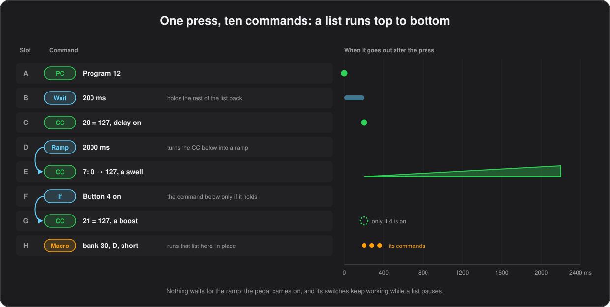

# Commands

What a button can send. Every list, short, long or double press, a bank's commands on entry and leaving, and the bank switches', holds up to ten of these, sent in order.

## Command fields

| Field | PC | CC | Note | PB | Key | Meaning |
|---|---|---|---|---|---|---|
| `CommandType` | | | | | | `PC`, `PCInc`, `CC`, `CCInc`, `Note`, `PB`, `Key`, `Media`, `Bank`, `SysEx`, `Tap`, `Start`, `Stop`, `MMC`, `Song`, `Panic`, `Scene`, `Wait`, `Ramp`, `LFO`, `Seq`, `Exp`, `Chan`, `Value`, `If`, `Macro`, `Cycle` (short press only), `Leave` (a bank's enter list only), or empty for none |
| `Channel_(PC/CC/Note/PB)` | ✓ | ✓ | ✓ | ✓ | | MIDI channel 1–16. Exp: empty for the pedal's own. Chan: the list of channels, `1 2 3` or `1-3` |
| `Number_(PC/CC/Note)` | ✓ | ✓ | ✓ | | ✓ | PC: program 0–127. CC: controller number. Note: note number. Key: modifier mask. Exp: the CC the pedal sends. Value: which of the eight, 1–8. If: the button it looks at, `1`–`4` or `A`–`D`, or the value, 1–8. Macro: the button, `1`–`4` or `A`–`D` |
| `OnValue_(CC/PB)` | | ✓ | | ✓ | ✓ | CC: value on press (0–127). PB: −8192..8191. Key: key name. Media: media key name. Cycle: the state's label, up to 4 characters. Exp: the pedal, 1 or 2. MMC `Locate`: where to go, in seconds. Song: the song number 0–127, or the position in sixteenth notes. LFO: the length of a cycle, `1/16T` `1/16` `1/8T` `1/8` `1/4T` `1/8.` `1/4` `1/2T` `1/4.` `1/2` `1/2.` `1/1` `2/1` `4/1` (empty for `1/4`). Seq: its two steps, a value 0–127 or `-` for a silent one, `100 -`. Value: the amount. If: what the value is compared with, or the bank. Bank: the bank, or how many to move. Macro: the bank the button is in |
| `OffValue_(CC)` | | ✓ | | | | CC: value on release / toggle off (0–127). Value: the highest it goes, 127 when empty |
| `BankSelect_(PC)` | ✓ | | | | | 0–16383, sent as CC#32 (LSB) before the PC |
| `BankSelectHighByte_(PC)` | ✓ | | | | | Y: also send CC#0 (MSB) |
| `Toggle_(CC/PB/Note)` | | ✓ | ✓ | ✓ | ✓ | Y: alternate on / off on successive presses. Key / Media: hold until the next press |
| `Velocity_(Note)` | | | ✓ | | | 0–127 |
| `Duration_(Note/PB)` | | | ✓ | ✓ | ✓ | In 10 ms steps, 0–127 (max 1.27 s). Media: same as Key. Wait: the pause in milliseconds, up to 2550. Ramp: its time in milliseconds, up to 655350 |
| `KeyMode_(Key)` | | | | | ✓ | Normal / Down / Up. CCInc and PCInc: Up / Down / Up Repeat / Down Repeat. Tap: Tap / Clock / Set / Up / Down / Up Repeat / Down Repeat. Exp: CC / Off / Own. LFO: Sine / Triangle / SawUp / SawDown / Square / Random (empty for Sine). Seq: how long a step lasts, the same note divisions as the LFO (empty for `1/8`), read from the first command of the run. MMC: Play / Stop / Record / RecordExit / Pause / FastForward / Rewind / Locate / DeferredPlay / Chase / Eject / Reset (empty for Play). Song: Select / Position. Value: Set / Add / Sub (empty for Set). If: Button on / Button off / Value = / Value <> / Value < / Value >= / Bank is / Bank is not. Bank: GoTo / Up / Down / Back / Page / Config / NextConfig. Macro: Short / Long / Double |

`Start` and `Stop` take no parameters; they send MIDI Start (0xFA) / Stop (0xFC) over USB and DIN.

## Keyboard keys

`Number` is the sum of the modifiers: 1 Ctrl, 2 Shift, 4 Alt, 8 Cmd/Win (3 = Ctrl+Shift). `OnValue` is a single character (`a`, `7`) or one of `enter`, `esc`, `tab`, `space`, `backspace`, `minus`, `equal`, `leftbr`, `rightbr`, `backslash`, `semicolon`, `quote`, `grave`, `comma`, `dot`, `slash`, `f1`–`f12`. `KeyMode`: **Normal** taps the key (held for `Duration` if set); **Down** presses and leaves it pressed, **Up** releases it, both after a `Duration` delay, so one button can build combinations across several slots. `Toggle` holds the key until the next press.

## Media keys

`CommandType` `Media` sends a USB consumer-control key to the computer, the same ones a keyboard's media buttons send, so they work in any player or DAW without MIDI mapping. `OnValue` is one of `play_pause`, `play`, `pause`, `stop`, `next`, `prev`, `record`, `fast_forward`, `rewind`, `eject`, `mute`, `vol_up`, `vol_down`, or a raw usage number (`0xE9`). The key is tapped on press and released on release, held for `Duration` if set, or held until the next press with `Toggle`. `Number` and `Channel` are unused.

## Relative CC

`CommandType` `CCInc` sends a CC whose value moves on every press instead of being fixed. `Number` is the CC, `OnValue` the value it starts from at power on, `OffValue` the step, `KeyMode` the direction (`Up` or `Down`, or `Up Repeat` or `Down Repeat` to repeat while held, below) and `Toggle` enables wrapping past the ends instead of sticking at 0 and 127. The running value lives in memory, one per command slot, and resets to the start value when the pedal is switched off.

## Next and previous preset

`CommandType` `PCInc` sends a Program Change one step up or down from the program last selected on its channel. That is whatever was sent last on the channel, by any PC command, by the commands of a bank being entered, or by the computer over USB, so the button always moves on from where the device really is; before anything has been sent it counts as program 0. The state is shared, so a Next and a Previous button work as a pair, and it is not kept across a power cycle. `Channel` is the channel, `KeyMode` the direction (`Up` or `Down`), `OffValue` the step (1 when empty), `Number` the last program of the range, 0 to 127 (127 when empty; a Line 6 HX Stomp, for instance, has 0 to 125), and `Toggle` makes it wrap round at the ends instead of stopping there. No Bank Select is sent. The new number shows on the display for a moment, as `PC 6`. Stored as a PC whose Bank Select MSB byte, where 0x80 and above already meant none, holds 0x81 for up or 0x82 for down; the step is in byte 1 and the last program in byte 3, with its top bit for wrapping. The demo puts PREV and NEXT on C and D of the program change bank, which sends PC 0 when entered.

## Repeat while held

With `KeyMode` `Up Repeat` or `Down Repeat`, a `CCInc` or `PCInc` command, or a `Tap` stepping the tempo, keeps firing while its button is held, like a key on a computer keyboard: once on the press, again after half a second, then every 200 ms, each gap a quarter shorter than the one before, down to one every 50 ms. A CC value can thus cross its whole range in about three seconds with a step of 2, while a tap still moves it a single step. Only the repeating commands of the list fire again, and they skip any `Wait`. A repeat that has hit an end and cannot move any further sends nothing, so a held button does not keep resending 127. Holding a button that has long press commands makes a long press, so its short list cannot repeat; its long press list can, and so can a double press list while the second press is held. Stored as the top bit of the step byte for `CCInc`, and as the markers 0x83 for up and 0x84 for down, in place of 0x81 and 0x82, for `PCInc`. Needs firmware 0.35; older firmware ignores the repeat on `CCInc` but sends a repeating `PCInc` as an ordinary, wrong, Program Change, so update the firmware first.

## One channel, or several

Two settings cover a rig that does not live on the channel the configuration was written for. `Global_Channel` moves everything: while it is set to a channel, every message the pedal sends goes out on it, whatever each command stores, the expression pedals included, so a configuration written for channel 1 drives a device listening on channel 9 without touching a single command. And `CommandType` `Chan` goes the other way, for one command: it names the channels in `Channel`, as `1 2 3` or `1-3`, and the command right below it is sent once on each of them, so one press mutes three devices or three amps change patch together. Naming channels is on purpose, so a `Chan` also beats the global channel: a `Chan 3` above a command keeps it on channel 3 while the rest of the configuration moves. Like a `Ramp`, a `Chan` only reaches the command directly below it, and it counts for the release too, so a momentary CC goes off on every channel it went on. Stored by the low nibble of the empty command type, 9, with the sixteen channels as a bit each: byte 2 for channels 1–7, byte 3 for 8–14 and the two low bits of byte 1 for 15 and 16. The global channel is byte 41 of the global settings, 0 meaning off. Both need firmware 0.51; older firmware ignores a `Chan` and the setting. In the demo, holding A in bank 11 mutes channels 1, 2 and 3 with one CC.

## Driving a recorder or a sequencer

`CommandType` `MMC` sends a MIDI Machine Control message to every device on the wire, over USB and DIN: the transport of a DAW, a hard disk recorder or a drum machine, from the pedal. `KeyMode` is the action: `Play`, `Stop`, `Record` (a record strobe, the punch in), `RecordExit` (the punch out), `Pause`, `FastForward`, `Rewind`, `DeferredPlay`, `Chase`, `Eject`, `Reset`, and `Locate`, which also takes `OnValue`, where to go in seconds from the start, up to 16383 (4h33m). A `Locate` goes out as a timecode of hours, minutes and seconds with the frames at zero, so `3725` is 1:02:05. Nothing is sent back: MMC is one way here, and the pedal does not follow a recorder's position. Stored like a `Wait`, by the low nibble of the empty command type, 7, with the MMC command byte in byte 1 and the seconds in bytes 2 and 3.

## Song Select and Song Position

`CommandType` `Song` with `KeyMode` `Select` sends a Song Select (0xF3) with the song number in `OnValue`, 0–127: the song, pattern or sequence a drum machine or a hardware sequencer should play. With `KeyMode` `Position` it sends a Song Position Pointer (0xF2) instead, `OnValue` being where in the song to start, counted in sixteenth notes, so 16 to a 4/4 bar and 0 for the top; a device usually waits there for the next Start or Continue. Neither message belongs to a MIDI channel, so there is no `Channel` to set, and both go out over USB and DIN. Put a `Select` in a bank's commands on entry and the recorder follows your setlist. Stored by the low nibble of the empty command type, 8: byte 1 says which message, bytes 2 and 3 the value. Both need firmware 0.50; older firmware ignores them, as it does an `MMC`.

## Custom SysEx

`CommandType` `SysEx` sends one of the messages stored in the `SysEx_Strings` section; `Number` selects which, 0 to 15. Nothing else in the command is used. The message goes to both USB and the DIN output.

## SysEx_Strings

Optional; sixteen rows with an `Index` (0–15) and `Bytes`. Write the bytes in hexadecimal as the device manual shows them, separated by spaces or commas, with an optional `0x` prefix. A leading `F0` and trailing `F7` are optional and added when sending. Up to 23 data bytes, each `00`–`7F`. A line that cannot be parsed is stored empty and the command sends nothing, rather than sending a malformed message. Edit it in the configurator's **SysEx** tab, which shows the byte count or a warning as you type.

## Panic

`CommandType` `Panic` sends All Sound Off (CC 120) and All Notes Off (CC 123) on all sixteen channels, to both USB and the DIN output. It takes no parameters. The 32 messages go out packed into two USB packets and two serial buffers, so a panic cannot itself run out of transmit buffers. It does not reset toggle states or controllers. A long press is a good place for it, where it cannot be hit by accident; the demo puts it on a long press of STOP in the tempo bank.

## Pauses

`CommandType` `Wait` sends nothing: it pauses the commands that follow it in the list. `Duration` is the pause in milliseconds, in steps of 10 and up to 2550. It is what a device that drops a Control Change arriving right behind a Program Change needs, and it also spaces out a chain the other end cannot swallow at once. The pedal does not stop to count: the rest of the list is picked up once the time is up, so other buttons, the expression pedals and the display keep working meanwhile. A button released while its list is still waiting has its release, the note off or the momentary off, held back until the list finishes, so nothing is switched off before it has been sent; pressing the same button again first sends whatever was left, without its pauses. Pauses work in every list: short, long and double press, bank enter and the bank switches. Four lists can be waiting at once, which is more than a foot can start; beyond that the pauses are skipped rather than queued. Needs firmware 0.30; older firmware sends the rest of the list without pausing.

## CC ramps

`CommandType` `Ramp` sends nothing itself: it turns the `CC` command right below it into a ramp. Instead of jumping to its value, that CC walks there over `Duration` milliseconds, in steps of 10 and up to 655350 (almost 11 minutes). On the press it walks to `OnValue`; on the release, or on the press that switches a toggle off, it walks back to `OffValue`. A ramp starts from the command's other end, `OffValue` on the way up and `OnValue` on the way down, so a swell sounds the same every time; a command whose `OffValue` is above 127, and so has no off value, starts from 0 and stays where it got to on the release. Starting a ramp on a channel and CC that is still ramping picks up from where that one got to, so pressing a toggle again halfway turns it round without a jump. The pedal does not stop while a ramp runs: switches, expression pedals and other ramps keep working, and a `Wait` below the CC can hold the rest of the list back until the ramp has finished. A ramp sends a message at most every 5 ms and only when the value changes, and always ends on the exact value. Eight ramps can run at once; beyond that a CC goes straight to its value. `Panic` stops every ramp. A `Ramp` above anything but a CC is ignored. Needs firmware 0.34; older firmware ignores the `Ramp` and sends the CC as usual.

## Changing an expression pedal's target

`CommandType` `Exp` changes what an expression pedal sends, so one pedal can drive the wah, then the volume, then a parameter. `OnValue` is the pedal, 1 or 2, and `KeyMode` says where it goes: `CC` sends it to the CC in `Number`, on `Channel` or, left empty, on the pedal's own channel; `Off` silences it; `Own` gives it back what it sends in this bank. It lasts until another `Exp` for the same pedal or a bank change, and it wins over the bank's `BankExpression_Settings`, even over a bank that silences the pedal, while the output range stays the bank's. With `Toggle` Y the command does it while the button is on, and switching the button off gives the pedal back its own target, so a button with `Exp 1 CC 7` as a toggle turns the wah pedal into a volume pedal and back, with the LED showing which. The pedal switches over on its next movement, like on a bank change, so the volume does not jump to where the wah was left. On entering a bank the pedals start from that bank's own targets, and then any toggling `Exp` on a button of the bank that is on takes effect again, so the pedals always match the LEDs, also after switching the pedal off and on. While an `Exp` has a pedal somewhere else, its auto-engage leaves its button alone. Like `Wait`, an `Exp` is marked by the low nibble of the empty command type, 5; byte 1 is the pedal with the toggle bit, byte 2 the CC, 0x80 for Off or 0x81 for Own, and byte 3 the channel, 0 for the pedal's own. Needs firmware 0.42; older firmware ignores it.

## Values and conditions

The pedal keeps eight values of its own, 0 to 127 each, all zero when it is switched on. `CommandType` `Value` changes one: `Number` says which, 1 to 8, `KeyMode` what to do with it — `Set` it to `OnValue`, `Add` that much or `Sub`tract it — and `OffValue` the highest it goes, 127 when empty, adding past it starting again at zero and taking away past zero starting again at it. So `Add 1` with a top of 2 counts 0, 1, 2, 0, 1… on successive presses. The values are not part of the configuration and are not saved: they are what a button remembers within a gig, and the tools report them with the rest of the pedal's state.

`CommandType` `If` sends nothing either: it holds back the command right below it unless its test holds. `KeyMode` is the test: `Button on` and `Button off` ask about the toggle state of a button of the current bank, named in `Number` as `1`–`4` or `A`–`D`; `Value =`, `Value <>`, `Value <` and `Value >=` compare the value in `Number`, 1 to 8, with `OnValue`; and `Bank is` and `Bank is not` ask which bank the pedal is on, `OnValue` being the bank number. An `If` reaches only the command right below it, with whatever `Chan`, `Ramp`, `LFO` or `Seq` commands belong to that one, and an `If` under another asks for both, so two tests can be required at once. Two `If` commands with opposite tests, each above a command of its own, are a one button either-or: hold the pedal's BOST toggle on and a button sends one CC, off and it sends another, which is a shift layer without a second bank. A button's toggle state is its own: it still turns over on every press, and its LED with it, whether or not the `If` above its command let anything out. The test is made again when the button is let go, so a momentary command that was held back is not sent its off value either, and a test a configuration made true while the button was down does not leave a device switched on for ever. The two commands are marked by the low nibble of the empty command type, 11 for `Value` and 12 for `If`, so the layout is unchanged. Both need firmware 0.54; older firmware ignores a `Value` and, more to the point, ignores an `If` and sends the command below it anyway. The demo's bank 11 has both: held, NUDG asks about BOST, and held, ALL5 counts round three program changes.

## Macros

`CommandType` `Macro` sends nothing of its own: it runs another button's command list in place, where it stands. `OnValue` is the bank that button is in, 0 to 31, `Number` the button, `1`–`4` or `A`–`D`, and `KeyMode` which of that button's lists to run, `Short`, `Long` or `Double`. So the ten commands that put the whole band's rig where it belongs are stored once, on a button of a bank set aside for them, and every bank that wants them spends one command instead of ten. It is the one thing here that gives configuration room back rather than taking it: four bytes wherever it is used instead of forty, which matters, the configuration block being all but full.

The called list runs as if its commands were written where the `Macro` stands: with the toggle state of the button that called it, on the release as well as on the press, so a momentary command inside a macro is still sent its off value when you let go. A `Wait` inside it pauses the whole thing and the caller carries on where it left off once the pause is over. An `If` above a `Macro` holds back the whole of it, which is how one button runs one stored list or another. What is above it otherwise — `Chan`, `Ramp`, `LFO`, `Seq` — belongs to the command right below it and does not reach inside a macro. A macro calls a macro, up to four lists deep counting the button's own, and a list already running is never called again, so a macro that names itself, or two that name each other, sends what it can and stops rather than going round for ever; the call that would have been the fifth, or the one that would have gone round, is simply passed over and the rest of the list carries on. Macros work in a button's short, long and double press lists, in a bank's commands on entering and leaving it, and in the Bank switches' lists.

Two things look only at the button's own list and do not follow a macro into another: `LED_Feedback` and the Kemper's answers, which light a button by matching the commands written on it, and the auto-repeat of a held `CCInc` or `PCInc`. Put those on the button itself rather than in a macro. `Macro` is marked by the low nibble of the empty command type, 13, with the bank in byte 1 and the button and list in byte 2, so the layout is unchanged. Needs firmware 0.56; older firmware ignores it and sends nothing in its place. In the demo, holding 2 on HOME runs the list stored on bank 11's WAIT button, pause and all.

---

[← Buttons](05-buttons.md) · [Contents](README.md) · [Tempo, clock, LFO and sequencer →](07-tempo.md)
