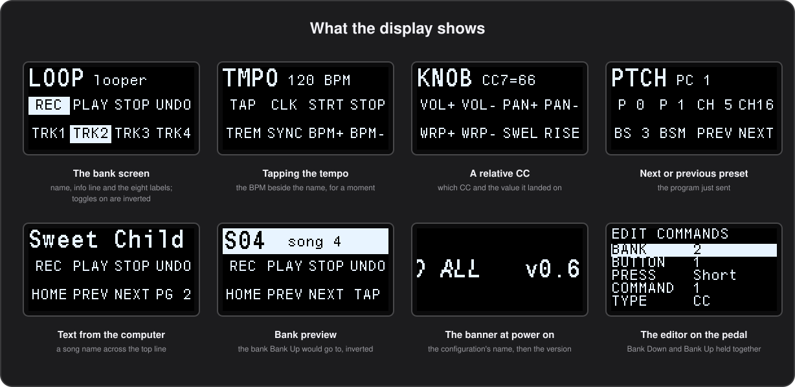

# The display

**English** · [Español](../es/09-the-display.md)

The pedal's 128×64 screen tells you where you are and what is on, at a glance from the floor. This chapter covers the bank screen, what shows over it for a moment, the text a computer can put on it, and the banner at power on.

## The bank screen



What the display shows most of the time:

- **Top line, left:** the bank's name, 4 characters in large letters.
- **Top line, right:** its info line, 8 characters in small letters.
- **Below:** a 2×4 grid laid out like the pedal, buttons **1 2 3 4** on the top row and **A B C D** on the bottom. Each cell shows the button's label, or its identifier when it has none.
- **Toggles:** the cell of a toggle button is drawn inverted while the toggle is on, so the state of the whole bank shows at a glance.

A [cycle button](05-buttons.md#cycle-buttons) shows the label of the state it last sent, and a [second page](04-banks.md#second-page) shows the page's labels in place of the bank's. With `Kemper_Mode` on, the rig you are on takes the info line ([Two way with a Kemper](11-devices.md#two-way-with-a-kemper)).

### What shows over it

Some things take the screen, or part of it, for a moment and then give the bank screen back:

| When | What you see |
|---|---|
| Tapping the tempo, starting or stopping the clock, or setting or stepping the tempo | the tempo, with a leading `*` while the clock is running ([Tempo](07-tempo.md)) |
| `Clock_Follow` picks up the host's clock, or its tempo changes | `EXT` and the tempo, for 1.5 seconds |
| A relative CC button | the CC number and the value just sent, in place of the info line for 1.5 seconds: `CC7=69`, or `C120=127` for three digit CC numbers |
| A next or previous preset button | the new program number, as `PC 6` |
| Switching configuration | the new configuration's number and name, full screen; a short notice when the slot asked for is empty |
| Bank Up / Down with `Bank_Preview` on | the bank they would go to, its name inverted, white with black letters, over its labels ([Bank preview](04-banks.md#bank-preview)) |
| Starting in safe mode | **SAFE MODE**, for three seconds ([Safe mode](10-editing-on-the-pedal.md#safe-mode)) |
| Power on | the configuration's name (`ConfigName`) and the firmware version for a moment, or the [banner](#the-banners-own-text) crossing the screen when `Boot_Banner` is on |
| Waiting for a firmware update | **FIRMWARE UPDATE** |

While a bank preview shows, readouts such as the tempo are skipped, and text from the computer waits under it until the preview is over.

### When it goes dark

With `Sleep_After_Min` set, the display and the LEDs switch off after that many minutes with nobody touching the pedal. Any press or expression pedal movement brings them back, and the press that wakes it still does its job. They also go off while the computer the pedal is connected to sleeps, and come back when it wakes. See the [global settings](12-configuration-file.md#global_settings).

## Text from the computer

A DAW, MainStage or a script can write on the top line: the name of the patch or song it has just loaded, a note for the next part, anything you want to see from the floor.

*Needs firmware 0.46 or later; scrolling needs 0.61.*

### Where and for how long

The text can go in four places, and stay for three lengths of time:

| Place | Where | Fits without scrolling |
|---|---|---|
| `info` | the small info line right of the bank name | 11 characters |
| `name` | the large bank name | 4 characters |
| `line` | the whole top line, large | 11 characters |
| `small` | the whole top line, small | 18 characters |

| Keep | How long |
|---|---|
| `bank` | until the bank changes |
| `always` | until the computer changes it |
| `moment` | 1.5 seconds, like the tempo readout |

- An empty text gives the place back to what the bank shows.
- A whole line text hides the bank name and info while it is there. The large and small whole lines replace each other.
- A text in the bank name or info shows even over a whole line text.
- A text shown for a moment goes back to what was there before.
- Text also wakes the display if the pedal was asleep.

The text is plain ASCII, one character per byte. Anything else shows as a space. Up to 32 characters are kept in any place, and more are cut off.

### Longer than fits

A text wider than its place scrolls across it once, so the whole song name gets read:

1. It stays still for a moment.
2. It moves along at about 40 pixels a second until its end shows.
3. It stays still again, then goes back to its beginning, where it stays.

It scrolls when it arrives, and again whenever a bank is entered. The same text sent again leaves it where it is, so a host that repeats itself does not keep it moving. Only its own place moves: a long info line scrolls beside a still bank name. A long text for a moment stays up until it has reached its end, however long that takes past the 1.5 seconds. Scrolling never holds up a press.

### Sending it from a terminal

`Send_Text.py` builds the message and sends it, or prints the bytes for a host to send:

```bash
.venv/bin/python python/Send_Text.py "Sweet Child"                      # whole line, large, until the bank changes
.venv/bin/python python/Send_Text.py --place info --keep always "Clean"  # the info line, for good
.venv/bin/python python/Send_Text.py --keep moment "Next: Intro"        # for a moment
.venv/bin/python python/Send_Text.py "Sweet Child O' Mine"              # too long for the line: scrolls once
.venv/bin/python python/Send_Text.py ""                                 # back to the bank
.venv/bin/python python/Send_Text.py --hex "Sweet Child"                # only print the bytes, for a host to send
```

`--place` is `info`, `name`, `line` (the default) or `small`, and `--keep` is `bank` (the default), `always` or `moment`.

<details><summary>Under the hood</summary>

The message is one SysEx:

```
F0 7D 48 place how text... F7
```

`place` is `00` for the info line, `01` for the bank name, `02` for the whole line in large letters and `03` for the whole line in small ones. `how` is `00` until the bank changes, `01` until the host changes it and `02` for 1.5 seconds. The text bytes are `20`–`7E`.

For example, `F0 7D 48 02 00 53 77 65 65 74 20 43 68 69 6C 64 F7` puts **Sweet Child** across the top line until the bank changes.

The pedal answers `F0 7D 49 place how F7`, and ignores a place or `how` it does not know. It draws a scroll step only once the previous screen has gone out, which is why scrolling never holds a press up. Firmware before 0.61 keeps only what fits.

</details>

## The banner's own text

At power on, with `Boot_Banner` on, the [banner](12-configuration-file.md#global_settings) crosses the display with the configuration's name. The pedal can hold a text of its own to show instead: up to 60 characters of plain ASCII, such as a band, a show or a phone number in case the pedal gets lost.

- It belongs to the pedal, not to a configuration, so it stays whichever of the four configurations is loaded.
- It survives flashing a configuration and updating the firmware.
- It shows only while `Boot_Banner` is on, at its speed, followed by the firmware version, as the name is.

*Needs firmware 0.63 or later.*

In the configurator, **Banner Text…** under PEDAL reads the text from the pedal and stores, clears or keeps it. From a terminal:

```bash
.venv/bin/python python/Send_Text.py --banner "The Band  612 345 678"   # store it
.venv/bin/python python/Send_Text.py --banner                           # print what the pedal holds
.venv/bin/python python/Send_Text.py --banner ""                        # clear it: the name again
```

<details><summary>Under the hood</summary>

Over SysEx, `F0 7D 4C 01 text... F7` stores it, the same with no text clears it, and `F0 7D 4C 00 F7` only asks. The pedal answers `F0 7D 4D result text... F7`: `result` is 0, or 1 when it refused a text longer than 60 characters or with a byte outside `20`–`7E` and kept the one it had, followed by the text it holds.

The text sits in a flash page of its own at `0x0803A000`, past the fourth configuration slot, which nothing else writes. A blank or damaged page reads as no text.

</details>

---

[← Expression pedals](08-expression.md) · [Contents](README.md) · [Editing on the pedal →](10-editing-on-the-pedal.md)
