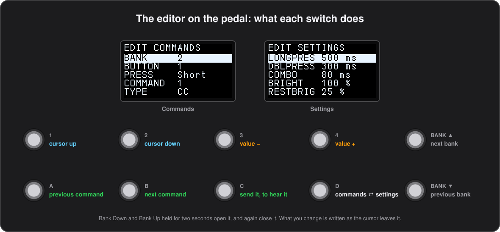

# Editing on the pedal

**English** · [Español](../es/10-editing-on-the-pedal.md)

Everything is easier from the configurator, but the configurator is not always there: the wrong Program Change turns up at soundcheck, with no laptop in sight. The pedal has an editor of its own, on its own screen, worked with your feet.

## Opening and closing it

Hold **Bank Down and Bank Up together for two seconds** and the pedal opens the editor on the configuration it is running; the same two switches held again leave it.

- All ten LEDs light while it is open.
- None of the switches sends anything while it is open, so nothing can go out by mistake.
- If a [bank preview](04-banks.md#bank-preview) is showing, opening the editor drops it.

## The switches

The screen is a list of named fields with the cursor on one of them:

| Switch | What it does |
| --- | --- |
| **1** / **2** | move the cursor up and down the list |
| **3** / **4** | change the value under the cursor; held, they repeat and speed up |
| **A** / **B** | step to the previous or next command of the button's list |
| **C** | send the command as it stands, so it can be heard |
| **D** | swap the commands for the settings |
| **Bank Down** / **Bank Up** | step to the previous or next bank |

## Editing a button's commands

On the commands screen the first fields say what is being edited:

1. the bank;
2. the button;
3. short or long press;
4. which of the ten commands.

Then come the command's type and the fields that type has — channel, CC or note number, on and off values, whether it toggles, and so on — and below them the four characters of the button's label, one field each.

The editor writes these types:

`---` (no command), `PC`, `CC`, `Note`, `Bank`, `Tap`, `Start`, `Stop`, `Panic` and `Wait`.

A command of any other type is shown by name and left exactly as it is until the type field is changed, which replaces it. The double press lists are not offered: they live in an area the tools write as a block.

## Editing the settings

**D** swaps to the settings screen, which holds the global settings that are a number or a choice. The rest, the ones that need text or a list, stay with the configurator.

| On the pedal | In the configurator (CSV) |
|---|---|
| `LONGPRES` | the long press time (`Long_Press_ms`) |
| `DBLPRESS` | the double press time (`Double_Press_ms`) |
| `COMBO` | the combination time (`Combo_ms`) |
| `BRIGHT`, `RESTBRIG` | the two LED brightnesses (`LED_Brightness`, `LED_Rest_Brightness`) |
| `BANKJUMP` | how far a long press on Bank Up / Down jumps (`Bank_Jump_Step`) |
| `SLEEP` | the sleep timeout (`Sleep_After_Min`) |
| `GLOBCHAN` | the global channel (`Global_Channel`) |
| `GLOBBANK` | the bank set aside for the global buttons (`Global_Bank`), as the editor shows its number, 0 for none |
| `BANK SW` | what the bank switches do (`Bank_Switch_Mode`) |
| `PREVIEW` | the bank preview time (`Bank_Preview`) |
| `SETLIST` | follow the setlist (`Setlist_Mode`) |
| `REMEMBER` | remember state (`Remember_State`) |
| `CLOCKFLW` | clock follow (`Clock_Follow`) |
| `LEDFEEDB` | LED feedback (`LED_Feedback`) |
| `LINKTOGL` | linked toggles (`Link_Toggles`) |
| `USB THRU`, `RT THRU` | the two thru switches (`USB_MIDI_Thru`, `RealTime_Passthrough`) |
| `KEMPER` | Kemper mode (`Kemper_Mode`) |
| `EXP1 CC`, `EXP2 CC` | the expression pedal CC numbers (`Exp1_CC`, `Exp2_CC`) |

## When a change is written

What you change is written to flash as soon as the cursor leaves the command, the label or the setting, so walking away loses nothing. A star in the title line says there is something not written yet.

- A write takes about a tenth of a second, during which the pedal is busy: change what you need between songs, not in the middle of one.
- Afterwards the pedal reads the configuration again, so the new command is live at once.
- Reading the configuration back with `Flash_to_CSV.py`, or **Read from Device** in the configurator, gives you a CSV with the change in it.

*Firmware 0.53 or later.*

Under the hood

A change is written by rewriting the 2 kB flash page it lives in, after which everything derived from the configuration is built again.

## Locking the editor

For a pedal that must not change under anybody's foot, tick **Lock on-pedal editing** in the configurator's **Global** tab, `Edit_Lock` in the CSV. The two bank switches held together then no longer open the editor at all. It can only be turned off again from the configurator, or for one session from [safe mode](#safe-mode).

## Safe mode

For the configuration that mutes the amp or upsets the rig at start-up, with no computer at hand. Hold **any one of the eight command switches** (1–4, A–D) while the pedal powers on, and let go once the display says **SAFE MODE**. The pedal then starts without sending anything, and stays that way until it is switched off:

- no bank enter or leave list runs, neither at start-up nor when the bank changes;
- the saved bank and toggle states are not brought back, even with `Remember_State` on: it starts on bank 0 with everything off;
- `Kemper_Mode` stays off, so no beacon and no questions go to the amp;
- the expression pedals keep their position to themselves until they are moved;
- the switch held at power on is not a press, and letting go of it does nothing.

Everything else works: the buttons send their commands, the bank switches change bank, a configuration can be flashed from the computer, and the [editor](#editing-on-the-pedal) opens even with `Edit_Lock` on, so a wrong Bank Enter command can be found and changed from the pedal itself.

- Switch the pedal off and on again with nothing held to leave safe mode.
- A bank changed in safe mode is remembered as usual, so with `Remember_State` on the pedal comes back there.
- Bank Down and D held together at power on is still the bootloader's DFU mode, as on the stock pedal: that is not safe mode.

*Firmware 0.60 or later.*

Under the hood

`GET_STATE` reports safe mode in its last byte (firmware 0.60).

---

[← The display](09-the-display.md) · [Contents](README.md) · [Templates and devices →](11-devices.md)
