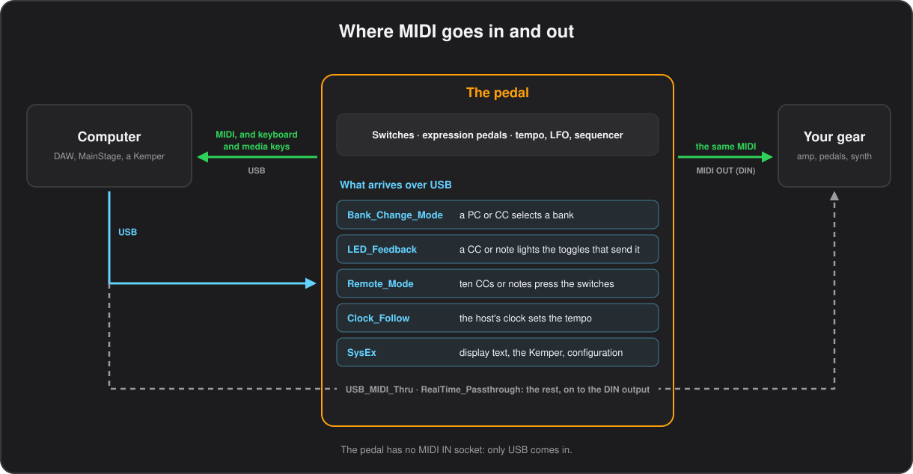

# Templates and devices

**English** · [Español](../es/11-devices.md)

The pedal talks to a computer over USB and to the rest of your gear through its MIDI OUT socket. Everything a button sends goes out of both; what arrives over USB can change bank, light LEDs, press switches, set the tempo or go on to the DIN output.



Three ready-made configurations under `python/templates/` put a device's main controls under your feet with nothing, or next to nothing, to set up on the device. To use one, open it with **Load CSV** in the configurator and press **Flash to Device**, or from a terminal:

```bash
.venv/bin/python python/CSV_to_Flash.py python/templates/FM3.csv
```

Each is built by a script from the device's own MIDI map, so a different channel or CC is a constant to change and the script to run again, as each section says. Or change the buttons in the configurator like any other configuration.

## Fractal Audio FM3 template

**`python/templates/FM3.csv`** is ready to flash for a Fractal Audio FM3 driven over the DIN output, and should suit an Axe-Fx III or FM9 too, which are set up the same way. Connect the pedal's MIDI OUT to the FM3's MIDI IN and power the pedal over USB.

| Banks | Buttons |
|---|---|
| 0–29, `P000`–`P029` | Entering the bank loads the FM3 preset with the same number. 1 2 3 4 A B are scenes 1–6, C latches the tuner, D taps the tempo |
| 30, `LOOP` | Looper: Record, Play/Stop, Undo, Once, Reverse, Half Speed, then tuner and tap |
| 31, `FX` | Engages and bypasses Drive 1, Compressor 1, Phaser 1, Chorus 1, Delay 1, Reverb 1, Wah 1 and Pitch 1 |

Bank Up / Down step through the presets, and a long press jumps ten. The scene buttons are an exclusive group, so the LED and the display show the scene last picked; pressing the lit one again darkens it without sending anything. The expression pedals are External 1 and 2, to attach to any parameter as a modifier.

The FM3 comes with no MIDI CC assigned, so on the FM3, under **SETUP > MIDI/Remote**, set its MIDI channel to 1 and assign:

| Page | Function | CC |
|---|---|---|
| Other | Tempo Tap | 14 |
| Other | Tuner | 15 |
| Other | Scene Select | 34 |
| External | External 1, External 2 | 16, 17 |
| Looper | Record, Play, Undo, Once, Reverse, Half Speed | 20–25 |
| Bypass | Drive 1, Compressor 1, Phaser 1, Chorus 1, Delay 1, Reverb 1, Wah 1, Pitch 1 | 40–47 |

To use other numbers, or another channel, change the constants at the top of `python/make_fm3_template.py` and run it again, or edit the buttons in the configurator. Presets above 29, or in the FM3's banks B to D, take a Program Change with `BankSelect_(PC)` set to 128 times the FM3 bank and `BankSelectHighByte_(PC)` to `Y`, so that CC#0 carries the bank.

## Line 6 HX Stomp template

**`python/templates/HX_Stomp.csv`** is ready to flash for a Line 6 HX Stomp driven over the DIN output. Connect the pedal's MIDI OUT to the HX Stomp's MIDI IN and power the pedal over USB.

| Banks | Buttons |
|---|---|
| 0–29, `01A`–`10C` | Entering the bank loads the HX Stomp preset with the same name, 01A to 10C. 1 2 3 are snapshots 1–3, 4 opens and closes the tuner, A B C press FS1–FS3 and D taps the tempo |
| 30, `LOOP` | Looper: Record, Overdub, Play/Stop, Half Speed, Play Once, Undo, Reverse, then tap |
| 31, `FS` | FS1–FS5, previous and next snapshot, and the tuner |

Bank Up / Down step through the presets, and a long press jumps ten. The snapshot buttons are an exclusive group, so the LED and the display show the snapshot last picked; pressing the lit one again darkens it without sending anything. FS1–FS5 act as if you stepped on the HX Stomp's footswitch in Stomp mode, so they switch whatever is assigned to it, and the expression pedals move the HX Stomp's EXP 1 and EXP 2 controllers.

The HX Stomp has a fixed MIDI map, so it needs no assignments: under **Global Settings > MIDI/Tempo**, set the MIDI Base Channel to 1 and turn MIDI PC Receive on. The template sends:

| Function | CC | Values |
|---|---|---|
| EXP 1, EXP 2 | 1, 2 | the pedals |
| FS1–FS5 | 49–53 | 127 and 0, each one a press |
| Looper Record / Overdub | 60 | 127 records, 0 overdubs |
| Looper Play / Stop, Play Once, Undo | 61, 62, 63 | |
| Tap Tempo | 64 | 127, on the press only |
| Looper Reverse, Half Speed | 65, 66 | |
| Tuner | 68 | |
| Snapshot | 69 | 0–2 snapshots 1–3, 8 next, 9 previous |

To use another channel, change `CHANNEL` at the top of `python/make_hx_stomp_template.py` and run it again, or edit the buttons in the configurator. Presets above 10C take a Program Change with the preset number, 0 to 125.

## Kemper Profiler Player template

**`python/templates/Kemper_Player.csv`** is ready to flash for a Kemper Profiler Player. The Player has no DIN sockets: plug the pedal's USB into the Player's USB A socket, where the Player acts as host and powers it. That is the link whose Active Sensing, a byte every 300 ms, stalls the stock firmware; this one reads and drains everything that arrives, so the link never backs up.

| Banks | Buttons |
|---|---|
| 0–9, `BK01`–`BK10` | The Player's ten banks of five rigs. Entering the bank preselects it, 1 2 3 4 A load rigs 1–5 of it, B and C press the Player's effect buttons I and II, and D taps the tempo |
| 10, `FX` | Modules A, B, DLY and REV, then the four effect buttons I to IIII |
| 11, `TOOL` | Tuner, rotary speed, delay infinity, freeze, all effects at once, delay and reverb again but keeping their tails, and tap |

Only those twelve banks are in use, so the template turns `Setlist_Mode` on and Bank Up / Down walk them and skip the empty ones; a long press jumps five. The rig buttons are an exclusive group, so the LED and the display show the rig last picked and pressing the lit one again sends nothing. Entering a bank only preselects it on the Player: the rig changes when you press one of the five, which is what keeps the sound from jumping about while you walk the banks with your foot.

The Player has a fixed MIDI map, so it needs no assignments: it listens on all sixteen channels unless **System Settings > MIDI In Channel** says otherwise. The template sends:

| Function | CC | Values |
|---|---|---|
| Wah pedal, Volume pedal | 1, 7 | the two expression pedals |
| All modules at once | 16 | 127 inverts every module |
| Module A, module B | 17, 18 | 127 and 0 |
| Delay, reverb | 26, 28 | 127 and 0, tails cut |
| Delay, reverb keeping the tails | 27, 29 | 127 and 0 |
| Tap Tempo | 30 | 127, on the press only |
| Tuner | 31 | 127 opens it, 0 closes it |
| Rotary speed, delay infinity, freeze | 33, 34, 35 | 127, and each press flips it |
| Bank preselect | 47 | 0–9, sent when you enter one of the ten rig banks |
| Rigs 1–5 of the bank | 50–54 | 1, which is what loads the rig |
| Effect buttons I–IIII | 75–78 | 127 and 0 |

To use another channel, change `CHANNEL` at the top of `python/make_kemper_player_template.py` and run it again, or edit the buttons in the configurator. The fifty rigs also answer to a plain Program Change: the Player's manual numbers them 1 to 50, which is `Number` 0 to 49 here.

## Two way with a Kemper

Everything above sends one way: the pedal tells the amp what to do and hopes it listened. A Kemper Profiler can also be asked about itself, and then the pedal shows what the amp is really doing, however it got there.

**To turn it on**, tick **Talk to a Kemper** in the configurator's **Global** tab (`Kemper_Mode` `Y` in the CSV), or start from the [Kemper Player template](#kemper-profiler-player-template), which has it on. The on-pedal editor offers it as `KEMPER`.

Two things come back and are worth seeing from the floor:

- **The rig you are on**, in the small line beside the bank name, and there it stays, bank after bank, until the rig changes. Eleven characters fit; a longer name, up to 32, [scrolls across once](09-the-display.md#text-from-the-computer) when the rig changes and whenever a bank is entered. The pedal asks for it every second, so it is right even when the rig was changed on the amp itself.
- **Which effect modules are running.** A module switching on or off is turned into the Control Change that switches that module — 17 and 18 for stomps A and B, 19, 20, 22 and 24 for C, D, X and MOD, 26 and 28 for delay and reverb, and 27 and 29 which keep their tails — and handed to the same machinery as [`LED_Feedback`](12-configuration-file.md#global_settings). Any toggle button that sends one of those ends up lit or dark like the amp, in every bank, whether the module was switched with your foot, on the amp's own buttons or from a third place. Nothing is sent back because of it, so the two cannot chase each other, and the channel does not have to match: the amp's answers carry none.

**Which Kempers.** The answers come in over USB. On a **Profiler Player** that is the very socket the pedal is already plugged into: the Player is the host, powers the pedal and speaks MIDI over it, so nothing else is needed. A Profiler head or Stage would have to reach the pedal's own MIDI input, which the hardware does not have, so there the pedal keeps talking one way as before.

<details><summary>Under the hood</summary>

The pedal sends the amp the message that asks it to report what it is doing from now on, and repeats it every five seconds, which is what tells the amp somebody is still on the other end. Six of the eight modules the amp reports by itself; the delay and the reverb it does not, so the pedal asks for those two every second, and for the rig name every second too. It asks for all eight when it starts and again whenever the rig changes. Safe mode keeps `Kemper_Mode` off, so no beacon and no questions go out.

</details>

*Firmware 0.55 or later.*

### Tried without an amp

The conversation was tested against `python/Kemper_Sim.py`, a Kemper of make believe that answers over the same USB link a Player would use: it replies to what the pedal asks and lets you change the rig or switch a module to watch the pedal follow.

```bash
.venv/bin/python python/Kemper_Sim.py
kemper> rig Brit Crunch DLX
kemper> dly
```

It has not been tried against a real Kemper yet. The numbers it speaks — the maker's `00 20 33`, the functions, the module pages and the beacon — are the ones the Profiler's MIDI documentation and the open controllers that talk to one use, and a test checks the firmware's list against the tools', so if an amp ever disagrees the fix will be in that table of numbers and nowhere else.

---

[← Editing on the pedal](10-editing-on-the-pedal.md) · [Contents](README.md) · [The configuration file →](12-configuration-file.md)
