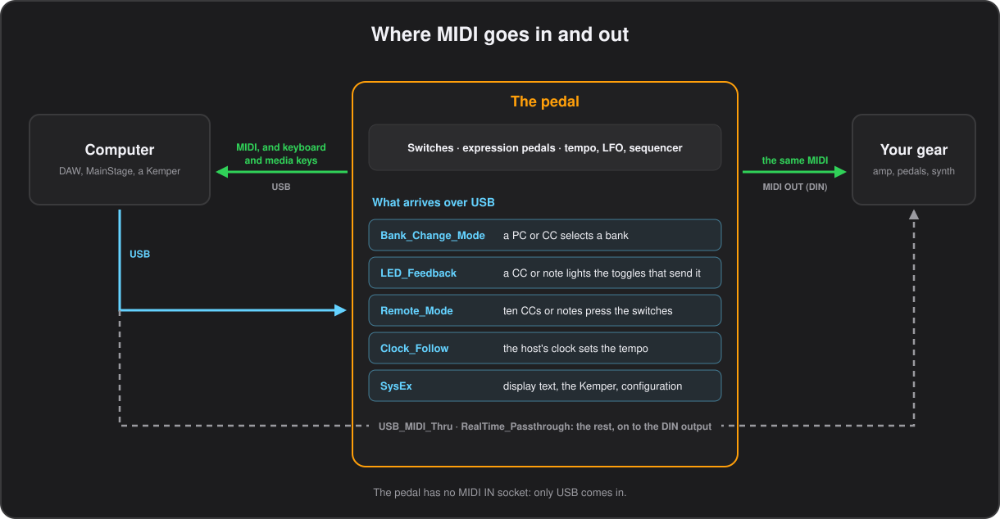

# Templates and devices

**English** · [Español](../es/11-devices.md)

The pedal talks to a computer over USB and to the rest of your gear through its MIDI OUT socket. Everything a button sends goes out of both; what arrives over USB can change bank, light LEDs, press switches, set the tempo or go on to the DIN output.



Ready-made configurations under `python/templates/` put a device's main controls under your feet with nothing, or next to nothing, to set up on the device: the [Fractal FM3](#fractal-audio-fm3-template), the [Line 6 HX Stomp](#line-6-hx-stomp-template), the [Neural DSP Quad Cortex](#neural-dsp-quad-cortex-template), the [Eventide H90](#eventide-h90-template), the Strymon [TimeLine](#timeline), [BigSky](#bigsky), [Volante](#volante) and [Iridium](#iridium), the Meris [Enzo X, LVX and MercuryX](#meris-templates), the [Hotone Ampero II](#hotone-ampero-ii-template), the [Boss RC-600](#boss-rc-600-template) and the [Kemper Player](#kemper-profiler-player-template), and on the computer [MainStage](#apple-mainstage), [Gig Performer](#gig-performer), [Cantabile](#cantabile) and [Ableton Live](#ableton-live). To use one, open it with **Load CSV** in the configurator and press **Flash to Device**, or from a terminal:

```bash
.venv/bin/python python/CSV_to_Flash.py python/templates/FM3.csv
```

Each is built by a script from the device's own MIDI map, so a different channel or CC is a constant to change and the script to run again, as each section says. Or change the buttons in the configurator like any other configuration.

## Fractal Audio FM3 template

**`python/templates/FM3.csv`** is ready to flash for a Fractal Audio FM3 driven over the DIN output, and should suit an Axe-Fx III or FM9 too, which are set up the same way. Connect the pedal's MIDI OUT to the FM3's MIDI IN and power the pedal over USB.

| Banks | Buttons |
|---|---|
| 0–29, `P000`–`P029` | Entering the bank loads the FM3 preset with the same number. 1 2 3 4 A B are scenes 1–6, C latches the tuner, D taps the tempo |
| 30, `LOOP` | Looper: Record, Play/Stop, Undo, Once, Reverse, Half Speed, then tuner and tap |
| 31, `FX` | Engages and bypasses Drive 1, Compressor 1, Phaser 1, Chorus 1, Delay 1, Reverb 1, Wah 1 and Pitch 1 |

Bank Up / Down step through the presets, and a long press jumps ten. The scene buttons are an exclusive group, so the LED and the display show the scene last picked; pressing the lit one again darkens it without sending anything. The expression pedals are External 1 and 2, to attach to any parameter as a modifier.

The FM3 comes with no MIDI CC assigned, so on the FM3, under **SETUP > MIDI/Remote**, set its MIDI channel to 1 and assign:

| Page | Function | CC |
|---|---|---|
| Other | Tempo Tap | 14 |
| Other | Tuner | 15 |
| Other | Scene Select | 34 |
| External | External 1, External 2 | 16, 17 |
| Looper | Record, Play, Undo, Once, Reverse, Half Speed | 20–25 |
| Bypass | Drive 1, Compressor 1, Phaser 1, Chorus 1, Delay 1, Reverb 1, Wah 1, Pitch 1 | 40–47 |

To use other numbers, or another channel, change the constants at the top of `python/make_fm3_template.py` and run it again, or edit the buttons in the configurator. Presets above 29, or in the FM3's banks B to D, take a Program Change with `BankSelect_(PC)` set to 128 times the FM3 bank and `BankSelectHighByte_(PC)` to `Y`, so that CC#0 carries the bank.

## Line 6 HX Stomp template

**`python/templates/HX_Stomp.csv`** is ready to flash for a Line 6 HX Stomp driven over the DIN output. Connect the pedal's MIDI OUT to the HX Stomp's MIDI IN and power the pedal over USB.

| Banks | Buttons |
|---|---|
| 0–29, `01A`–`10C` | Entering the bank loads the HX Stomp preset with the same name, 01A to 10C. 1 2 3 are snapshots 1–3, 4 opens and closes the tuner, A B C press FS1–FS3 and D taps the tempo |
| 30, `LOOP` | Looper: Record, Overdub, Play/Stop, Half Speed, Play Once, Undo, Reverse, then tap |
| 31, `FS` | FS1–FS5, previous and next snapshot, and the tuner |

Bank Up / Down step through the presets, and a long press jumps ten. The snapshot buttons are an exclusive group, so the LED and the display show the snapshot last picked; pressing the lit one again darkens it without sending anything. FS1–FS5 act as if you stepped on the HX Stomp's footswitch in Stomp mode, so they switch whatever is assigned to it, and the expression pedals move the HX Stomp's EXP 1 and EXP 2 controllers.

The HX Stomp has a fixed MIDI map, so it needs no assignments: under **Global Settings > MIDI/Tempo**, set the MIDI Base Channel to 1 and turn MIDI PC Receive on. The template sends:

| Function | CC | Values |
|---|---|---|
| EXP 1, EXP 2 | 1, 2 | the pedals |
| FS1–FS5 | 49–53 | 127 and 0, each one a press |
| Looper Record / Overdub | 60 | 127 records, 0 overdubs |
| Looper Play / Stop, Play Once, Undo | 61, 62, 63 | |
| Tap Tempo | 64 | 127, on the press only |
| Looper Reverse, Half Speed | 65, 66 | |
| Tuner | 68 | |
| Snapshot | 69 | 0–2 snapshots 1–3, 8 next, 9 previous |

To use another channel, change `CHANNEL` at the top of `python/make_hx_stomp_template.py` and run it again, or edit the buttons in the configurator. Presets above 10C take a Program Change with the preset number, 0 to 125.

## Neural DSP Quad Cortex template

**`python/templates/Quad_Cortex.csv`** is ready to flash for a Neural DSP Quad Cortex driven over the DIN output. Connect the pedal's MIDI OUT to the Quad Cortex's MIDI IN and power the pedal over USB.

| Banks | Buttons |
|---|---|
| 0–29, `P000`–`P029` | Entering the bank loads the preset with the same number from the My Presets setlist. 1 2 3 4 A B are scenes A–F, C opens and closes the tuner, D taps the tempo |
| 30, `LOOP` | Looper X: Record / Overdub, Play / Stop, Undo / Redo, the Looper X view, One Shot, Half Speed, Reverse, then tap |
| 31, `FS` | Footswitches A–H, as laid out on the Quad Cortex: A–D on the bottom row, E–H on the top one |

Bank Up / Down step through the presets, and a long press jumps ten. The scene buttons are an exclusive group, so the LED and the display show the scene last picked; pressing the lit one again darkens it without sending anything. The footswitch buttons act as if you stepped on the Quad Cortex's own, so they switch whatever is assigned to it in the mode it is in, and the expression pedals move its Expression Pedal 1 and 2. Button 4 of the looper bank opens the Looper X view on one press and closes it on the next; One Shot, Half Speed and Reverse light while they are on, counted from when the looper was opened.

The Quad Cortex has a fixed MIDI map, so it needs no assignments: under **Settings > Device > MIDI**, set its MIDI Channel to 1, or OMNI. The template sends, from the Quad Cortex manual (CorOS 4.1.1):

| Function | CC | Values |
|---|---|---|
| Bank Select before each preset | 0, 32 | 0 and 1: presets 0–127 of My Presets |
| Expression Pedal 1, 2 | 1, 2 | the pedals |
| Footswitches A–H | 35–42 | 127 and 0, each one a press |
| Scene | 43 | 0–5, scenes A–F |
| Tap Tempo | 44 | 127, on the press only |
| Tuner | 45 | 127 opens, 0 closes |
| Looper X view | 48 | 0 opens, 127 closes |
| Looper X One Shot, Half Speed, Reverse | 50, 51, 55 | 127, each one a switch |
| Looper X Record / Overdub, Play / Stop, Undo / Redo | 53, 54, 56 | 127, on the press only |

To use another channel, or another setlist, change `CHANNEL` or `SETLIST` at the top of `python/make_quad_cortex_template.py` and run it again: `SETLIST` is the Bank Select LSB, 0 for Factory Presets, 1 for My Presets and 2 to 12 for the user setlists. Scenes G and H are CC 43 with 6 and 7, for any button in the configurator.

## Eventide H90 template

**`python/templates/H90.csv`** is ready to flash for an Eventide H90 driven over the DIN output. Connect the pedal's MIDI OUT to the H90's MIDI IN and power the pedal over USB.

| Banks | Buttons |
|---|---|
| 0–30, `P001`–`P031` | Entering the bank loads Program 1 to 31 of the current Playlist. 1 and 2 switch Preset A and Preset B on and off, 3 the whole Program, 4 A B are HotSwitches 1–3, C opens and closes the tuner, D taps the tempo |
| 31, `PERF` | PERFORM 1–6, the Program's Performance Parameters, then tuner and tap |

The H90 switches each of these on a value of 64 or more, whatever state it is in, so every press sends 127 and the LED only takes turns: it can be out of step with the H90 after a Program loads. The expression pedals move the Program's HotKnob and its output gain.

The H90 comes with no MIDI CC mapped, so under **System > MIDI**, set its MIDI channel to 1, then under **Global Control** map:

| Global Control | CC |
|---|---|
| P HotKnob, P Out Gain | 16, 17 (the expression pedals) |
| P Act/Byp, A Act/Byp, B Act/Byp | 20, 21, 22 |
| HS1, HS2, HS3 | 23, 24, 25 |
| Tuner, Tap Tempo | 26, 27 |
| PERFORM 1–6 | 40–45 |

The H90 counts Program Changes from 1 by default, so the template's first, PC 0, is what the H90 shows as PC 1. If each bank loads the Program next to the one its name says, change **PC Offset** in System > MIDI. To use other numbers, change the constants at the top of `python/make_h90_template.py` and run it again.

## Strymon templates

Four templates for Strymon's MIDI pedals, each on the pedal's own MIDI map, so nothing is assigned on it. Each loads a preset per bank, the first 30 or so; the Strymon counts its presets in MIDI banks of 128, so a preset above 127 takes a Program Change with `BankSelect_(PC)` set to 128 times the MIDI bank and `BankSelectHighByte_(PC)` to `Y`, which sends CC#0 with the bank as the manuals ask.

A Strymon loads a preset engaged, so its bypass button is lit while it is **bypassed**. Tap is Remote Tap, CC 93, sent on the press only.

### TimeLine

**`python/templates/TimeLine.csv`**, from the TimeLine manual, rev H. Connect the pedal's MIDI OUT to the TimeLine's MIDI IN and, in its Globals, set MIDI Channel to 1 and turn MIDI Continuous Controllers and MIDI Patch Change on.

| Banks | Buttons |
|---|---|
| 0–29, `00A`–`14B` | Entering the bank loads the preset of the same name. 1 bypasses, 2 switches Infinite Repeats, D taps the tempo |
| 30, `LOOP` | The looper: Record, Play, Stop, Undo, Redo, Reverse, Half Speed, then tap |
| 31, `FS` | The TimeLine's A and B footswitches, the looper's Pre/Post, bypass, infinite repeats and tap |

| Function | CC | Values |
|---|---|---|
| Bypass | 102 | 0 bypasses, 127 engages |
| Infinite Repeats | 97 | 127 on, 0 off |
| Looper Stop, Play, Record, Undo, Redo | 85, 86, 87, 89, 90 | any value |
| Looper Reverse, Half Speed, Pre/Post | 94, 95, 96 | any value switches it |
| A and B footswitches | 80, 82 | 0 on the press, 127 on the release, the manual's "down=0 up=127" |
| Expression pedal 1, 2 | 100, 14 | the TimeLine's expression, and Mix |

### BigSky

**`python/templates/BigSky.csv`**, from the BigSky manual, rev D. Set up as the TimeLine.

| Banks | Buttons |
|---|---|
| 0–30, `00A`–`10A` | Entering the bank loads the preset of the same name. 1 bypasses, 2 holds the reverb while pressed, 3 latches the hold, D taps the tempo |
| 31, `FS` | The BigSky's A, B and C footswitches, bypass, hold and tap |

The hold is the BigSky's Press/Hold switch, CC 97: whether it holds infinite or freezes is the preset's own setting. The A, B and C footswitches are CC 80, 82 and 81, sent as the TimeLine's; bypass is CC 102, and the expression pedals are the BigSky's expression, CC 100, and Mix, CC 15.

### Volante

**`python/templates/Volante.csv`**, from the Volante manual, rev E. Connect the pedal's MIDI OUT to the Volante's MIDI IN; the Volante listens on channel 1 out of the box.

| Banks | Buttons |
|---|---|
| 0–29, `P000`–`P029` | Entering the bank loads the preset of the same number, 0 to 7 being the eight on the Volante's buttons. 1 bypasses, 2 reverses, 3 pauses with the ramp, 4 holds the echo, oscillating, while pressed, D taps the tempo |
| 30, `SOS` | The SOS looper: SOS mode on and off, Record / Splice / Clear, Exit, reverse, pause, then tap |
| 31, `HEAD` | The four playback heads, echo and reverb on and off, then tap |

| Function | CC | Values |
|---|---|---|
| Playback heads 1–4 | 21–24 | 127 on, 0 off |
| SOS mode, Pause (ramp), Reverse, Infinite Hold | 41, 43, 44, 45 | 127 on, 0 off |
| SOS Record / Splice / Clear, Exit SOS Looper | 49, 50 | any value |
| Echo, Reverb | 78, 79 | 127 on, 0 off |
| Bypass | 102 | 0 bypasses, 127 on |
| Expression pedal 1, 2 | 100, 12 | the Volante's expression, and Echo Level |

The heads, echo and reverb buttons start dark whatever the preset has on.

### Iridium

**`python/templates/Iridium.csv`**, from the Iridium manual, rev D. The Iridium has no DIN socket: its MIDI goes into the EXP jack, through Strymon's MIDI EXP cable or any TRS MIDI adapter from the pedal's MIDI OUT. Set the jack to Digital mode first: power the Iridium up holding FAV and turn LEVEL until the ON LED is blue. It listens on channel 1 out of the box.

| Banks | Buttons |
|---|---|
| 0–31, `P000`–`P031` | Entering the bank loads the preset of the same number, 0 being the one on FAV. 1 2 3 choose the amp, Round, Chime or Punch, A B C the room, small, medium or large, and D bypasses |

The amp and room buttons are two exclusive groups, so the LEDs show the choice last made; they start dark, as the preset's own choice is not known. Amp is CC 19 with 1 to 3, room size CC 18 with 1 to 3, bypass CC 102. The expression pedals are the Iridium's volume pedal, CC 7, and Drive, CC 13.

## Meris templates

**`python/templates/Enzo_X.csv`**, **`LVX.csv`** and **`MercuryX.csv`**, for the Meris X pedals, from their manuals (v1.5.1, the MercuryX's v1.5), on their own MIDI map, so nothing is assigned on them. Connect the pedal's MIDI OUT to the Meris's MIDI IN and, in its Globals, set MIDI CHANNEL to 1.

| Banks | Buttons |
|---|---|
| 0–16, `P01`–`P97` | Six presets a bank, two of the Meris's banks of three: 1, 2, 3 on top and A, B, C below, each a Program Change; bank 16 has presets 97–99 and, on A, B and C, the three favorites (`FAV1`–`FAV3`, PC 100–102). 4 bypasses, and held opens the tuner. D taps the tempo; on the MercuryX, which takes no tap over MIDI, D is the Hold Modifier, held while pressed |
| 31, `CTL` | Bypass, the Hold Modifier while pressed, the tuner and tap; on the LVX, the looper's Record / Overdub, Play / Stop, FX1 and FX2 on A, B, C and 4 |

Banks 17–30 are empty: Bank Down from bank 0 goes straight to `CTL`.

| Function | CC | Values |
|---|---|---|
| Bypass | 14 | 0 bypasses, 127 enables |
| Tap | 99 | 127, on the press only (Enzo X and LVX) |
| Tuner | 117 | 127, each press opens or closes it |
| Hold Modifier | 118 | 127 on the press, 0 on the release, as the manuals ask |
| LVX looper: Record / Overdub, Play / Stop, FX1, FX2 | 100–103 | 127 |
| Expression pedal 1, 2 | 4, and 60 on the Enzo X or 1 | the Meris's expression, and Mix |

The bypass button is lit while the Meris is **bypassed**, and starts dark, taking the Meris to be enabled: if it was bypassed, the first press enables it. The preset buttons only flash: the Meris's screen shows which preset is on. Tried in the simulated pedal; not yet tried with a Meris.

The Meris pedals answer no request for their preset or its state that is documented, so there is no two way with them as with a Kemper or a GT-1000.

## Hotone Ampero II template

**`python/templates/Ampero_II.csv`** is ready to flash for a Hotone Ampero II, from its MIDI Control Information List (firmware V1.0.2). Connect the pedal's MIDI OUT to the Ampero II's MIDI IN; out of the box it listens on every channel, Omni, from MIDI IN and USB alike.

| Banks | Buttons |
|---|---|
| 0–29, `01-1`–`08-2` | Entering the bank loads the patch of the same name. 1 2 3 4 are scenes 1–4, A and B the effect slots on FS1 and FS2, C opens and closes the tuner, D taps the tempo |
| 30, `LOOP` | The looper: its menu, Record / Overdub, Play / Stop, Undo / Redo, Clear, Half Speed and Reverse, lit while on, then tap |
| 31, `FS` | The drum machine's menu and Play / Stop, the tuner, bypass, lit while bypassed, and the effect slots on FS1–FS4 |

| Function | CC | Values |
|---|---|---|
| Patch Volume, Expression Pedal (EXP 3) | 7, 11 | the expression pedals; volume goes 0–100 |
| Scene | 25 | 1–4 |
| Drum Machine menu, Play / Stop | 36, 37 | 127 on, 0 off |
| Tuner, Looper menu | 60, 62 | 127 on, 0 off |
| Looper Rec / Overdub, Undo / Redo, Clear | 63, 67, 68 | 127, on the press only |
| Looper Play / Stop | 64 | 127 plays, 0 stops |
| Looper Speed, Playback | 65, 66 | 0 half speed, reverse; 127 back to normal |
| Tap Tempo | 76 | 127, on the press only |
| Engage / Bypass | 78 | 0 analog bypass, 2 engages |
| FS 1–4 Effect Slot | 79–82 | 127, then 0 |

A patch above 128 takes a Program Change with `BankSelect_(PC)` set to 128 and `BankSelectHighByte_(PC)` to `Y`, 256 above 256, which sends CC#0 1 or 2. The Ampero II Stomp and Stage have maps of their own, three and five patches to a bank and five scenes, so the patch names would not match.

## Boss RC-600 template

**`python/templates/RC-600.csv`** is ready to flash for a Boss RC-600 Loop Station. Connect the pedal's MIDI OUT to the RC-600's MIDI IN; it listens on channel 1 out of the box (MENU > MIDI > RX CH CTL).

| Banks | Buttons |
|---|---|
| 0–30, `M001`–`M031` | Entering the bank recalls memory 01 to 31. 1 2 3 record and play tracks 1–3, 4 undoes and redoes, A starts every track, B stops them, C clears the current track, D taps the tempo |
| 31, `TRKS` | Tracks 4–6, then the same undo, start, stop, clear and tap |

Memories and start / stop need nothing: a Program Change 0 to 98 recalls memory 01 to 99, and MIDI Start and Stop start and stop the tracks as the memory's ALL START and ALL STOP settings say. The rest has no MIDI CC out of the box: set these up under **MEMORY > ASSIGN**, each ASSIGN with SW ON, SOURCE MODE MOMENT, and ACT LOW 0 and ACT HIGH 127:

| SOURCE | TARGET |
|---|---|
| MIDI CC#80, 81, 82 | TRK1 REC/PLY, TRK2 REC/PLY, TRK3 REC/PLY |
| MIDI CC#86, 87, 88 | TRK4 REC/PLY, TRK5 REC/PLY, TRK6 REC/PLY |
| MIDI CC#83, 84, 85 | CUR.TRK UN/RED, CUR.TRK CLEAR, TAP TEMPO |
| MIDI CC#70, 71 | the expression pedals: LOOP LEVEL, or a track's level |

The RC-600 keeps the ASSIGN settings in each memory, so they have to be in, and written to, every memory the template recalls. Every button sends 127 on the press and 0 on the release.

## Kemper Profiler Player template

**`python/templates/Kemper_Player.csv`** is ready to flash for a Kemper Profiler Player. The Player has no DIN sockets: plug the pedal's USB into the Player's USB A socket, where the Player acts as host and powers it. That is the link whose Active Sensing, a byte every 300 ms, stalls the stock firmware; this one reads and drains everything that arrives, so the link never backs up.

| Banks | Buttons |
|---|---|
| 0–9, `BK01`–`BK10` | The Player's ten banks of five rigs. Entering the bank preselects it, 1 2 3 4 A load rigs 1–5 of it, B and C press the Player's effect buttons I and II, and D taps the tempo |
| 10, `FX` | Modules A, B, DLY and REV, then the four effect buttons I to IIII |
| 11, `TOOL` | Tuner, rotary speed, delay infinity, freeze, all effects at once, delay and reverb again but keeping their tails, and tap |

Only those twelve banks are in use, so the template turns `Setlist_Mode` on and Bank Up / Down walk them and skip the empty ones; a long press jumps five. The rig buttons are an exclusive group, so the LED and the display show the rig last picked and pressing the lit one again sends nothing. Entering a bank only preselects it on the Player: the rig changes when you press one of the five, which is what keeps the sound from jumping about while you walk the banks with your foot.

The Player has a fixed MIDI map, so it needs no assignments: it listens on all sixteen channels unless **System Settings > MIDI In Channel** says otherwise. The template sends:

| Function | CC | Values |
|---|---|---|
| Wah pedal, Volume pedal | 1, 7 | the two expression pedals |
| All modules at once | 16 | 127 inverts every module |
| Module A, module B | 17, 18 | 127 and 0 |
| Delay, reverb | 26, 28 | 127 and 0, tails cut |
| Delay, reverb keeping the tails | 27, 29 | 127 and 0 |
| Tap Tempo | 30 | 127, on the press only |
| Tuner | 31 | 127 opens it, 0 closes it |
| Rotary speed, delay infinity, freeze | 33, 34, 35 | 127, and each press flips it |
| Bank preselect | 47 | 0–9, sent when you enter one of the ten rig banks |
| Rigs 1–5 of the bank | 50–54 | 1, which is what loads the rig |
| Effect buttons I–IIII | 75–78 | 127 and 0 |

To use another channel, change `CHANNEL` at the top of `python/make_kemper_player_template.py` and run it again, or edit the buttons in the configurator. The fifty rigs also answer to a plain Program Change: the Player's manual numbers them 1 to 50, which is `Number` 0 to 49 here.

## Templates for programs on the computer

Four templates for the programs that play live from a computer, with the pedal on its USB. They lean on what works without learning anything: a Program Change where the program answers one, and its own keyboard shortcuts, which the pedal types as a USB keyboard would. The shortcuts go to the window in front, so keep the program there on stage. What a program has no shortcut for goes out as a CC, to learn once; the expression pedals send CC 11 and CC 1, expression and the modulation wheel, which most instruments answer as they are.

In the tables, Ctrl, Shift and Cmd are the keys the pedal holds with the key; the Key command's modifiers are listed in [Keyboard keys](06-commands.md#keyboard-keys).

### Apple MainStage

**`python/templates/MainStage.csv`**. MainStage answers Program Changes from any controller out of the box and gives each patch a number; **Reset Program Change Numbers**, Option-Shift-Command-R, numbers them in the order of the Patch List.

| Banks | Buttons |
|---|---|
| 0–30, `P000`–`P030` | Entering the bank selects the patch with that program number. 1 and 2 the previous and next patch (↑ ↓), 3 and 4 the first patch of the previous and next set (← →), A play / stop (Space), B recording (Ctrl+R), C the tuner (Cmd+T), D tap tempo (Ctrl+T) |
| 31, `CTRL` | Panic (Ctrl+P), master mute (Ctrl+M), previous and next patch, and FX1–FX4, CC 20–23, 127 on and 0 off, to assign to screen controls with **Assign & Map** |

### Gig Performer

**`python/templates/Gig_Performer.csv`**. Gig Performer gives each rackspace a Program Change out of the box, from 0 in their order.

| Banks | Buttons |
|---|---|
| 0–31, `R000`–`R031` | Entering the bank selects the rackspace with that number. 1 and 2 the song part above and below in the Setlist view (↑ ↓), 3 play / stop, 4 panic, A and B FX1 and FX2, C the tuner (Shift+T), D tap tempo |

Learn the CCs once under **Options > Global MIDI**, with **Momentary** ticked, since each press sends 127 and its release 0: Tap Tempo CC 20, Play/Stop CC 21 and Panic CC 22. FX1 and FX2, CC 24 and 25, 127 on and 0 off, are for widgets.

### Cantabile

**`python/templates/Cantabile.csv`**, for Cantabile on Windows.

| Banks | Buttons |
|---|---|
| 0–31, `S000`–`S031` | Entering the bank loads the song of the set list with that program number. 1 and 2 the previous and next state (Shift+T, T), 3 play / stop, 4 panic, A B C FX1–FX3, D tap tempo |

Cantabile answers Program Changes through a binding: add one in the background rack from the pedal's MIDI input, on Program Change, to the set list, loading the song by its program number. Bind the rest the same way, with **Learn Binding**: tap tempo CC 20, play / stop CC 21 and panic CC 22, each 127 on the press and 0 on the release. FX1–FX3, CC 24–26, 127 on and 0 off, are for plugin parameters.

### Ableton Live

**`python/templates/Ableton_Live.csv`**. Live answers no Program Change, so this one is two banks, which a setlist keeps Bank Up and Bank Down on.

| Banks | Buttons |
|---|---|
| 0, `LIVE` | The Session View and the transport: 1 and 2 the scene above and below (↑ ↓), 3 launches the scene selected (Enter), 4 the metronome (O, Live 12), A play / stop (Space), B continue (Shift+Space), C record (F9), D tap tempo |
| 1, `FX` | FX1–FX8, CC 21–28, 127 on and 0 off |

Map the CCs once in MIDI Map mode, **Cmd+M** (Ctrl+M on Windows): click the Tap button and press D, click a parameter and press an FX button, then leave the mode. The pedal's MIDI input needs **Remote** on in Settings > Link, Tempo & MIDI.

## Two way with a Kemper

Everything above sends one way: the pedal tells the amp what to do and hopes it listened. A Kemper Profiler can also be asked about itself, and then the pedal shows what the amp is really doing, however it got there.

**To turn it on**, tick **Talk to a Kemper** in the configurator's **Global** tab (`Kemper_Mode` `Y` in the CSV), or start from the [Kemper Player template](#kemper-profiler-player-template), which has it on. The on-pedal editor offers it as `TWO WAY`, set to `Kemper`.

Three things come back and are worth seeing from the floor:

- **The rig you are on**, in the small line beside the bank name, and there it stays, bank after bank, until the rig changes. Eleven characters fit; a longer name, up to 32, [scrolls across once](09-the-display.md#text-from-the-computer) when the rig changes and whenever a bank is entered. The pedal asks for it every second, so it is right even when the rig was changed on the amp itself.
- **Which effect modules are running.** A module switching on or off is turned into the Control Change that switches that module — 17 and 18 for stomps A and B, 19, 20, 22 and 24 for C, D, X and MOD, 26 and 28 for delay and reverb, and 27 and 29 which keep their tails — and handed to the same machinery as [`LED_Feedback`](12-configuration-file.md#global_settings). Any toggle button that sends one of those ends up lit or dark like the amp, in every bank, whether the module was switched with your foot, on the amp's own buttons or from a third place. Nothing is sent back because of it, so the two cannot chase each other, and the channel does not have to match: the amp's answers carry none.
- **The tuner.** While the amp's tuner is up, the pedal's display is a tuner: the note in letters twice the large size, and under it a scale with a needle, left of the middle when flat and right when sharp, with an arrow on that side pointing the way to turn. In tune, the note is boxed in and the needle filled in. The tuner is up however it was opened, with your foot or on the amp, and a button that sends CC 31, the Player template's `TUNR`, is lit while it is. When it closes the bank screen is back as it was; if the amp stops answering for three seconds, the pedal closes its tuner too.

**Which Kempers.** The answers come in over USB. On a **Profiler Player** that is the very socket the pedal is already plugged into: the Player is the host, powers the pedal and speaks MIDI over it, so nothing else is needed. A Profiler head or Stage would have to reach the pedal's own MIDI input, which the hardware does not have, so there the pedal keeps talking one way as before.

<details><summary>Under the hood</summary>

The pedal sends the amp the message that asks it to report what it is doing from now on, and repeats it every five seconds, which is what tells the amp somebody is still on the other end. Six of the eight modules the amp reports by itself; the delay and the reverb it does not, so the pedal asks for those two every second, and for the rig name every second too. It asks for all eight when it starts and again whenever the rig changes. The beacon asks for the tuner's readings only while the tuner is up, so they are not on the wire the rest of the time. Safe mode keeps `Kemper_Mode` off, so no beacon and no questions go out.

</details>

*Firmware 0.55 or later; the tuner, 1.07 or later.*

### Tried without an amp

The conversation was tested against `python/Kemper_Sim.py`, a Kemper of make believe that answers over the same USB link a Player would use: it replies to what the pedal asks and lets you change the rig, switch a module or tune a string to watch the pedal follow.

```bash
.venv/bin/python python/Kemper_Sim.py
kemper> rig Brit Crunch DLX
kemper> dly
kemper> tune A -1500
kemper> sweep E
kemper> tuner
```

`tune` opens the tuner and has it hear a note, off by the number given, 0 being in tune and about 3400 the end of the scale; `sweep` brings a string up to pitch from flat, and `tuner` closes it again, as CC 31 from the pedal does.

It has not been tried against a real Kemper yet. The numbers it speaks — the maker's `00 20 33`, the functions, the module pages, the tuner's and the beacon — are the ones the Profiler's MIDI documentation and the open controllers that talk to one use, and a test checks the firmware's list against the tools', so if an amp ever disagrees the fix will be in that table of numbers and nowhere else.


## Two way with a GT-1000

A Boss GT-1000 or GT-1000CORE can be asked about itself too. Roland units are read as one big table of addresses, and the pedal reads three corners of it.

**To turn it on**, tick **Talk to a GT-1000** in the configurator's **Global** tab (`GT1000_Mode` `Y` in the CSV); the on-pedal editor offers it as `TWO WAY`, set to `GT-1000`. The pedal talks to one unit at a time, so `Kemper_Mode` and `GT1000_Mode` cannot both be on.

What comes back:

- **The patch you are on**, in the small line beside the bank name, as with a Kemper's rig: eleven characters fit and the rest of the sixteen scroll. The pedal asks for the patch number every second, so a patch changed on the unit itself shows up within a second, and a letter of the name edited on the unit at once.
- **Which effects are on, by the ASSIGNs you already have.** A GT-1000 switches an effect from a Control Change only through an ASSIGN, which you set up on the unit: source `CC#80`, target `DELAY 1` `ON OFF`, say. The pedal reads the sixteen ASSIGNs of each patch it lands on, and for every one that is on, comes from a CC (1–31 or 64–95) and switches an effect on and off, it follows that effect: on or off, it is handed to the LED feedback as that CC, 127 or 0, so any toggle button sending it ends up lit or dark like the unit, in every bank, whether the effect was switched with your foot, on the unit or from a third place. Nothing is sent back because of it, and the channel does not have to match. The effects it knows are COMP, OD/DS 1 and 2, PREAMP 1 and 2, NS 1 and 2, EQ 1–4, DELAY 1–4, MASTER DELAY, CHORUS, FX1–FX4, REVERB and PEDAL FX.

So set the GT-1000 up first, an ASSIGN per effect you want on the floor, and give the pedal's buttons the same CCs as toggles. A patch with different ASSIGNs is followed with its own, as it is entered.

**How to connect it.** The answers come in over USB, and the GT-1000's USB, like the pedal's, is a device, not a host: the two cannot be plugged into each other. They have to meet on something that is a host to both and passes MIDI between them: a computer running a MIDI router, or a USB MIDI host box such as a CME H2MIDI Pro or an iConnectivity mioXM, with the pedal's port routed to the GT-1000's and back. What the pedal asks goes out on its DIN output as well, so a DIN cable to the unit's MIDI IN can carry the questions while the answers come back over the host.

<details><summary>Under the hood</summary>

Roland's messages are RQ1, which asks for a stretch of the address space, and DT1, which carries one, from the unit's MIDI Implementation. The pedal asks for the patch number every second, and when it changes, for the name and the sixteen ASSIGNs, and then for the switch of each effect an ASSIGN switches, again every second. It also writes 1 to the address `7F 00 00 01` every five seconds: no Roland document mentions it, but it is what the unit's editor does, and it makes the unit report what is changed on it the moment it is changed. Without it the pedal still catches up within a second. A message with a wrong checksum is ignored. Safe mode keeps `GT1000_Mode` off, so no questions go out.

</details>

*Firmware 1.09 or later.*

### Tried without a GT-1000

The conversation was tested on the pedal against `python/GT1000_Sim.py`, a GT-1000 of make believe on the computer, which answers what the pedal asks in Roland's own messages and lets you change the patch, set an ASSIGN or switch an effect to watch the pedal follow.

```bash
.venv/bin/python python/GT1000_Sim.py
gt1000> patch 12 Lead Boost
gt1000> assign 1 DELAY 1 81
gt1000> fx DELAY 1
```

It has not been tried against a real GT-1000 yet. The addresses, the ASSIGN layout and the target numbers are the ones in Roland's MIDI Implementation for the GT-1000 (version 4.01), and a test checks the firmware's table against the tools', so if a unit ever disagrees the fix will be in that table and nowhere else.

## Three USB ports

With `USB_Ports` at 3 the pedal shows up on the computer as three USB MIDI ports instead of one:

| Port | Name on macOS | What it is |
|---|---|---|
| 1 | `MIDI Commander Custom Pedal` | The pedal, as with one port. |
| 2 | `MIDI Commander Custom DIN` | Straight to the MIDI OUT socket. |
| 3 | `MIDI Commander Custom Config` | The pedal again, for a second program. |

**Port 2** makes the pedal a USB MIDI interface for the gear on its DIN output. Whatever a program sends there goes out of the MIDI OUT socket as it came, clock and SysEx included, and the pedal itself never sees it: it does not change bank, press switches or follow that clock, and `USB_MIDI_Thru`, `RealTime_Passthrough` and the MIDI map do not apply. So a DAW can play the synth behind the pedal on port 2 and talk to the pedal on port 1, each on its own. Nothing comes back on port 2, as the pedal has no MIDI IN socket.

**Port 3** is the same pedal as port 1: what the pedal sends goes out on both, and it listens to both alike. A configurator gets its answers on the port it asked on. It is there for a second program: on Windows only one program at a time can open a port, so while a DAW holds port 1 the configurator, the [browser page](14-in-the-browser.md) or the [command line tools](13-command-line-tools.md) use port 3. The tools choose it by themselves when it is there, and never port 2. Leave port 3 off in the DAW, or it hears everything twice.

The ports change the next time the pedal starts; flashing a configuration restarts it. A DAW set up with one port needs its port choosing again, as the names change, which is why one port stays the default. With three ports the pedal also gives a USB serial number of its own, so macOS and Windows set it up as a new device instead of keeping the one port they remember; the one port entry stays in Audio MIDI Setup, offline, for when you go back. Switching configuration on the pedal (`NextConfig`) keeps the ports it started with.

Windows numbers the ports instead of naming them, `MIDIOUT2 (MIDI Commander Custom)` and so on, and older Linux kernels call them `MIDI 1` to `MIDI 3`; the tools know those names too, but three ports have only been tried on macOS so far.

Needs firmware 1.04 (bit 1 of global byte 6, beside `USB_MIDI_Thru` in bit 0).


## Translating what comes in

A DAW, a sequencer or a keyboard on USB rarely speaks the language of the old pedal on the DIN cable: the DAW changes scene with a Program Change, the delay wants two CCs; the keyboard's mod wheel is CC 1, the amp's volume CC 11 and the other way round. The **MIDI map** puts the pedal in the middle and translates.

Each entry says **when**, a message arriving over USB, and what it **becomes**:

- **When**: its type, `Note`, `CC`, `PC`, `Pressure` (Channel Pressure) or `PitchBend`; its channel or any; its number (the note, the CC, the program) or any; and a range of values, 0 to 127 unless narrowed. A `Note Off` counts as a note of velocity 0, a PC's value is its program, and a pitch bend's is its upper seven bits.
- **Becomes** another message on the DIN output: another type, channel or number, empty for the same, and the value range scaled onto another. From 127 to 0 turns it round, one value alone sends that value every time, and nothing keeps the value as it came. A PC made with no number takes the value as its program, so `CC 20` becomes `PC` of its value.
- Or it **runs a button's list**, named by bank, button and short, long or double press, as a [`Macro`](06-commands.md#macros) does. The list runs as a press would, with its commands on USB and DIN; a `Note Off`, a velocity 0 or a value below 64 runs it with its toggles off, so a pad held down holds a toggle on.
- Or **Nothing**, which only stops the message.

Every entry that matches acts, so one message can make several: two entries on the same PC send two CCs. A message some entry matched goes no further as it came, unless one of them has **also as it came** ticked; what the entries make goes out whether `USB_MIDI_Thru` is on or not, and a message no entry matches goes on through the thru as ever. Up to 32 entries per configuration.

The map works alongside everything else the pedal listens for. [`Remote_Mode`](12-configuration-file.md#usb-midi) comes first, and a message pressing a switch goes no further; bank selection by PC or CC, `LED_Feedback` and following the host's programs still see a message the map translated.

**In the configurator** it is the **MIDI Map** tab, each entry with its **When** and **Becomes**; the web configurator has it too.

**In the demo**, a PC on channel 15 becomes CC 20 = 127 and CC 21 = the program on channel 2, the mod wheel on channel 14 becomes CC 11 on channel 1 turned round and also goes on as it came, note 36 on channel 14 holds the global bank's tuner on while it is down, and the pitch bend on channel 14 becomes CC 4.

### MidiMap_Settings

A row per entry. Empty cells take the default shown.

| Column | Values | Meaning |
|---|---|---|
| `In_Type` | `Note`, `CC`, `PC`, `Pressure`, `PitchBend` | The message it matches. A row without one is left out. |
| `In_Channel` | `Any`, 1–16 | Default any. |
| `In_Number` | `Any`, 0–127 | The note, CC or program. `Pressure` and `PitchBend` have none: leave it empty. |
| `In_Min`, `In_Max` | 0–127 | The values it matches. Default 0 and 127. |
| `Out_Type` | `Note`, `CC`, `PC`, `Pressure`, `PitchBend`, `Run`, `Nothing` | What it becomes. Default the same type. |
| `Out_Channel` | `Same`, 1–16 | Default the same. |
| `Out_Number` | `Same`, 0–127 | Default the same; a `Note` or `CC` made from a `Pressure` or `PitchBend` needs one. |
| `Out_Min`, `Out_Max` | 0–127 | `In_Min`..`In_Max` scaled onto these. Both empty: the value as it came; one alone: always that value. |
| `Run_Bank`, `Run_Button`, `Run_List` | 0–31, `1`–`D`, `Short` / `Long` / `Double` | The list an `Out_Type` of `Run` runs. |
| `Keep` | Y / N | Also as it came. |

<details><summary>Under the hood</summary>

The pages of a slot were full, so the map lives in a second extension area, two flash pages per slot above the power on banner's page, which the tools see as the configuration going on after the double press area. It starts with the marker `EXT2` and counts only when that is there. An entry is 12 bytes, described in `flash_midi_settings.h`. The map is looked up in the USB interrupt, as the thru is; a list to run is queued there, eight at most, and run by the main loop.

</details>

*Firmware 0.90 or later; older firmware gets everything else and the tools say the map was left out.*

---

[← Editing on the pedal](10-editing-on-the-pedal.md) · [Contents](README.md) · [The configuration file →](12-configuration-file.md)
