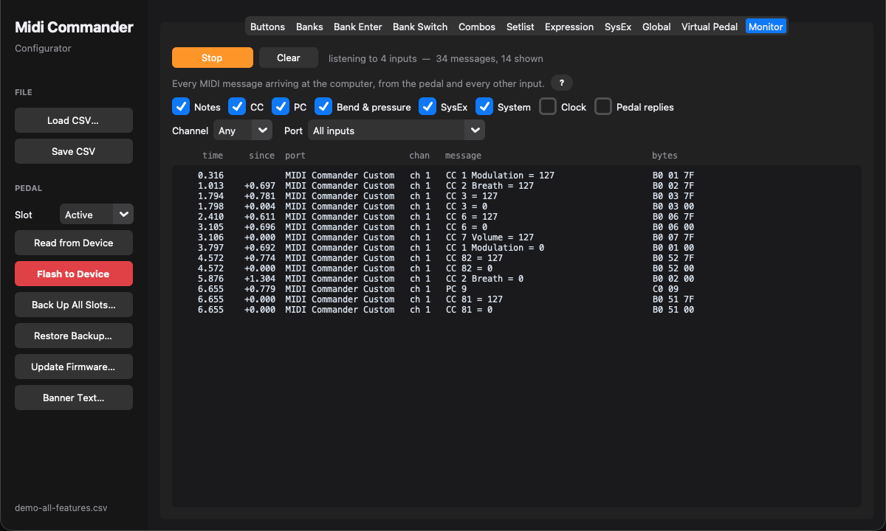

# El configurador

[English](../en/03-the-configurator.md) · **Español**

El configurador, `python/gui_configurator.py`, es donde se monta una configuración: edita un CSV de configuración y lo intercambia con la pedalera por MIDI USB, sin drivers especiales. Arráncalo desde la raíz del repositorio:

```bash
.venv/bin/python python/gui_configurator.py
```


A la izquierda está la barra lateral, con el archivo y la pedalera. A la derecha, las pestañas, en el orden en que se suele montar una configuración. Cada pestaña empieza con un resumen de una línea; la **?** de al lado abre los detalles.

El programa está en inglés, así que aquí los nombres de botones, pestañas y campos van tal como los verás en pantalla.

## Barra lateral

Dos grupos, FILE (archivo) y PEDAL (pedalera), con el nombre del archivo abierto abajo.

**FILE**

- **Load CSV…** abre un archivo de configuración. Al arrancar se carga `python/demo-all-features.csv`, así que tienes todas las funciones a la vista desde el principio.
- **Save CSV** guarda los ajustes actuales en el archivo abierto, y **Save As…** en uno nuevo, que desde entonces pasa a ser el archivo abierto.
- La demo, el ejemplo y las [plantillas](11-devices.md) vienen con las herramientas y nunca se sobrescriben: al abrirlos son un punto de partida, y el primer **Save CSV** pregunta dónde guardar tu copia.
- Cargar otro archivo o cerrar el configurador con cambios sin guardar pregunta antes.

**PEDAL**

- **Slot** elige cuál de las cuatro [ranuras de configuración](04-banks.md#cuatro-configuraciones) usan los dos botones de debajo. `Active` es la que está usando la pedalera. Cargar una ranura nunca toca las demás.
- **Read from Device** trae esa configuración de la pedalera conectada a un CSV que eliges, y lo carga.
- **Flash to Device**, el único botón rojo, guarda el CSV, lo envía a la pedalera y la reinicia. Con la demo o una plantilla abierta carga los ajustes tal como están sin guardarlos en ningún archivo.
- **Back Up All Slots…** lee cada ranura que tenga una configuración a una carpeta nueva con fecha, un CSV por ranura.
- **Restore Backup…** vuelve a escribir una carpeta así, cada archivo en su ranura, después de enseñarte qué ranuras va a sustituir. Mira [Copias de seguridad](13-command-line-tools.md#copias-de-seguridad).
- **Update Firmware…** flashea un archivo `.dfu`, sin mantener nada pisado con el firmware 0.58 o posterior. Mira [Primeros pasos](02-getting-started.md#actualizar-el-firmware-más-adelante).
- **Banner Text…** lee de la pedalera el [texto propio del banner](09-the-display.md#el-texto-propio-del-banner), y lo guarda, lo borra o lo deja como está.

## Buttons

Donde se ponen los comandos de cada botón. Mira [Botones](05-buttons.md) y [Comandos](06-commands.md).

1. Elige un banco y luego un botón de los ocho, colocados como en la pedalera: del 1 al 4 arriba, de la A a la D abajo. El que estás editando sale resaltado.
2. Arriba, pon su **display label** (etiqueta en pantalla), **LED light mode** (modo del LED) y **exclusive group** (grupo exclusivo), y marca **Momentary when held**, **Flash at the tempo**, **Global** o **Reset on bank change** si hace falta.
3. Debajo hay diez casillas de comando, de la A a la J. Elige el tipo de comando de una casilla y solo aparecen los campos que usa ese tipo.
4. **Short press / Long press / Double press** cambia las casillas entre las tres listas de comandos del botón: corta, larga y doble.

Lo que editas se guarda en memoria solo al cambiar de botón, de banco o de pestaña.

**Copy bank** y **Paste bank** copian un banco entero sobre otro: etiquetas, modos de LED, grupos, los comandos de pulsación corta, larga y doble, y los comandos que se envían al entrar en el banco. El destino queda idéntico al origen, así que lo que tuviera y el origen no, desaparece. Su nombre se conserva, porque una copia suele ser el principio de una variante. Pegar pide confirmación antes.

**Copy button** y **Paste button** hacen lo mismo con un solo botón: elige el botón que quieres copiar, pulsa **Copy button**, elige el que quieres sustituir, en el mismo banco o en otro, y pulsa **Paste button**. Su etiqueta, modo de LED, grupo, las cuatro casillas y sus comandos de pulsación corta, larga y doble pasan a ser los del botón copiado. Pegar pide confirmación antes.

### Aprender por MIDI

En vez de buscar qué CC envía un mando, deja que el configurador lo oiga. Pulsa **Learn** junto al tipo de comando de una casilla (el botón se pone naranja y dice **Stop**) y mueve el mando o pulsa el botón en el aparato. El primer Program Change, Control Change, nota o Pitch Bend que llegue rellena la casilla: su tipo, canal y número, y su valor si la casilla no tenía, así que un botón aprendido de un aparato que envía 127 envía 127. La casilla dice qué ha llegado y por qué puerto.

El configurador escucha todas las entradas MIDI del ordenador: un aparato conectado por USB, el puerto virtual de un DAW o la propia pedalera, cuyas pulsaciones también se pueden aprender. El reloj, el SysEx y parecidos se ignoran. Una casilla que ya es `CCInc` o `PCInc` conserva su tipo y toma el canal y el número de CC, y un [`Listen`](06-commands.md#escuchar-otro-cc) toma el CC y el valor que informa el equipo. Pulsa **Stop**, o espera 15 segundos, para dejarlo; aprender otra casilla para la primera. También funciona en las pestañas Bank Enter y Bank Switch.


## Banks

El nombre de 4 caracteres y la línea de información de 8 de cada banco, y adónde envían los pedales de expresión mientras está elegido. Mira [Bank_Naming](04-banks.md#bank_naming) y [BankExpression_Settings](08-expression.md#bankexpression_settings).

Para cada pedal:

- un CC y un canal, cada uno en `Default` para mantener los del propio pedal, `Off` en el CC para silenciar el pedal en ese banco, o `Speed` para que marque la [velocidad de los LFO y las secuencias](08-expression.md#velocidad-de-los-lfo-y-las-secuencias);
- el valor más bajo y el más alto que envía ahí, vacíos para mantener el rango del propio pedal.

### Mover un banco

Las flechas al principio de cada fila suben o bajan un banco un puesto. **Move bank … to place …** lleva un banco a cualquier sitio de una vez: mover el banco 12 al puesto 3 lo pone en el 3 y baja un puesto los bancos del 3 al 11, como al arrastrar una fila en una lista.

Todo lo que es del banco se va con él: su nombre, sus botones con sus tres listas de comandos, sus comandos al entrar y al salir y los ajustes de los pedales de expresión. Y todo lo que nombra un banco por su número se renumera para seguirlo, así que la configuración se comporta igual que antes:

- los comandos `Bank` en modo `GoTo` y `Page` (`Up`, `Down` y `Back` son relativos y se quedan como están);
- los comandos `If` que miran `Bank is` o `Bank is not`;
- los comandos `Macro`, que nombran el banco de la lista que ejecutan;
- el [setlist](04-banks.md#setlist), el [banco de los botones globales](05-buttons.md#botones-globales) y las [combinaciones](05-buttons.md#dos-pulsadores-a-la-vez).

Un host que cambia de banco por número, con **Change bank from MIDI** (`Bank_Change_Mode`) en la pestaña Global, está fuera de la configuración: si nombra un banco que has movido, cámbialo también allí.

## Bank Enter

Los comandos que envía cada banco cuando llegas a él y, debajo de un comando `Leave`, cuando sales. Mira [BankEnter_Settings](04-banks.md#bankenter_settings).

## Bank Switch

Las listas de comandos de los pulsadores Bank Down y Bank Up, una por pulsador y duración de pulsación. Solo salen cuando lo dice **Bank switches** (`Bank_Switch_Mode`) en la pestaña Global. Mira [BankSwitch_Settings](04-banks.md#bankswitch_settings).


## Combos

Dos pulsadores pisados a la vez, una combinación por fila: los dos pulsadores, el banco en el que cuenta o todos los bancos, y la lista que ejecuta, indicada por banco, botón y pulsación corta, larga o doble. Cuánto espera un pulsador al otro es **Two switches together within** en la pestaña Global. Mira [Combo_Settings](05-buttons.md#combo_settings).

## Setlist

El orden que siguen Bank Up / Down cuando **Follow the setlist** (`Setlist_Mode`) está activado: un desplegable por posición, con cada banco por número y nombre. La lista termina en la primera fila vacía. Mira [Setlist](04-banks.md#setlist).

## Expression

Todo sobre los dos pedales de expresión, pedal a pedal: extremos, curva de respuesta, invertir, canal, los interruptores de punta y talón, el rango de salida, qué envía (CC, Pitch Bend, CC de 14 bits o la velocidad de los LFO y las secuencias) y el auto-engage. Mira [Pedales de expresión](08-expression.md).

**Connect live view** enseña la posición del pedal y el CC que se está enviando, leídos de la pedalera en tiempo real.

Para calibrar un pedal:

1. Pulsa **Calibrate**.
2. Recorre el pedal despacio del talón a la punta y vuelta, un par de veces.
3. Pulsa **Done**.

Los extremos se rellenan con un pequeño margen, para que siempre se llegue a 0 y a 127.

## SysEx

Los dieciséis mensajes SysEx guardados, con el número de bytes, o un aviso cuando una línea no se puede leer, según escribes. Mira [SysEx_Strings](06-commands.md#sysex_strings).

## Global

Los ajustes de toda la pedalera, en grupos: Configuration, Presses, LEDs, Banks, USB MIDI y Power. Cada ajuste tiene un nombre claro, una pista corta y, en letra pequeña, su etiqueta en el CSV, que es el nombre que usa la [referencia](12-configuration-file.md#global_settings). Los ajustes con pocas opciones son desplegables o casillas, y los números se quedan dentro de su rango válido.

## Virtual Pedal

La pedalera tal como está ahora mismo, para probar una configuración sin ponerte encima.

- Está dibujada como la pedalera: cinco pulsadores por fila, con Bank Up y Bank Down a la derecha.
- Cada LED sale con su brillo real, incluidos los que parpadean y los atenuados.
- Entre las filas está la pantalla de la pedalera, copiada píxel a píxel, así que los avisos superpuestos y las celdas de toggle invertidas se ven exactamente como en la pedalera.

Pulsa **Connect**, y luego haz clic en un pulsador para darle un toque, mantén el botón del ratón para una pulsación larga, o haz doble clic rápido para una doble. La pulsación sigue exactamente el mismo camino que un pie, así que las pulsaciones largas y dobles, los pulsadores de banco y todo lo que envían se comportan como en la pedalera. Un pulsador que mantienes aquí se suelta solo a los 10 segundos. Debajo de la pedalera están los ocho valores que guardan los comandos `Value`.

Comparte la conexión con la pestaña Expression.

*Necesita el firmware 0.27 o posterior.*


## Monitor

Todos los mensajes MIDI que llegan al ordenador, según llegan: lo que envía la pedalera y lo que trae cualquier otra entrada, un aparato USB o el puerto virtual de un DAW. Para averiguar qué envía de verdad un aparato, y para ver de un vistazo que un botón envía lo que querías.

Pulsa **Start** y cada mensaje ocupa una fila:

- el tiempo desde Start, y desde la fila de arriba, en segundos con milésimas, así que se puede cronometrar un `Wait`, una `Ramp` o el paso de un `LFO`;
- el puerto por el que ha llegado y su canal;
- una lectura en claro, como `CC 7 Volume = 100`, `Note On 60 (C4) velocity 90`, `MMC Play` o `Kemper`;
- sus bytes tal cual, en hexadecimal.

Las casillas enseñan u ocultan cada tipo de mensaje: notas, CC, PC, Pitch Bend y presión, SysEx, mensajes de sistema (Start, Stop, Song Select…), reloj, y las respuestas de la pedalera al propio configurador. El reloj, 24 por pulso, y esas respuestas, muchas por segundo mientras la Virtual Pedal está conectada, empiezan ocultos. **Channel** y **Port** afinan más. Los filtros también se aplican a lo que ya ha llegado, sobre los últimos 2000 mensajes, así que un mensaje que tapaba un filtro no se pierde.

La lista sigue los mensajes nuevos mientras está al final; si subes, se queda donde estás. **Clear** la vacía y vuelve a contar el tiempo desde cero, y **Stop** cierra las entradas.

Ve lo que llega al ordenador: lo que el ordenador envía a la pedalera no vuelve a él.



---

[← Primeros pasos](02-getting-started.md) · [Índice](README.md) · [Bancos →](04-banks.md)
