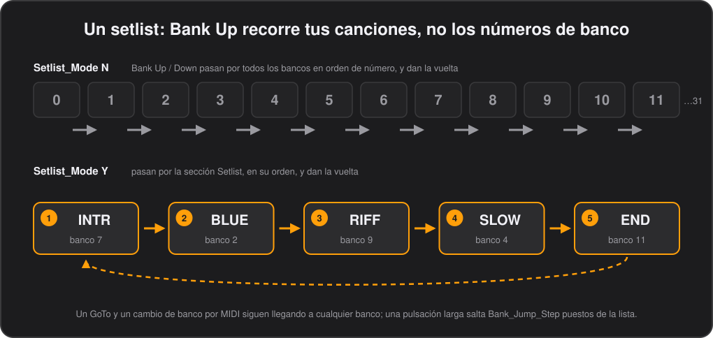
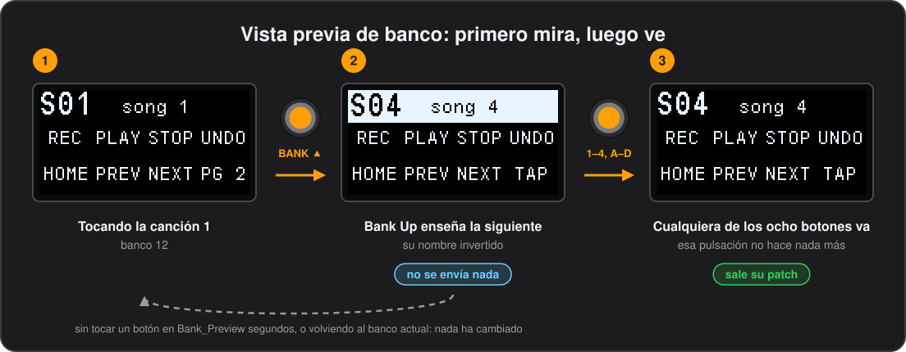

# Bancos

[English](../en/04-banks.md) · **Español**

La pedalera tiene 32 bancos de ocho botones, numerados del 0 al 31. Un banco suele ser una canción, un patch o un grupo de controles que quieres tener juntos bajo los pies. Este capítulo trata de:

- cómo te mueves entre bancos: Bank Up y Bank Down, un setlist, una vista previa antes de decidirte y botones que saltan;
- qué hace un banco cuando llegas y cuando te vas: los comandos que envía al entrar y al salir;
- las segundas páginas, que doblan los botones de una canción;
- las cuatro configuraciones completas que caben en una pedalera, y cómo cambiar de una a otra.

## Nombres de banco

Cada banco tiene un nombre que la pantalla muestra en letras grandes, de 4 caracteres, y al lado una línea de información en letra pequeña, de 8 caracteres: `S01` y `song 1`, `FX` y `led mode`. Se ponen en la pestaña **Banks** del configurador.

### `Bank_Naming`

Una fila por banco, `Bank_Number` 0–31: `Bank_Name_Large` (4 caracteres, letra grande) y `Bank_Info_Small` (8 caracteres, letra pequeña). Pueden faltar filas: una configuración que solo define los primeros bancos, incluso una escrita para el firmware de 8 bancos, se graba tal cual y deja vacíos los demás.

## Bank Up y Bank Down

Los dos pulsadores de la derecha recorren los bancos. Una pulsación corta en **Bank Up** o **Bank Down** avanza o retrocede un banco, y actúa al soltar. Si lo mantienes más de `Long_Press_ms` (500 ms si no lo cambias), salta varios bancos de golpe en cuanto se cumple ese tiempo; cuántos lo decide **Long press jumps** en la pestaña **Global** del configurador, `Bank_Jump_Step` en el CSV, de 1 a 31, 8 si no lo cambias. Los dos dan la vuelta, del 31 al 0 y del 0 al 31.

Lo que hacen se cambia con **Bank switches** en la pestaña **Global**, `Bank_Switch_Mode`:

| `Bank_Switch_Mode` | Qué hacen Bank Up / Down |
|---|---|
| `Bank` | Cambian de banco y nada más. Es lo predeterminado. |
| `Bank+MIDI` | Cambian de banco y además envían sus propios comandos (ver [Lo que envían los pulsadores de banco](#lo-que-envían-los-pulsadores-de-banco)). |
| `MIDI only` | Envían sus propios comandos y nunca cambian de banco, con lo que la pedalera se convierte en un controlador de diez pulsadores sin más. |

Si mantienes Bank Down y Bank Up a la vez durante dos segundos, se abre el [editor de la pedalera](10-editing-on-the-pedal.md).

## Setlist

En un bolo casi nunca quieres los bancos 12, 13 y 14 en orden de número: quieres las canciones de esta noche, en el orden de esta noche, estén donde estén. Un setlist hace que Bank Up y Bank Down recorran ese orden en lugar de los números de banco.

En el configurador, pon los bancos en orden en la pestaña **Setlist**, un desplegable por puesto, y marca **Follow the setlist** en la pestaña **Global**. La lista termina en su primera fila vacía.

- Bank Up / Down, su pulsación larga y los comandos `Bank` relativos siguen la lista, y dan la vuelta por los dos extremos. Una pulsación larga salta `Bank_Jump_Step` puestos de la lista.
- Desde un banco que no está en la lista, Up entra por su primer puesto y Down por el último.
- Un banco puede aparecer más de una vez, pero al avanzar desde él siempre se sigue desde su primera aparición.
- Un `GoTo` y un cambio de banco por MIDI entrante siguen yendo al banco exacto que se pide.
- La lista solo cuenta mientras **Follow the setlist** está activado, así que puedes tener una guardada y desactivarla.

### En el CSV

`Setlist_Mode` `Y` en `Global_Settings` lo activa, y `N` (lo predeterminado) lo desactiva. La sección `Setlist` es opcional: filas de `Position` y `Bank_Number` (0–31). Hasta 32 puestos, ordenados por `Position`, así que las filas pueden ir en cualquier orden y los puestos pueden saltarse números; los números de banco no válidos se descartan.

## Vista previa de banco

En mitad de una canción, un pie que roza Bank Up cambia el patch, y con él la canción. Con la vista previa activada, Bank Up y Bank Down solo *enseñan* el banco al que irían y no envían nada; uno de los ocho botones te lleva allí.

Actívala con **Preview banks** en la pestaña **Global**, `Bank_Preview` en el CSV: los segundos que una vista previa te espera, de 1 a 60. 0 la desactiva, y es lo predeterminado. En el editor de la pedalera es `PREVIEW`.

- Una pulsación, corta o larga, en Bank Up / Down mueve el banco que se enseña igual que habría movido el propio banco, setlist incluido. La pantalla muestra el nombre de ese banco invertido, en blanco con letras negras, sobre las etiquetas de sus botones.
- Mientras miras no se envía nada: ni los comandos de los bancos ni los propios de los pulsadores de banco.
- El primero de los ocho botones que baja lo confirma. La pedalera va allí como lo habrían hecho Bank Up / Down, con los comandos de salida y de entrada, y esa pulsación no hace nada más, ni tampoco al soltarla. Un botón que ya estaba pisado cuando empezó la vista previa termina su pulsación con normalidad.
- Al confirmar tampoco se envían los comandos propios de los pulsadores de banco (`Bank+MIDI`).
- Volver al banco en el que estás quita la vista previa, y también dejarla sin tocar durante los segundos puestos: la pantalla vuelve al banco en el que estás y no ha cambiado nada.
- Un cambio de banco por MIDI, un cambio de configuración o abrir el editor también la quitan.
- Las lecturas de tempo y los textos del ordenador esperan a que termine la vista previa.
- Con **Bank switches** en `MIDI only` los pulsadores de banco no cambian de banco, así que no hay nada que previsualizar.

*Firmware 0.66 o posterior.*

## Botones que cambian de banco

Cualquier botón puede moverte entre bancos con un comando `Bank`, además de lo que envíe. En el configurador elige `Bank` como tipo de comando y una **Action**:

| Action | Qué hace |
|---|---|
| `GoTo` | Salta al banco indicado, 0–31. Un banco lleno de botones `GoTo` hace de índice de tus canciones. |
| `Up`, `Down` | Avanza o retrocede ese número de bancos, 1–31, dando la vuelta, y siguiendo el setlist cuando está activado. |
| `Back` | Vuelve al banco de donde venías, ver más abajo. |
| `Page` | Muestra otro banco como [segunda página](#segunda-página) de este. |
| `Config`, `NextConfig` | Cambia a otra [configuración](#cuatro-configuraciones). |

El cambio se hace después de enviar el resto de comandos del botón, así que un botón puede enviar MIDI y luego llevarte a otro banco. En el CSV es `CommandType` `Bank`, con la acción en `KeyMode` y el banco o el número de bancos en `OnValue`; nada más del comando se usa.

### Volver al banco de donde venías

Un banco de utilidades —un afinador, unos boosts para los solos— es mucho más útil a un botón de distancia y a otro de vuelta, estés donde estés. `Back` vuelve al banco del que salió el último cambio de banco, lo hiciera quien lo hiciera: un botón, un comando `Bank`, el setlist, Bank Up / Down o el ordenador. No lleva valor.

- Volver ya es un cambio de banco, así que guarda el banco del que sales: un botón `Back` en cada uno de dos bancos salta de uno a otro.
- Mostrar una segunda página no es un cambio de banco, así que `Back` en una página vuelve al banco desde el que se llegó al banco de la página, no al banco de la propia página. Salir de un banco desde su página cuenta como salir del banco.
- La pedalera olvida de dónde venías cuando cambia la configuración y al apagarla, así que un `Back` pulsado antes de ningún cambio de banco no hace nada.

En la demo, el botón B del banco 10, PREV, es uno de ellos.

*Firmware 0.49 o posterior.*

Por dentro

Se guarda como el nibble bajo 6 del comando `Bank`. El firmware anterior a 0.49 lo toma como un `GoTo` al banco 0.

## Segunda página

Ocho botones no siempre bastan para una canción. Un botón `Page` muestra otro banco en lugar del actual, como su segunda página: los ocho botones, etiquetas, nombres, modos de LED y tipos de pulsación de ese banco pasan a los pulsadores, como una tecla de mayúsculas. Pulsar otra vez un botón `Page`, ya en la página, te devuelve.

Se configura con un comando `Bank`, **Action** `Page`, indicando el banco de la página. En la página, pon un botón `Page` en el mismo pulsador que indique el primer banco, para que el mismo pulsador vaya y vuelva; un botón con `Page` se queda encendido mientras se muestra la página.

La página es un banco como cualquier otro y podrías usarla por su cuenta, pero cuando llegas así pertenece al banco del que viene:

- Al volver no se envía de nuevo nada del banco: sus comandos de entrada salieron cuando entraste en él.
- Los comandos de entrada de la página salen cuando se muestra, y los de salida cuando vuelves, así que una página puede encender algo en el equipo y volver a apagarlo. Déjalos vacíos para una página que solo cambia los pulsadores.
- Bank Up / Down, los comandos `Bank` relativos y el setlist avanzan desde el banco, no desde la página, y salen de la página por el camino.
- Los pedales de expresión conservan los `BankExpression_Settings` del banco y lo que hayan puesto los comandos `Exp`. Sus botones de punta, talón y auto-engage pulsan el botón de la página que se muestra.
- El texto que el ordenador escribió hasta el próximo cambio de banco se queda en la pantalla.
- Tras apagar y encender con `Remember_State`, la pedalera vuelve al banco, no a su página. Cada página guarda sus propios estados de toggle, como cualquier banco.
- `GoTo`, un cambio de banco por MIDI entrante o un cambio de configuración también salen de la página, enviando sus comandos de salida y luego los del banco.

En la demo, la canción 1 (banco 12) tiene PG 2 en D, que muestra el banco 31.

*Firmware 0.47 o posterior.*

## Comandos al entrar y al salir de un banco

Casi todos los equipos quieren lo mismo cada vez que llegas a una canción: su patch. Cada banco puede enviar hasta diez comandos propios al entrar en él, normalmente un Program Change, así no gastas ningún botón en eso, y otros al salir, para apagar lo que encendió.

Se editan en la pestaña **Bank Enter** del configurador. La lista admite los mismos comandos que un botón.

- Los comandos se envían una vez al entrar en el banco, llegues como llegues: con los pulsadores de banco, un comando `Bank` o un mensaje MIDI entrante. No se envía la parte de soltar.
- Los comandos `Bank` se ignoran aquí, así que entrar en un banco no puede encadenar la entrada en otro.

### Comandos al salir de un banco

Un comando `Leave`, que no lleva campos, parte la lista en dos: los comandos de encima se envían al entrar en el banco y los de debajo al salir. Un banco que enciende un delay al entrar, por ejemplo, lleva `CC 59 127`, `Leave`, `CC 59 0`, y el delay se apaga de nuevo salgas como salgas.

- Los comandos de salida se envían justo antes que los del banco en el que entras, te lleve lo que te lleve, un pulsador de banco, un comando `Bank` o MIDI entrante, y también cuando cambias de configuración, antes de entrar en el primer banco de la nueva.
- Se envían del tirón: un `Wait` entre ellos se salta, así que las dos listas nunca se solapan. Para separarlas, pon un `Wait` al principio de la lista del banco siguiente.
- Las diez casillas se reparten entre las dos partes y el `Leave` ocupa una. Las herramientas rechazan un segundo `Leave`, o uno en cualquier sitio que no sea la lista de un banco.

En la demo, el banco 11 envía CC 59 127 al entrar y CC 59 0 al salir.

*Firmware 0.40 o posterior para `Leave`.*

Por dentro

Igual que `Wait`, un `Leave` se marca con el nibble bajo del tipo de comando vacío, 4, así que la disposición no cambia. El firmware anterior a 0.40 envía las dos partes al entrar.

### `BankEnter_Settings`

Opcional; una fila por banco con las mismas diez casillas de comando que un botón, menos las columnas propias de los botones.

## Lo que envían los pulsadores de banco

Bank Up y Bank Down pueden enviar su propio MIDI, para un equipo que quiera enterarse —la siguiente pista de un looper, el siguiente marcador de un DAW— o, con el cambio de banco desactivado, para tener dos pulsadores más. Cada pulsador tiene una lista para la pulsación corta y otra para la larga.

Se editan en la pestaña **Bank Switch** del configurador, y en la pestaña **Global** eliges si se envían: con **Bank switches** en `Bank`, lo predeterminado, no se envía nada; en `Bank+MIDI` se envían junto con el cambio de banco; en `MIDI only` es lo único que hacen los pulsadores. Ver [Bank Up y Bank Down](#bank-up-y-bank-down).

- Las listas son las mismas en todos los bancos, porque los pulsadores sirven para moverse y deben comportarse igual estés donde estés.
- Cada lista sale como un toque, pulsar y soltar, así que un comando `Toggle` cambia una vez por pulsación y guarda su propio estado.
- Los comandos `Bank` se ignoran aquí: adónde llegas lo deciden el propio pulsador y `Bank_Switch_Mode`.

*Firmware 0.17 o posterior.*

### `BankSwitch_Settings`

Opcional; cuatro filas, una por pulsador y duración de la pulsación: `Switch` `Down` o `Up`, `Press` `Short` o `Long`, y después las mismas diez casillas de comando que un botón. Pueden faltar filas o ir en cualquier orden.

## Cuatro configuraciones

En una pedalera caben cuatro configuraciones completas, una por banda o por sala, por ejemplo, cada una con sus 32 bancos y sus ajustes. El selector **Slot** del configurador elige en qué ranura actúan **Read from Device** y **Flash to Device**; grabar una nunca toca las demás.

Para cambiar entre ellas desde la pedalera, dale a un botón un comando `Bank` con **Action** `Config`, indicando la ranura, de 1 a 4, o `NextConfig`, que pasa a la siguiente ranura que tenga una configuración, dando la vuelta.

- El cambio espera a que sueltes todos los pulsadores, y envía cualquier soltado temporizado pendiente, para que nada se quede colgado.
- La nueva configuración empieza en el banco 0 con todos los toggles apagados, y la pantalla muestra su número y su nombre a pantalla completa.
- Si pides una ranura vacía, o la siguiente cuando ninguna otra tiene configuración, sale un aviso breve en su lugar.
- Mientras una herramienta escribe una ranura, y hasta 10 segundos después de su última escritura, el cambio no se hace y la pantalla dice `UPLOAD`: la carga sigue en la ranura en la que empezó (firmware 0.79 o posterior).
- La pedalera vuelve a la ranura activa al apagarla y encenderla, diga lo que diga `Remember_State`; el banco y los toggles solo se recuperan cuando la configuración que arranca lo pide.
- Una ranura tiene configuración cuando su `ConfigName` son dieciséis caracteres imprimibles, cosa que las herramientas escriben siempre.

*Firmware 0.24 o posterior.*

---

[← El configurador](03-the-configurator.md) · [Índice](README.md) · [Botones →](05-buttons.md)
