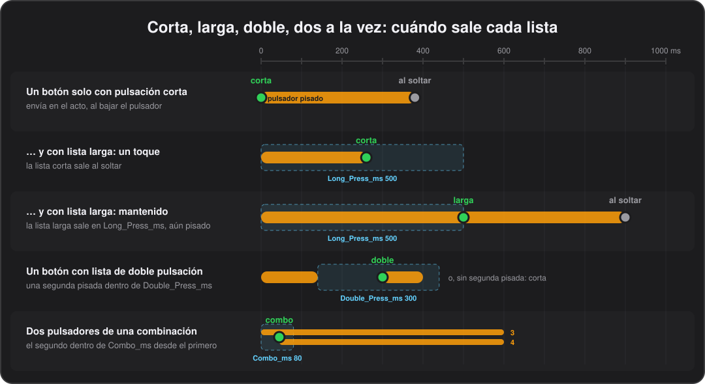

# Botones

[English](../en/05-buttons.md) · **Español**

Cada botón tiene tres listas de comandos (pulsación corta, larga y doble), una etiqueta en la pantalla, una luz y unas cuantas opciones que cambian cómo se comporta.

En el configurador todo esto está en la pestaña **Buttons**: eliges un banco y luego uno de los ocho botones, colocados como en la pedalera. Arriba del editor están su **display label** (etiqueta), su **LED light mode** (modo del LED) y su **exclusive group** (grupo exclusivo), y las casillas **Momentary when held**, **Flash at the tempo** y **Global**. Debajo, las diez casillas de comandos, y **Short press / Long press / Double press** para cambiar entre las tres listas.

## Pulsación corta, larga y doble

Un botón puede hacer tres cosas distintas: una con un toque, otra si lo mantienes y una tercera con dos toques rápidos. Un delay con un toque, el afinador manteniendo y el looper con doble toque, todo bajo el mismo pie.

- **Pulsación corta.** La lista que tienen todos los botones. Un botón que no tiene nada más que esperar la envía en el instante en que el pulsador baja.
- **Pulsación larga.** Una segunda lista de hasta diez comandos, que sale cuando mantienes el botón más allá de **Long press after** (`Long_Press_ms`, 500 ms si no lo cambias, de 100 a 2500) en la pestaña Global. Sale en ese momento, con el pie todavía encima. Un botón que tiene comandos de pulsación larga envía su pulsación corta al soltarlo, siempre que lo sueltes antes de que se cumpla el tiempo.
- **Pulsación doble.** Una tercera lista, que sale con dos pulsaciones dentro de **Double press within** (`Double_Press_ms`, 300 ms si no lo cambias, de 100 a 1000). Sale en cuanto baja la segunda pulsación.

Solo cambian de comportamiento los botones que tienen comandos de pulsación doble en el banco actual: un toque simple en ellos espera esa ventana antes de enviar su pulsación corta, y mantenerlos sigue dando la pulsación larga, o la corta si no hay larga. Los botones sin comandos de pulsación larga ni doble responden al instante, exactamente como siempre.

Los comandos de pulsación larga y doble tienen cada uno su propio estado de toggle, aparte del de la pulsación corta. Copy / Paste bank en el configurador copia las tres listas.

*Pulsación doble: firmware 0.26 o posterior.*

Por dentro

`CSV_to_Flash.py` deja fuera los comandos de pulsación doble, con un aviso, cuando la pedalera lleva un firmware anterior a 0.26.

## Dos pulsadores a la vez

Pisar dos pulsadores a la vez, el 3 y el 4 con un solo pie por ejemplo, ejecuta una lista propia en lugar de lo que hace cada uno por separado, como hacen las controladoras de Boss y Morningstar para llegar al afinador o al looper.

Se configura en la pestaña **Combos** del configurador, una fila por combinación y hasta doce: los dos pulsadores, el banco en el que cuenta (o todos) y la lista que ejecuta. Cuánto espera un pulsador al otro es **Two switches together within** (`Combo_ms`) en la pestaña Global.

- **Qué ejecuta.** Una combinación no tiene comandos propios: ejecuta una lista guardada en un botón, la pulsación corta, larga o doble de cualquier botón, nombrada igual que la nombra un [`Macro`](06-commands.md#macros). Guarda esas listas en un botón de un banco que tengas libre, el banco global por ejemplo, donde además puedes probarlas pisando ese botón.
- **En qué banco.** Una combinación cuenta en un banco o en todos. Una combinación del banco que se ve gana a una de todos los bancos para la misma pareja; así es como un banco le da otro trabajo a una pareja.
- **Tiempos.** Un pulsador que forma parte de una combinación en el banco actual no dispara al momento: espera `Combo_ms`, 80 ms si no lo cambias, a que llegue el otro, cosa que un pie sobre dos pulsadores consigue sin problema. Si el otro llega a tiempo, la pareja ejecuta la combinación y ninguno de los dos envía lo suyo. Si no llega, la pulsación sigue como habría seguido, hacia una corta, larga o doble, contando ya la espera, y un toque que sueltas dentro de la ventana sigue siendo un toque.
- **Todo lo demás responde al instante.** Los pulsadores que no están en ninguna combinación, y todos los de un banco que no tenga ninguna, responden al momento, como siempre.
- **Al soltar.** La lista se ejecuta al pisar, con un estado de toggle propio de la combinación, y lo que va al soltar (los «off» momentáneos) sale cuando se levanta el primero de los dos pulsadores. `Wait`, `If`, `Macro` y los demás funcionan ahí como en cualquier otro sitio.
- Dos pulsaciones del mismo pulsador siguen siendo una pulsación doble, no una combinación, y los dos pulsadores de banco conservan su propio gesto, el [editor de la pedalera](10-editing-on-the-pedal.md).

En la demo, 3+4 activa y desactiva un afinador en todos los bancos y borra el looper en la canción 1.

*Firmware 0.59 o posterior.*

Por dentro

Una combinación ocupa cuatro bytes en lugar de diez comandos: no quedaba sitio para una lista propia. El firmware lee la tabla de los últimos 48 bytes de la ranura de configuración; un firmware anterior la ignora y los dos pulsadores hacen lo que hacen por separado.

## Toggles, y cuándo se envía el «off»

La mayoría de los comandos tienen un «on» y un «off»: el `OnValue` y el `OffValue` de un CC, el note on y el note off de una nota. Que un botón sea momentáneo, temporizado o un toggle decide cuándo sale el «off»:

| `Toggle` | `Duration` | Qué pasa |
|---|---|---|
| N | 0 | «On» al pisar y «off» al soltar: momentáneo. |
| N | más de 0 | «On» al pisar y «off» automático pasado ese tiempo, aunque sigas pisando. Solo notas, pitch bend y teclas; un CC ignora la duración. |
| Y | | La primera pulsación envía «on», la siguiente «off», y así sucesivamente. |

El estado del toggle se guarda por botón y por banco, y es el que manda en el LED y en la casilla de la pantalla.

## Luz y etiqueta

Cada botón tiene una etiqueta de hasta 4 caracteres en la pantalla, en una rejilla colocada como la pedalera; un botón sin etiqueta muestra su identificador. Las casillas de los toggles se dibujan invertidas mientras están encendidos.

Su LED sigue uno de tres modos, el **LED light mode** del configurador:

- **Normal**: encendido mientras el botón está activo, apagado el resto del tiempo.
- **Reverse**: encendido en reposo, apagado mientras está activo.
- **AlwaysOn**: encendido en reposo, parpadeando mientras está activo.

«Activo» quiere decir pisado físicamente en un botón momentáneo, o encendido si alguno de los comandos del botón es un toggle. Un LED encendido usa **Brightness** (`LED_Brightness`) del grupo LEDs de la pestaña Global, y uno encendido en reposo usa **Brightness at rest** (`LED_Rest_Brightness`), para que un botón activo se distinga de uno en reposo. Los LEDs se atenúan por PWM por software a 500 Hz, así que no se nota ningún parpadeo.

**Flash at the tempo** (`Tempo_Flash`) hace que el LED de cualquier botón parpadee con el pulso; mira [LED del tap](07-tempo.md#led-del-tap).

## Enclavar o momentáneo

Un toggle que se enclava con un toque y funciona como momentáneo si lo mantienes, como el boost de un pedal de Boss o Morningstar: un toque y queda encendido toda la canción, o lo mantienes para un solo y se apaga al soltar.

Marca **Momentary when held** (`Momentary_Hold` `Y`) en un botón con un comando toggle en su lista de pulsación corta.

- Cambia de estado en cuanto lo pisas, como siempre.
- Si lo mantienes más allá de `Long_Press_ms` (500 ms si no lo cambias), al soltarlo se pulsa a sí mismo una vez más, así que vuelve a donde estaba: encendido solo mientras lo pisas si estaba apagado, apagado solo mientras lo pisas si estaba encendido.
- Un toque más corto que eso lo enclava como siempre.
- Mantenerlo es cosa de la lista de pulsación larga cuando el botón tiene una, así que la opción no hace nada en un botón así, ni en un botón de ciclo.
- En un grupo exclusivo, mantener un botón apaga los demás y se quedan apagados.

La usa el botón 4 del banco 11 de la demo, BOST.

*Firmware 0.39 o posterior; un firmware anterior ignora la opción y el botón simplemente alterna.*

Por dentro

La opción es el bit 7 del byte de modo de LED del botón, que las configuraciones siempre han dejado a cero, así que el formato no cambia.

## Grupos exclusivos

Como los botones de canal de un ampli, o elegir entre dos delays: encender un botón del grupo apaga los demás.

Elige el **exclusive group** (`Group`, del 1 al 4) junto al modo del LED. Los botones de un banco en el mismo grupo quedan atados:

- Encender uno apaga cualquier otro del grupo que esté encendido, como si lo pisaras, así que salen sus comandos de «off» y su LED y su casilla de la pantalla lo siguen.
- Se apagan antes de que el botón pisado envíe nada, así que cuando todo el grupo controla un mismo parámetro, un CC de canal del ampli por ejemplo, el aparato acaba donde dice el botón pisado.
- Pisar el botón encendido lo apaga como cualquier toggle y deja el grupo entero apagado.
- Solo participan los botones con un comando toggle, y solo su pulsación corta.
- Los grupos son por banco: el grupo 1 de un banco no tiene nada que ver con el grupo 1 de otro.
- Una escena puede encender dos botones de un grupo, y gana el último.

La demo agrupa los cuatro botones de pista del banco del looper. Copy / Paste bank copia los grupos.

*Firmware 0.32 o posterior.*

Por dentro

El grupo vive en los bits altos del byte de modo de LED del botón, que las configuraciones siempre han dejado a cero, así que el formato no cambia. Un firmware anterior a 0.32 lee un botón con grupo como modo de LED `Normal`.

## Escenas

Una pulsación pone los toggles del banco en la combinación que elijas, delay encendido y chorus apagado por ejemplo.

Una escena es un comando, `CommandType` `Scene`, que el configurador muestra como ocho desplegables, uno por botón. En el CSV, `OnValue` lleva ocho caracteres, uno por botón en el orden `1234ABCD`: `+` para encenderlo, `-` para apagarlo y `.` o cualquier otra cosa para dejarlo como está. Así, `+-+..-..` enciende el 1 y el 3 y apaga el 2 y el B.

- Cada botón afectado que no esté ya en el estado buscado se pulsa como si lo pisaras, así que sus propios comandos, su LED y su casilla de la pantalla lo siguen.
- Los que ya están así no se tocan, de modo que llamar dos veces a la misma escena no envía nada la segunda vez.
- Los botones sin comando toggle no tienen estado y se saltan.
- Una escena no puede disparar otra escena.

La demo pone tres en las pulsaciones largas del banco de modos de LED.

## Botones de ciclo

Un botón que pasa por varios estados, cada uno con sus comandos y su etiqueta en la pantalla: los cuatro canales de un ampli en un solo pulsador, una pulsación cada uno, y vuelta a empezar.

`CommandType` `Cycle` divide los comandos de pulsación corta de un botón en estados. Los comandos que hay encima del primer `Cycle` son el estado 1, los que hay entre ese y el siguiente `Cycle` el estado 2, y así sucesivamente. Para un ampli con cuatro canales en los Program Change 0 a 3, los comandos del botón son:

`PC 0`, `Cycle "CH B"`, `PC 1`, `Cycle "CH C"`, `PC 2`, `Cycle "CH D"`, `PC 3`, con `CH A` como etiqueta del botón.

- Cada pulsación envía los comandos del estado siguiente, y después del último vuelve al estado 1.
- La casilla de la pantalla muestra la etiqueta del estado que se acaba de enviar: el `OnValue` del comando `Cycle`, hasta 4 caracteres, o la `Label` del propio botón para el estado 1 y para un `Cycle` sin etiqueta.
- Un botón empieza antes de su primer estado, así que su primera pulsación envía el estado 1.
- Los comandos `Cycle` también ocupan casillas, así que en las diez casillas caben cinco estados de un comando cada uno.
- Un estado puede llevar varios comandos, pausas, rampas y comandos que se repiten, que entonces solo se repiten mientras se mantiene la pulsación de ese estado.
- Cada botón de ciclo de cada banco conserva su posición mientras la pedalera está encendida, pases por los bancos que pases entre medias. Un cambio de configuración, o apagar la pedalera, los devuelve todos al principio.
- `Cycle` solo va en la lista de pulsación corta: las herramientas lo rechazan en una pulsación larga o doble, en los comandos de entrada de un banco o en las listas de los pulsadores de banco.
- Las etiquetas se guardan en una tabla de 48, y cada etiqueta distinta se guarda una sola vez, la usen cuantos botones la usen; las herramientas rechazan una configuración con más.

El botón D del banco 11 de la demo recorre cuatro canales de ampli.

*Firmware 0.38 o posterior; un firmware anterior ignora los comandos `Cycle` y envía todos los estados a la vez.*

Por dentro

La tabla de etiquetas va al final de la configuración. Como `Wait`, un `Cycle` se marca con el nibble bajo del tipo de comando vacío, 3, y el byte 1 guarda la posición de la etiqueta en la tabla, o 0x7F si no tiene.

## Botones globales

Un afinador, un panic, un tap tempo: lo que debería estar bajo el mismo pie toda la noche. Sin esto, significa copiar los mismos comandos en los 32 bancos, y cambiar algo supone cambiarlo 32 veces.

En su lugar, reserva un banco para ellos con **Global buttons bank** (`Global_Bank`) en la pestaña Global, escribe allí esos botones una vez y, en cada uno de los demás bancos, marca **Global** (`Global` `Y`) en los botones que deban seguirlo. En la pedalera el ajuste es `GLOBBANK` en el [editor](10-editing-on-the-pedal.md): el número de banco tal como lo muestra el editor, o 0 para ninguno.

- Un botón global lo toma todo del mismo botón de ese banco: sus listas de pulsación corta, larga y doble, su etiqueta en la pantalla, su modo de LED, su grupo exclusivo y si está encendido. Así el afinador se ve encendido en todos los bancos a la vez, y apagarlo en uno lo apaga en todos.
- Lo que haya escrito en el botón en su propio banco se queda como está y no se envía nunca: un botón no puede ser global y a la vez tener algo propio.
- Por lo demás, el banco reservado es un banco normal. Puedes estar en él, sus propios botones funcionan como siempre y es donde se editan los botones globales, en la pedalera o en el configurador. Sus propios botones no siguen a nada, así que nada puede quedarse dando vueltas.
- `Global_Bank` en `Off`, que es lo que tienen todas las configuraciones escritas antes de esto, no redirige nada y cada botón vuelve a ser el suyo.
- Como las macros, devuelve espacio de configuración en lugar de gastarlo: lo que ahorra son las copias.

En la demo, el banco 30 está reservado y guarda el tap, y todos los bancos de canciones salvo el primero toman su D de ahí; el primero conserva el suyo, que es el que lleva a su segunda página.

*Firmware 0.57 o posterior; un firmware anterior ignora la marca y envía lo que haya escrito en el propio botón.*

Por dentro

La marca es el bit 3 del byte de modo de LED del botón, que las configuraciones siempre han dejado a cero, así que el formato no cambia.

## En el CSV

### Button_Settings

Una fila por botón, 256 filas en orden de banco y, dentro de cada banco, en el orden `1, 2, 3, 4, A, B, C, D` (fila de arriba de la pedalera y luego la de abajo). Columnas:

- `Bank_Number`, `Button_Identifier`
- `Label`: hasta 4 caracteres que se ven en la pantalla. Vacía, muestra el identificador del botón.
- `Light_Mode`: Normal / Reverse / AlwaysOn.
- `Group`: vacío, o un grupo exclusivo del 1 al 4 (mira [Grupos exclusivos](#grupos-exclusivos)).
- `Momentary_Hold`: `Y` para un toggle que es momentáneo si lo mantienes (mira [Enclavar o momentáneo](#enclavar-o-momentáneo)); vacío o `N` si no.
- `Tempo_Flash`: `Y` para un botón cuyo LED parpadea con el pulso (mira [LED del tap](07-tempo.md#led-del-tap)); vacío o `N` si no.
- `Global`: `Y` para un botón que lo toma todo del mismo botón de `Global_Bank` (mira [Botones globales](#botones-globales)); vacío o `N` si no.
- Diez casillas de comandos, con los prefijos `A_` a `J_`, cada una con los campos de [Comandos](06-commands.md#campos-de-un-comando).

Las filas son opcionales aquí y en `Bank_Naming`: una configuración que solo define los primeros bancos, incluida una escrita para el firmware de 8 bancos, se flashea tal cual y deja vacíos los demás. El configurador siempre muestra los 32 bancos y los escribe todos al guardar.

### Modos de LED

`Light_Mode` es `Normal`, `Reverse` o `AlwaysOn`, como se explica en [Luz y etiqueta](#luz-y-etiqueta).

### LongPress_Settings

Opcional. `Bank_Number`, `Button_Identifier` y las diez casillas de comandos: las columnas de `Button_Settings` sin la etiqueta ni las de luz, grupo y mantener, que son del botón. Pueden faltar filas o venir en cualquier orden; un botón sin fila no tiene comandos de pulsación larga y reacciona al instante al pisarlo.

### DoublePress_Settings

Opcional, y con el mismo formato exacto que `LongPress_Settings`: la tercera lista de comandos de cada botón, la que sale con dos pulsaciones rápidas (mira [Pulsación corta, larga y doble](#pulsación-corta-larga-y-doble)).

### Combo_Settings

Opcional; una fila por combinación, hasta doce, en cualquier orden (mira [Dos pulsadores a la vez](#dos-pulsadores-a-la-vez)).

| Columna | Valores | Significado |
|---|---|---|
| `Switches` | dos de 1–4, A–D, como `3+4` | La pareja. El orden no importa. |
| `Bank` | All / 0–31 | El banco en el que cuenta, o `All` para todos. Una combinación del banco que se ve gana a una `All` para la misma pareja. |
| `Run_Bank`, `Run_Button`, `Run_List` | 0–31, 1–4 o A–D, Short / Long / Double | La lista que ejecuta, la de cualquier botón, nombrada como la nombra un [`Macro`](06-commands.md#macros). |

---

[← Bancos](04-banks.md) · [Índice](README.md) · [Comandos →](06-commands.md)
