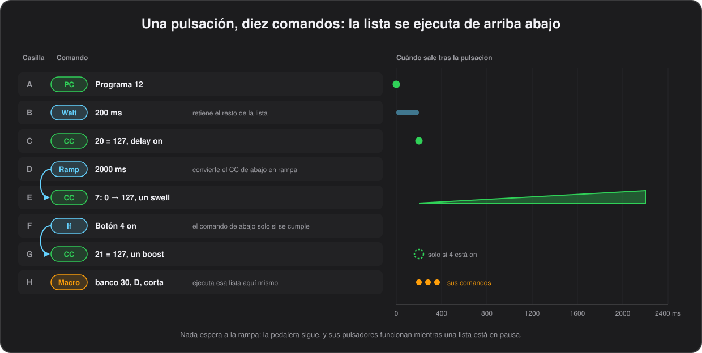

# Comandos

[English](../en/06-commands.md) · **Español**

Lo que puede enviar un botón. Cada lista —la pulsación corta, larga y doble de un botón, los comandos de un banco al entrar y al salir, y los de los pulsadores de banco— admite hasta diez comandos, que se envían en orden, de arriba abajo.

En el configurador, una lista son diez casillas, de la A a la J. Elige el tipo de comando de una casilla y solo aparecen los campos que ese tipo usa. En el CSV, cada casilla es un grupo de columnas con el prefijo `A_` a `J_`; la tabla [Campos de un comando](#campos-de-un-comando), al final de este capítulo, las recoge todas. Cuándo envía un comando su «off» —al soltar, pasado un tiempo o en la siguiente pulsación— se explica en [Botones](05-buttons.md#toggles-y-cuándo-se-envía-el-off).

## Todos los comandos de un vistazo

| `CommandType` | Qué hace | Dónde |
|---|---|---|
| `PC` | Program Change, con Bank Select opcional | [Program Change](#program-change) |
| `CC` | Control Change | [Control Change](#control-change) |
| `Note` | Note On, y Note Off para soltarla | [Notas](#notas) |
| `PB` | Pitch Bend | [Pitch Bend](#pitch-bend) |
| `SysEx` | Uno de los dieciséis mensajes SysEx guardados | [SysEx propio](#sysex-propio) |
| `Start`, `Stop` | MIDI Start y Stop | [Start y Stop](#start-y-stop) |
| `MMC` | El transporte de una grabadora o un DAW | [Controlar una grabadora o un secuenciador](#controlar-una-grabadora-o-un-secuenciador) |
| `Song` | Song Select o Song Position | [Song Select y Song Position](#song-select-y-song-position) |
| `Panic` | All Sound Off y All Notes Off en todas partes | [Panic](#panic) |
| `CCInc` | Un CC que sube o baja un paso en cada pulsación | [CC relativo](#cc-relativo) |
| `PCInc` | El preset siguiente o el anterior | [Preset siguiente y anterior](#preset-siguiente-y-anterior) |
| `Key` | Una tecla del teclado del ordenador | [Teclas del teclado](#teclas-del-teclado) |
| `Media` | Una tecla multimedia: play, siguiente, volumen… | [Teclas multimedia](#teclas-multimedia) |
| `Chan` | Envía el comando de abajo por varios canales | [Un canal, o varios](#un-canal-o-varios) |
| `Wait` | Una pausa en la lista | [Pausas](#pausas) |
| `Ramp` | Convierte el CC de abajo en un paseo lento hasta su valor | [Rampas de CC](#rampas-de-cc) |
| `Exp` | Cambia lo que envía un pedal de expresión | [Cambiar el destino de un pedal de expresión](#cambiar-el-destino-de-un-pedal-de-expresión) |
| `Value` | Fija o cuenta uno de los ocho valores de la pedalera | [Valores y condiciones](#valores-y-condiciones) |
| `If` | Retiene el comando de abajo si no se cumple una condición | [Valores y condiciones](#valores-y-condiciones) |
| `Macro` | Ejecuta la lista de otro botón en su sitio | [Macros](#macros) |
| `Listen` | El CC en el que un equipo informa del estado del botón | [Escuchar otro CC](#escuchar-otro-cc) |
| `Tap` | Tap tempo, el reloj MIDI, fijar o retocar el tempo | [Tempo](07-tempo.md#tap-tempo) |
| `LFO` | Hace oscilar a tempo el CC de abajo | [Tempo](07-tempo.md#lfo-sincronizado-al-tempo) |
| `Seq` | Toca el CC o la nota de abajo como una secuencia por pasos | [Tempo](07-tempo.md#secuenciador-por-pasos) |
| `Bank` | Cambia de banco, vuelve atrás, enseña una segunda página o cambia de configuración | [Bancos](04-banks.md#botones-que-cambian-de-banco) |
| `Scene` | Pone los toggles del banco en una combinación elegida | [Botones](05-buttons.md#escenas) |
| `Cycle` | Divide una lista corta en estados, uno por pulsación (solo pulsación corta) | [Botones](05-buttons.md#botones-de-ciclo) |
| `Leave` | Divide la lista de un banco en entrada y salida (solo en la lista de entrada de un banco) | [Bancos](04-banks.md#comandos-al-salir-de-un-banco) |
| vacío | Ningún comando | |

## Enviar MIDI

Todo lo de este grupo sale a la vez por USB y por la salida DIN.

### Program Change

Elige un patch. `Channel` es el canal MIDI, 1–16, y `Number` el programa, 0–127.

Para equipos con más de 128 patches, `BankSelect` antepone un Bank Select al Program Change, 0–16383: sale como CC#32, el byte bajo, antes del PC. Con `BankSelectHighByte` a `Y` sale también CC#0, el byte alto, así que el valor es 128 veces el byte alto más el bajo. La [plantilla del FM3](11-devices.md) lo usa para llegar a los bancos B a D del FM3.

Si dejas `BankSelect` vacío no se envía ningún Bank Select; un `0` explícito sí envía uno.

Por dentro

Hasta las herramientas del firmware 0.17, un Bank Select vacío se empaquetaba como 0, así que cada Program Change enviaba un Bank Select LSB de 0 que nadie había pedido, y eso cambia de banco en los equipos que lo escuchan. Fue un arreglo de las herramientas: una configuración escrita con herramientas antiguas hay que volver a escribirla para quitárselo.

### Control Change

`Channel` es el canal, `Number` el controlador, `OnValue` el valor que se envía al pisar, 0–127, y `OffValue` el que se envía al soltar, o al apagar un toggle. Con `Toggle` a `Y`, el botón alterna entre los dos en pulsaciones sucesivas, y su LED indica en cuál está. Un CC no usa `Duration`. Deja `OffValue` vacío para un CC sin valor de apagado, que solo envía `OnValue`.

### Notas

`Channel` es el canal, `Number` la nota y `Velocity` su velocidad, 0–127. La nota se suelta con un Note Off al soltar el botón; pasado `Duration` si lo pones, en pasos de 10 ms hasta 1,27 s, aunque el botón siga pisado; o en la siguiente pulsación con `Toggle`.

### Pitch Bend

`Channel` es el canal y `OnValue` la inflexión, de −8192 a 8191. Vuelve al centro al soltar; pasado `Duration` si lo pones; o en la siguiente pulsación con `Toggle`, igual que una nota.

### Start y Stop

`Start` y `Stop` no llevan campos: envían MIDI Start (0xFA) y Stop (0xFC), para arrancar y parar una caja de ritmos o un secuenciador. Para el reloj MIDI propio de la pedalera, mira [Tap tempo](07-tempo.md#tap-tempo).

### SysEx propio

Para un equipo que solo se controla por SysEx. `CommandType` `SysEx` envía uno de los dieciséis mensajes guardados en la sección [`SysEx_Strings`](#sysex_strings) de la configuración; `Number` dice cuál, de 0 a 15, y el resto del comando no se usa.

*Firmware 0.13 o posterior.*

### SysEx_Strings

Los mensajes en sí, que se editan en la pestaña **SysEx** del configurador, que te enseña el número de bytes, o un aviso, mientras escribes.

- En el CSV la sección es opcional: dieciséis filas, cada una con un `Index`, 0–15, y sus `Bytes`.
- Escribe los bytes en hexadecimal tal como vienen en el manual del equipo, separados por espacios o comas, con o sin `0x` delante.
- El `F0` inicial y el `F7` final son opcionales: se añaden al enviar.
- Hasta 23 bytes de datos, cada uno entre `00` y `7F`.
- Una línea que no se puede leer se guarda vacía, y un comando que apunte a ella no envía nada, en lugar de un mensaje mal formado.

### Controlar una grabadora o un secuenciador

El transporte de un DAW, una grabadora de disco duro o una caja de ritmos, con el pie. `CommandType` `MMC` envía un mensaje MIDI Machine Control a todos los equipos de la línea.

`KeyMode` es la acción:

| `KeyMode` | Qué hace |
|---|---|
| `Play` (o vacío), `Stop`, `Pause` | El transporte |
| `Record`, `RecordExit` | Un pulso de grabación, el pinchazo de entrada, y el de salida |
| `FastForward`, `Rewind` | Avanzar o rebobinar |
| `Locate` | Ir al tiempo de `OnValue`, en segundos desde el principio, hasta 16383 (4h33m) |
| `DeferredPlay`, `Chase`, `Eject`, `Reset` | El resto del juego MMC |

Un `Locate` sale como un código de tiempo de horas, minutos y segundos con los frames a cero, así que `3725` es 1:02:05. Aquí el MMC va en un solo sentido: no vuelve nada, y la pedalera no sigue la posición de la grabadora.

Por dentro

Se guarda como un `Wait`, por el nibble bajo del tipo de comando vacío, 7, con el byte de comando MMC en el byte 1 y los segundos en los bytes 2 y 3. El firmware anterior lo ignora.

*Firmware 0.50 o posterior.*

### Song Select y Song Position

Para elegir lo que toca una caja de ritmos o un secuenciador hardware. `CommandType` `Song`:

- `KeyMode` `Select` envía un Song Select (0xF3) con el número de canción en `OnValue`, 0–127: la canción, el patrón o la secuencia que hay que tocar.
- `KeyMode` `Position` envía en su lugar un Song Position Pointer (0xF2); `OnValue` es desde dónde empezar dentro de la canción, contado en semicorcheas: 16 por compás de 4/4, 0 para el principio. Normalmente el equipo espera ahí al siguiente Start o Continue.

Ninguno de los dos mensajes va por un canal MIDI, así que no hay `Channel` que poner. Pon un `Select` en los comandos de entrada de un banco y la grabadora seguirá tu setlist.

Por dentro

Se guarda por el nibble bajo del tipo de comando vacío, 8: el byte 1 dice qué mensaje, y los bytes 2 y 3 el valor. El firmware anterior ignora los dos, igual que un `MMC`.

*Firmware 0.50 o posterior.*

### Panic

Para la nota colgada o el sonido desbocado en mitad de un concierto. `CommandType` `Panic` no lleva campos y envía All Sound Off (CC 120) y All Notes Off (CC 123) por los dieciséis canales.

No reinicia los toggles ni los controladores, pero sí para todas las [rampas de CC](#rampas-de-cc). Una pulsación larga es buen sitio para él, porque ahí no se pisa sin querer; la demo lo pone en una pulsación larga de STOP en el banco del tempo.

Por dentro

Los 32 mensajes salen empaquetados en dos paquetes USB y dos buffers serie, así que un panic no puede quedarse él mismo sin buffers de envío.

*Firmware 0.21 o posterior.*

## Mover valores paso a paso

### CC relativo

Para ajustar un parámetro con el pie: un botón que sube o baja un CC un paso en cada pulsación, en lugar de enviar un valor fijo. `CommandType` `CCInc`:

| Campo | Significado |
|---|---|
| `Number` | El CC |
| `OnValue` | El valor del que parte al encender |
| `OffValue` | El paso |
| `KeyMode` | La dirección: `Up` o `Down`, o `Up Repeat` o `Down Repeat` para que siga mientras lo mantienes (mira [Repetir mientras se mantiene](#repetir-mientras-se-mantiene)) |
| `Toggle` | `Y` para dar la vuelta al pasar de los extremos, en lugar de quedarse en 0 y 127 |

El valor en curso vive en memoria, uno por casilla, y vuelve al valor inicial al apagar la pedalera.

*Firmware 0.13 o posterior.*

### Preset siguiente y anterior

Un botón que sube o baja el Program Change desde donde esté el equipo. `CommandType` `PCInc` envía un Program Change un paso más allá del último programa elegido en su canal: lo último que se haya enviado por ese canal, desde cualquier comando PC, desde los comandos de un banco al entrar o desde el ordenador por USB. Así el botón siempre avanza desde donde está realmente el equipo; antes de que se haya enviado nada, cuenta como programa 0.

| Campo | Significado |
|---|---|
| `Channel` | El canal |
| `KeyMode` | La dirección: `Up` o `Down`, o `Up Repeat` o `Down Repeat` para que siga mientras lo mantienes |
| `OffValue` | El paso; 1 si está vacío |
| `Number` | El último programa del rango, de 0 a 127; 127 si está vacío. Un Line 6 HX Stomp, por ejemplo, va de 0 a 125 |
| `Toggle` | `Y` para dar la vuelta en los extremos, en lugar de pararse ahí |

- El último programa es compartido, así que un botón Siguiente y uno Anterior funcionan como pareja.
- No se conserva al apagar y encender.
- No se envía Bank Select.
- El número nuevo aparece un momento en la pantalla, como `PC 6`.

La demo pone PREV y NEXT en C y D del banco de program change, que envía PC 0 al entrar.

Por dentro

Se guarda como un PC cuyo byte de Bank Select MSB, donde 0x80 o más ya significaba «ninguno», lleva 0x81 para subir o 0x82 para bajar; el paso va en el byte 1 y el último programa en el byte 3, con su bit alto para dar la vuelta.

*Firmware 0.31 o posterior.*

### Repetir mientras se mantiene

Como una tecla del ordenador: mantienes el botón pisado y sigue. Con `KeyMode` `Up Repeat` o `Down Repeat`, un comando `CCInc` o `PCInc`, o un `Tap` que mueve el tempo, se dispara una vez al pisar, otra a los medio segundo, luego cada 200 ms, cada intervalo una cuarta parte más corto que el anterior, hasta llegar a uno cada 50 ms. Con un paso de 2, un valor de CC recorre todo su rango en unos tres segundos, y un toque sigue moviéndolo un solo paso.

- Solo vuelven a dispararse los comandos de la lista que repiten, y se saltan cualquier `Wait`.
- Una repetición que ha llegado a un extremo y no puede moverse más no envía nada, así que un botón mantenido no se queda reenviando 127.
- Mantener pisado un botón que tiene comandos de pulsación larga es una pulsación larga, así que su lista corta no puede repetir. Su lista larga sí puede, y también una lista doble mientras mantienes la segunda pisada.

Por dentro

Se guarda como el bit alto del byte del paso en `CCInc`, y como las marcas 0x83 para subir y 0x84 para bajar, en lugar de 0x81 y 0x82, en `PCInc`. El firmware anterior ignora la repetición en `CCInc`, pero envía un `PCInc` que repite como un Program Change normal y equivocado, así que actualiza antes el firmware.

*Firmware 0.35 o posterior.*

## Teclas del ordenador

Estas llegan al ordenador por USB como las de un teclado, no como MIDI, así que funcionan en cualquier programa sin mapear nada.

### Teclas del teclado

`CommandType` `Key` pulsa una tecla del teclado del ordenador: para pasar página en una partitura, arrancar una grabación o cualquier cosa que tenga atajo en un programa.

| Campo | Significado |
|---|---|
| `OnValue` | La tecla: un solo carácter (`a`, `7`) o una de `enter`, `esc`, `tab`, `space`, `backspace`, `minus`, `equal`, `leftbr`, `rightbr`, `backslash`, `semicolon`, `quote`, `grave`, `comma`, `dot`, `slash`, `f1`–`f12` |
| `Number` | Los modificadores, sumados: 1 Ctrl, 2 Shift, 4 Alt, 8 Cmd/Win; 3 es Ctrl+Shift |
| `KeyMode` | `Normal` pulsa y suelta la tecla, mantenida `Duration` si lo pones. `Down` la pulsa y la deja pulsada, `Up` la suelta, las dos tras esperar `Duration`, así que un botón puede montar una combinación en varias casillas. La espera retiene los comandos de debajo, como un [`Wait`](#pausas), y el resto de la pedalera sigue funcionando |
| `Toggle` | `Y` mantiene la tecla hasta la siguiente pulsación |

### Teclas multimedia

`CommandType` `Media` envía una de las teclas que mandan los botones multimedia de un teclado, así que funciona en cualquier reproductor o DAW.

- `OnValue` es una de `play_pause`, `play`, `pause`, `stop`, `next`, `prev`, `record`, `fast_forward`, `rewind`, `eject`, `mute`, `vol_up`, `vol_down`, o un número de uso en bruto (`0xE9`).
- La tecla se pulsa al pisar y se suelta al soltar; se mantiene `Duration` si lo pones; o hasta la siguiente pulsación con `Toggle`.
- `Number` y `Channel` no se usan.

*Firmware 0.10 o posterior.*

## Canales

### Un canal, o varios

Dos ajustes resuelven un equipo que no está en el canal para el que se escribió la configuración.

**Todo por un canal.** `Global_Channel`, en los [ajustes globales](12-configuration-file.md#global_settings), lo mueve todo: mientras tenga un canal, todos los mensajes de la pedalera salen por él, lleve cada comando el que lleve, pedales de expresión incluidos. Una configuración escrita para el canal 1 controla entonces un equipo que escucha en el 9 sin tocar un solo comando.

**Un comando por varios canales.** `CommandType` `Chan` va al revés, para un solo comando: nombra canales en `Channel`, como `1 2 3` o `1-3`, y el comando que tiene justo debajo se envía una vez por cada uno. Una pulsación silencia tres equipos, o tres amplis cambian de patch a la vez.

- Nombrar canales es a propósito, así que un `Chan` gana al canal global: un `Chan 3` encima de un comando lo deja en el canal 3 aunque el resto de la configuración se mueva.
- Igual que un `Ramp`, un `Chan` solo llega al comando que tiene justo debajo.
- También cuenta al soltar, así que un CC momentáneo se apaga en todos los canales en los que se encendió.

En la demo, mantener A en el banco 11 silencia los canales 1, 2 y 3 con un solo CC.

Por dentro

`Chan` se guarda por el nibble bajo del tipo de comando vacío, 9, con los dieciséis canales como un bit cada uno: el byte 2 para los canales 1–7, el byte 3 para el 8–14 y los dos bits bajos del byte 1 para el 15 y el 16. El canal global es el byte 41 de los ajustes globales, y 0 significa desactivado. El firmware anterior ignora tanto el `Chan` como el ajuste.

*Firmware 0.51 o posterior.*

## Dar forma a una lista

Estos no envían nada por sí mismos: cambian cuándo, si o cómo salen los comandos que tienen alrededor.

### Pausas

Para el equipo que se pierde un Control Change que llega justo detrás de un Program Change, o una ristra de mensajes que el otro lado no puede tragar de golpe. `CommandType` `Wait` pausa los comandos que le siguen en la lista; `Duration` es la pausa en milisegundos, en pasos de 10, hasta 2550.

- La pedalera no se queda parada contando: el resto de la lista se retoma cuando pasa el tiempo, y mientras tanto los demás botones, los pedales de expresión y la pantalla siguen funcionando.
- Si sueltas un botón mientras su lista aún está esperando, su suelta —el Note Off o el off momentáneo— se retiene hasta que la lista termina, así que nada se apaga antes de haberse enviado.
- Si vuelves a pisar el mismo botón, primero se envía lo que quedaba, sin sus pausas.
- Las pausas funcionan en todas las listas: pulsación corta, larga y doble, los comandos de entrada de un banco y los pulsadores de banco.
- Puede haber cuatro listas esperando a la vez, más de las que un pie puede empezar; a partir de ahí las pausas se saltan en vez de ponerse en cola.

Por dentro

El firmware anterior envía el resto de la lista sin pausa.

*Firmware 0.30 o posterior.*

### Rampas de CC

Un swell de volumen o un barrido lento de filtro con una sola pulsación. `CommandType` `Ramp` convierte en rampa el comando `CC` que tiene justo debajo: en lugar de saltar a su valor, el CC va llegando a él a lo largo de `Duration` milisegundos, en pasos de 10, hasta 655350, casi 11 minutos.

- Al pisar va hacia `OnValue`; al soltar, o con la pulsación que apaga un toggle, vuelve hacia `OffValue`.
- Arranca desde el otro extremo del comando, `OffValue` al subir y `OnValue` al bajar, así que un swell suena igual cada vez.
- Un CC sin valor de apagado arranca desde 0, y al soltar se queda donde haya llegado.
- Si empiezas una rampa en un canal y CC que todavía está en rampa, sigue desde donde iba esa, así que volver a pisar un toggle a mitad de camino le da la vuelta sin salto.
- La pedalera no se para mientras corre una rampa: los pulsadores, los pedales de expresión y otras rampas siguen funcionando. Un `Wait` debajo del CC puede retener el resto de la lista hasta que la rampa termine.
- Siempre acaba en el valor exacto.
- Puede haber ocho rampas a la vez; a partir de ahí, un CC salta directamente a su valor.
- `Panic` para todas las rampas.
- Un `Ramp` encima de algo que no sea un CC se ignora.

Por dentro

Una rampa envía como mucho un mensaje cada 5 ms, y solo cuando cambia el valor. El firmware anterior ignora el `Ramp` y envía el CC como siempre.

*Firmware 0.34 o posterior.*

### Cambiar el destino de un pedal de expresión

Un mismo pedal como wah, luego como volumen, luego como un parámetro. `CommandType` `Exp` cambia lo que envía un pedal de expresión.

| Campo | Significado |
|---|---|
| `OnValue` | El pedal, 1 o 2 |
| `KeyMode` | `CC` lo manda al CC de `Number`, por `Channel` o, si lo dejas vacío, por el canal propio del pedal. `Off` lo silencia. `Own` le devuelve lo que envía en este banco. `Speed` hace que marque la [velocidad de los LFO y las secuencias](08-expression.md#velocidad-de-los-lfo-y-las-secuencias) (firmware 0.70) |
| `Toggle` | `Y`: solo mientras el botón está encendido |

- Dura hasta otro `Exp` para el mismo pedal, o hasta un cambio de banco.
- Manda sobre los [`BankExpression_Settings`](08-expression.md) del banco, incluso sobre un banco que silencia el pedal, aunque el rango de salida sigue siendo el del banco.
- Como toggle, apagar el botón devuelve al pedal su destino propio: un botón con `Exp 1 CC 7` como toggle convierte el pedal de wah en pedal de volumen y vuelta, y el LED te dice en cuál estás.
- El pedal cambia en su siguiente movimiento, igual que en un cambio de banco, así que el volumen no salta a donde se quedó el wah.
- Al entrar en un banco, los pedales parten de los destinos propios de ese banco, y luego vuelve a aplicarse cualquier `Exp` de tipo toggle que esté encendido en un botón del banco, así que los pedales siempre coinciden con los LED, también después de apagar y encender la pedalera.
- Mientras un `Exp` tiene un pedal en otro sitio, su [auto-engage](08-expression.md#auto-engage) deja en paz su botón.

Por dentro

Como `Wait`, un `Exp` se marca por el nibble bajo del tipo de comando vacío, 5; el byte 1 es el pedal con el bit de toggle, el byte 2 el CC, 0x80 para Off, 0x81 para Own o 0x82 para Speed, y el byte 3 el canal, 0 para el propio del pedal. El firmware anterior lo ignora.

*Firmware 0.42 o posterior.*

### Valores y condiciones

Un botón que hace cosas distintas según otro —una capa de shift sin necesidad de otro banco—, o un contador que recorre una serie de patches pulsación a pulsación.

**Valores.** La pedalera guarda ocho valores propios, de 0 a 127 cada uno, todos a cero al encenderla. `CommandType` `Value` cambia uno:

| Campo | Significado |
|---|---|
| `Number` | Qué valor, de 1 a 8 |
| `KeyMode` | `Set` lo fija a `OnValue` (también si está vacío), `Add` le suma esa cantidad y `Sub` se la resta |
| `OnValue` | La cantidad |
| `OffValue` | Hasta dónde llega como máximo; 127 si está vacío. Si al sumar lo pasa, vuelve a empezar en cero; si al restar baja de cero, vuelve a empezar desde él |

Así, `Add 1` con un máximo de 2 cuenta 0, 1, 2, 0, 1… en pulsaciones sucesivas. Los valores no forman parte de la configuración y no se guardan: son lo que un botón recuerda durante un bolo, y las herramientas los informan junto con el resto del estado de la pedalera.

**Condiciones.** `CommandType` `If` retiene el comando que tiene justo debajo salvo que se cumpla su condición. `KeyMode` es la condición:

| `KeyMode` | Pregunta por | Comparado con |
|---|---|---|
| `Button on`, `Button off` | El estado de toggle de un botón del banco actual | `Number`: el botón, `1`–`4` o `A`–`D` |
| `Value =`, `Value <>`, `Value <`, `Value >=` | El valor de `Number`, de 1 a 8 | `OnValue` |
| `Bank is`, `Bank is not` | En qué banco está la pedalera | `OnValue`: el número de banco |

- Un `If` solo llega al comando que tiene justo debajo, con los comandos `Chan`, `Ramp`, `LFO` o `Seq` que le correspondan.
- Un `If` debajo de otro exige los dos, así que puedes pedir dos condiciones a la vez.
- Dos `If` con condiciones opuestas, cada uno encima de su propio comando, son un «o esto o aquello» en un solo botón: con el toggle BOST de la pedalera encendido, un botón envía un CC; apagado, envía otro.
- El estado de toggle de un botón es suyo: sigue cambiando en cada pulsación, y su LED con él, deje pasar algo o no el `If` que hay encima de su comando.
- La condición se vuelve a comprobar al soltar el botón, así que a un comando momentáneo que se retuvo tampoco se le envía su valor de apagado, y una condición que se cumplió mientras el botón estaba pisado no deja un equipo encendido para siempre.

El banco 11 de la demo tiene las dos cosas: mantenido, NUDG pregunta por BOST, y mantenido, ALL5 va rotando entre tres program changes.

Por dentro

Los dos comandos se marcan por el nibble bajo del tipo de comando vacío, 11 para `Value` y 12 para `If`, así que la disposición no cambia. El firmware anterior ignora un `Value` y, lo que importa más, ignora un `If` y envía de todas formas el comando de debajo.

*Firmware 0.54 o posterior.*

### Macros

Una lista de comandos que se guarda una vez y se llama desde muchos botones. `CommandType` `Macro` ejecuta la lista de comandos de otro botón en su sitio, justo donde está:

| Campo | Significado |
|---|---|
| `OnValue` | El banco en el que está ese botón, de 0 a 31 |
| `Number` | El botón, `1`–`4` o `A`–`D` |
| `KeyMode` | Cuál de sus listas ejecutar: `Short`, `Long` o `Double` |

Así, los diez comandos que dejan el equipo de toda la banda en su sitio se guardan una sola vez, en un botón de un banco reservado para ellos, y cada banco que los necesite gasta un comando en lugar de diez. Es la única función que devuelve espacio de configuración en lugar de gastarlo: cuatro bytes allí donde se use en lugar de cuarenta, y eso importa, porque el bloque de configuración está casi lleno.

Cómo se ejecuta la lista llamada:

- Como si sus comandos estuvieran escritos donde está el `Macro`, con el estado de toggle del botón que la llamó, tanto al soltar como al pisar, así que a un comando momentáneo dentro de una macro se le sigue enviando su valor de apagado al soltar.
- Un `Wait` dentro de ella pausa todo, y quien la llamó sigue donde se quedó cuando termina la pausa.
- Un `If` encima de un `Macro` la retiene entera, y así un botón puede ejecutar una lista guardada u otra. Cualquier otra cosa encima —`Chan`, `Ramp`, `LFO`, `Seq`— pertenece al comando que tiene justo debajo y no entra en la macro.
- Una macro puede llamar a otra, hasta cuatro listas de profundidad contando la del propio botón, y nunca se vuelve a llamar a una lista que ya está en marcha. Una macro que se nombra a sí misma, o dos que se nombran entre sí, envían lo que pueden y paran en vez de dar vueltas para siempre: la llamada que sería la quinta, o la que cerraría el círculo, se salta y el resto de la lista sigue.
- Las macros funcionan en las listas corta, larga y doble de un botón, en los comandos de un banco al entrar y al salir, y en las listas de los pulsadores de banco.

Dos cosas miran solo la lista propia del botón y no siguen a una macro hasta otra: `LED_Feedback` y las respuestas del Kemper, que encienden un botón comparando los comandos que tiene escritos, y la repetición automática de un `CCInc` o `PCInc` mantenido. Esas ponlas en el propio botón, no en una macro.

En la demo, mantener 2 en HOME ejecuta la lista guardada en el botón WAIT del banco 11, pausa incluida.

Por dentro

`Macro` se marca por el nibble bajo del tipo de comando vacío, 13, con el banco en el byte 1 y el botón y la lista en el byte 2, así que la disposición no cambia. El firmware anterior lo ignora y no envía nada en su lugar.

*Firmware 0.56 o posterior.*

### Escuchar otro CC

`LED_Feedback` enciende un botón toggle cuando le vuelve el CC que envía. Muchos equipos no funcionan así: la pedalera envía un CC para activar un bloque y el equipo informa del bloque en otro, o informa con 1 de que está encendido cuando el botón envía 127. `CommandType` `Listen`, en cualquier punto de la lista del botón, dice lo que el equipo informa de verdad:

| Campo | Significado |
|---|---|
| `Number` | El CC en el que informa el equipo |
| `OnValue` | El valor que envía para encendido; 127 si está vacío |
| `OffValue` | El valor que envía para apagado; 0 si está vacío |

Un valor que llega cuenta como el de los dos al que esté más cerca, así que también se entiende un equipo que informa 0 para encendido y 127 para apagado, y uno que envía 100 para encendido con un `OnValue` de 127 sigue encendiendo el botón.

- El toggle de la lista sigue entonces solo a ese CC: el CC que envía el botón, si vuelve, no cambia nada.
- Se escucha en el canal del primer comando toggle de la lista, canal global incluido, y en cualquier canal para las respuestas del Kemper, que no llevan canal.
- Funciona tanto si `LED_Feedback` está activado como si no. Si está apagado, solo los botones con un `Listen` siguen lo que llega.
- Como `LED_Feedback`, solo cambia el estado, en todos los bancos: el LED, la casilla de la pantalla y lo que enviará la siguiente pulsación. No se envía nada, así que no hay bucle.
- Un `Listen` no envía nada y no estorba a nadie: puede ir entre un `Chan`, `Ramp`, `LFO`, `Seq` o `If` y el comando al que afectan. Funciona en las listas de pulsación corta, larga y doble; solo la corta tiene LED.
- Varios `Listen` en una lista escuchan varios CC, y cuenta el último que llegó.

En el configurador, **Learn** en una casilla `Listen` la rellena desde el equipo: activa el bloque en el propio equipo y se toman el CC y el valor que informa. En la demo, PLAY del banco 1 envía el CC 2 y sigue al CC 22, que vale 1 mientras el looper reproduce.

Por dentro

`Listen` se marca por el nibble bajo del tipo de comando vacío, 14, con el CC en el byte 1, el valor de encendido en el byte 2 y el de apagado en el byte 3, así que la disposición no cambia. El firmware anterior lo ignora, y el botón sigue al CC que envía, con `LED_Feedback` activado, como antes.

*Firmware 0.69 o posterior.*

## Campos de un comando

La referencia: cada columna de una casilla de comando en el CSV, y qué hace con ella cada tipo de comando. Un ✓ marca los tipos de comando que dan nombre a la columna.

| Campo | PC | CC | Note | PB | Key | Significado |
|---|---|---|---|---|---|---|
| `CommandType` | | | | | | `PC`, `PCInc`, `CC`, `CCInc`, `Note`, `PB`, `Key`, `Media`, `Bank`, `SysEx`, `Tap`, `Start`, `Stop`, `MMC`, `Song`, `Panic`, `Scene`, `Wait`, `Ramp`, `LFO`, `Seq`, `Exp`, `Chan`, `Value`, `If`, `Macro`, `Listen`, `Cycle` (solo pulsación corta), `Leave` (solo en la lista de entrada de un banco), o vacío para ninguno |
| `Channel_(PC/CC/Note/PB)` | ✓ | ✓ | ✓ | ✓ | | Canal MIDI 1–16. Exp: vacío para el propio del pedal. Chan: la lista de canales, `1 2 3` o `1-3` |
| `Number_(PC/CC/Note)` | ✓ | ✓ | ✓ | | ✓ | PC: programa 0–127. CC: número de controlador. Note: número de nota. Key: máscara de modificadores. Exp: el CC que envía el pedal. Value: cuál de los ocho, 1–8. If: el botón al que mira, `1`–`4` o `A`–`D`, o el valor, 1–8. Macro: el botón, `1`–`4` o `A`–`D`. Listen: el CC que escucha |
| `OnValue_(CC/PB)` | | ✓ | | ✓ | ✓ | CC: valor al pisar (0–127). PB: −8192..8191. Key: nombre de la tecla. Media: nombre de la tecla multimedia. Cycle: la etiqueta del estado, hasta 4 caracteres. Exp: el pedal, 1 o 2. MMC `Locate`: adónde ir, en segundos. Song: el número de canción 0–127, o la posición en semicorcheas. LFO: la duración de un ciclo, `1/16T` `1/16` `1/8T` `1/8` `1/4T` `1/8.` `1/4` `1/2T` `1/4.` `1/2` `1/2.` `1/1` `2/1` `4/1` (vacío es `1/4`). Seq: sus dos pasos, un valor 0–127 o `-` para uno en silencio, `100 -`. Value: la cantidad. If: con qué se compara el valor, o el banco. Bank: el banco, o cuántos moverse. Macro: el banco en el que está el botón. Listen: el valor que significa encendido; 127 si está vacío |
| `OffValue_(CC)` | | ✓ | | | | CC: valor al soltar / al apagar el toggle (0–127). Value: hasta dónde llega como máximo; 127 si está vacío. Listen: el valor que significa apagado; 0 si está vacío |
| `BankSelect_(PC)` | ✓ | | | | | 0–16383, enviado como CC#32 (LSB) antes del PC |
| `BankSelectHighByte_(PC)` | ✓ | | | | | Y: envía también CC#0 (MSB) |
| `Toggle_(CC/PB/Note)` | | ✓ | ✓ | ✓ | ✓ | Y: alterna on / off en pulsaciones sucesivas. Key / Media: mantener hasta la siguiente pulsación |
| `Velocity_(Note)` | | | ✓ | | | 0–127 |
| `Duration_(Note/PB)` | | | ✓ | ✓ | ✓ | En pasos de 10 ms, 0–127 (máx. 1,27 s). Media: igual que Key. Wait: la pausa en milisegundos, hasta 2550. Ramp: su tiempo en milisegundos, hasta 655350 |
| `KeyMode_(Key)` | | | | | ✓ | Normal / Down / Up. CCInc y PCInc: Up / Down / Up Repeat / Down Repeat. Tap: Tap / Clock / Set / Up / Down / Up Repeat / Down Repeat. Exp: CC / Off / Own / Speed. LFO: Sine / Triangle / SawUp / SawDown / Square / Random (vacío es Sine). Seq: cuánto dura un paso, las mismas divisiones que el LFO (vacío es `1/8`), leído del primer comando de la serie. MMC: Play / Stop / Record / RecordExit / Pause / FastForward / Rewind / Locate / DeferredPlay / Chase / Eject / Reset (vacío es Play). Song: Select / Position. Value: Set / Add / Sub (vacío es Set). If: Button on / Button off / Value = / Value <> / Value < / Value >= / Bank is / Bank is not. Bank: GoTo / Up / Down / Back / Page / Config / NextConfig. Macro: Short / Long / Double |

---

[← Botones](05-buttons.md) · [Índice](README.md) · [Tempo, reloj, LFO y secuenciador →](07-tempo.md)
