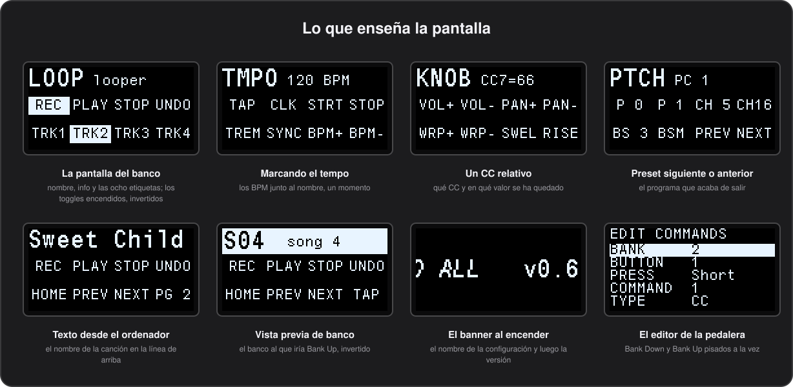

# La pantalla

[English](../en/09-the-display.md) · **Español**

La pantalla de 128×64 de la pedalera te dice dónde estás y qué está encendido, de un vistazo desde el suelo. Este capítulo trata la pantalla del banco, lo que aparece encima un momento, el texto que puede poner un ordenador y el banner al encender.

## La pantalla del banco



Lo que muestra la pantalla casi todo el tiempo:

- **Línea de arriba, a la izquierda:** el nombre del banco, 4 caracteres en letra grande.
- **Línea de arriba, a la derecha:** su línea de información, 8 caracteres en letra pequeña.
- **Debajo:** una rejilla de 2×4 colocada como la pedalera, con los botones **1 2 3 4** en la fila de arriba y **A B C D** en la de abajo. Cada casilla muestra la etiqueta del botón, o su identificador si no tiene.
- **Toggles:** la casilla de un toggle se dibuja invertida mientras está encendido, así que el estado de todo el banco se ve de un vistazo.

Un [botón de ciclo](05-buttons.md#botones-de-ciclo) muestra la etiqueta del último estado que envió, y una [segunda página](04-banks.md#segunda-página) muestra las etiquetas de la página en lugar de las del banco. Con `Kemper_Mode` activado, el rig en el que estás ocupa la línea de información ([Kemper en las dos direcciones](11-devices.md#kemper-en-las-dos-direcciones)).

### Lo que aparece encima

Algunas cosas ocupan la pantalla, o parte de ella, un momento y luego devuelven la pantalla del banco:

| Cuándo | Qué ves |
|---|---|
| Al marcar el tempo con el tap, arrancar o parar el reloj, o fijar o subir y bajar el tempo | el tempo, con un `*` delante mientras el reloj está en marcha ([Tempo](07-tempo.md)) |
| Cuando `Clock_Follow` engancha el reloj del ordenador, o cambia su tempo | `EXT` y el tempo, durante 1,5 segundos |
| Un botón de CC relativo | el número de CC y el valor que se acaba de enviar, en lugar de la línea de información durante 1,5 segundos: `CC7=69`, o `C120=127` para números de CC de tres cifras |
| Un botón de preset siguiente o anterior | el nuevo número de programa, como `PC 6` |
| Al cambiar de configuración | el número y el nombre de la nueva configuración, a pantalla completa; un aviso breve si la ranura pedida está vacía |
| Bank Up / Down con `Bank_Preview` activado | el banco al que irían, con el nombre invertido, blanco con letras negras, sobre sus etiquetas ([Vista previa de banco](04-banks.md#vista-previa-de-banco)) |
| Al arrancar en modo seguro | **SAFE MODE**, durante tres segundos ([Modo seguro](10-editing-on-the-pedal.md#modo-seguro)) |
| Al encender | el nombre de la configuración (`ConfigName`) y la versión de firmware un momento, o el [banner](#el-texto-propio-del-banner) cruzando la pantalla cuando `Boot_Banner` está activado |
| Esperando una actualización de firmware | **FIRMWARE UPDATE** |

Mientras se ve una vista previa de banco, los avisos como el del tempo se saltan, y el texto del ordenador espera debajo hasta que termina la vista previa.

### Cuándo se apaga

Con `Sleep_After_Min` puesto, la pantalla y los LEDs se apagan tras ese número de minutos sin que nadie toque la pedalera. Cualquier pulsación o movimiento de un pedal de expresión los vuelve a encender, y la pulsación que la despierta sigue haciendo su trabajo. También se apagan mientras duerme el ordenador al que está conectada la pedalera, y vuelven cuando se despierta. Mira los [ajustes globales](12-configuration-file.md#global_settings).

## Texto desde el ordenador

Un DAW, MainStage o un script pueden escribir en la línea de arriba: el nombre del patch o de la canción que acaban de cargar, una nota para la siguiente parte, lo que quieras ver desde el suelo.

*Necesita firmware 0.46 o posterior; el desplazamiento necesita la 0.61.*

### Dónde y durante cuánto tiempo

El texto puede ir en cuatro sitios y quedarse durante tres tiempos distintos:

| Sitio | Dónde | Cabe sin desplazarse |
|---|---|---|
| `info` | la línea de información pequeña, a la derecha del nombre del banco | 11 caracteres |
| `name` | el nombre grande del banco | 4 caracteres |
| `line` | toda la línea de arriba, en grande | 11 caracteres |
| `small` | toda la línea de arriba, en pequeño | 18 caracteres |

| Duración | Cuánto tiempo |
|---|---|
| `bank` | hasta que cambia el banco |
| `always` | hasta que el ordenador lo cambia |
| `moment` | 1,5 segundos, como el aviso del tempo |

- Un texto vacío devuelve el sitio a lo que muestra el banco.
- Un texto de línea completa tapa el nombre y la información del banco mientras está. Las líneas completas grande y pequeña se sustituyen entre sí.
- Un texto en el nombre o en la información del banco se ve incluso encima de un texto de línea completa.
- Un texto que se muestra un momento vuelve después a lo que había antes.
- El texto también despierta la pantalla si la pedalera estaba dormida.

El texto es ASCII simple, un carácter por byte, y un byte que la pantalla no puede dibujar se ve como un espacio. `Send_Text.py` y el configurador envían `Canción` como `Cancion`, igual que los [nombres de una configuración](12-configuration-file.md). En cualquier sitio se guardan hasta 32 caracteres, y lo que pase de ahí se corta.

### Más largo de lo que cabe

Un texto más ancho que su sitio se desplaza por él una vez, para que se pueda leer el nombre entero de la canción:

1. Se queda quieto un momento.
2. Avanza a unos 40 píxeles por segundo hasta que se ve su final.
3. Se queda quieto otra vez, y luego vuelve a su principio, donde se queda.

Se desplaza cuando llega y otra vez cada vez que se entra en un banco. El mismo texto enviado otra vez lo deja donde está, así que un ordenador que se repite no lo tiene moviéndose todo el rato. Solo se mueve su propio sitio: una línea de información larga se desplaza junto a un nombre de banco quieto. Un texto largo de los de un momento se queda hasta llegar a su final, por mucho que eso pase de los 1,5 segundos. El desplazamiento nunca retrasa una pulsación.

### Enviarlo desde un terminal

`Send_Text.py` construye el mensaje y lo envía, o imprime los bytes para que los envíe otro programa:

```bash
.venv/bin/python python/Send_Text.py "Sweet Child"                      # línea completa, grande, hasta que cambia el banco
.venv/bin/python python/Send_Text.py --place info --keep always "Clean"  # la línea de información, para siempre
.venv/bin/python python/Send_Text.py --keep moment "Next: Intro"        # un momento
.venv/bin/python python/Send_Text.py "Sweet Child O' Mine"              # demasiado largo para la línea: se desplaza una vez
.venv/bin/python python/Send_Text.py ""                                 # volver al banco
.venv/bin/python python/Send_Text.py --hex "Sweet Child"                # solo imprimir los bytes, para que los envíe otro programa
```

`--place` es `info`, `name`, `line` (por defecto) o `small`, y `--keep` es `bank` (por defecto), `always` o `moment`.

<details><summary>Por dentro</summary>

El mensaje es un único SysEx:

```
F0 7D 48 place how text... F7
```

`place` es `00` para la línea de información, `01` para el nombre del banco, `02` para la línea completa en letra grande y `03` para la línea completa en letra pequeña. `how` es `00` hasta que cambia el banco, `01` hasta que el ordenador lo cambia y `02` durante 1,5 segundos. Los bytes del texto van de `20` a `7E`.

Por ejemplo, `F0 7D 48 02 00 53 77 65 65 74 20 43 68 69 6C 64 F7` pone **Sweet Child** en toda la línea de arriba hasta que cambia el banco.

La pedalera contesta `F0 7D 49 place how F7`, e ignora un `place` o un `how` que no conoce. Solo dibuja un paso del desplazamiento cuando la pantalla anterior ya ha salido, y por eso el desplazamiento nunca retrasa una pulsación. Un firmware anterior a 0.61 solo guarda lo que cabe.

</details>

## El texto propio del banner

Al encender, con `Boot_Banner` activado, el [banner](12-configuration-file.md#global_settings) cruza la pantalla con el nombre de la configuración. La pedalera puede guardar un texto propio para mostrarlo en su lugar: hasta 60 caracteres de ASCII simple, como el nombre de un grupo, de un espectáculo o un teléfono por si se pierde la pedalera.

- Es de la pedalera, no de una configuración, así que se mantiene sea cual sea la configuración cargada de las cuatro.
- Sobrevive a flashear una configuración y a actualizar el firmware.
- Solo se muestra mientras `Boot_Banner` está activado, a su velocidad, seguido de la versión de firmware, igual que el nombre.

*Necesita firmware 0.63 o posterior.*

En el configurador, **Banner Text…**, en PEDAL, lee el texto de la pedalera y lo guarda, lo borra o lo deja como está. Desde un terminal:

```bash
.venv/bin/python python/Send_Text.py --banner "The Band  612 345 678"   # guardarlo
.venv/bin/python python/Send_Text.py --banner                           # ver el que tiene la pedalera
.venv/bin/python python/Send_Text.py --banner ""                        # borrarlo: vuelve el nombre
```

<details><summary>Por dentro</summary>

Por SysEx, `F0 7D 4C 01 text... F7` lo guarda, lo mismo sin texto lo borra, y `F0 7D 4C 00 F7` solo pregunta. La pedalera contesta `F0 7D 4D result text... F7`: `result` es 0, o 1 cuando ha rechazado un texto de más de 60 caracteres o con un byte fuera de `20`–`7E` y se ha quedado con el que tenía, seguido del texto que guarda.

El texto vive en una página de flash propia en `0x0803A000`, después de la cuarta ranura de configuración, que nadie más escribe. Una página en blanco o dañada se lee como que no hay texto.

</details>

---

[← Pedales de expresión](08-expression.md) · [Índice](README.md) · [Editar en la pedalera →](10-editing-on-the-pedal.md)
