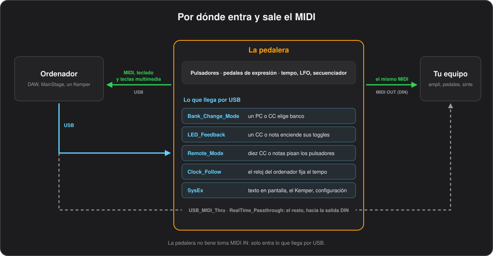

# Plantillas y equipos

[English](../en/11-devices.md) · **Español**

La pedalera habla con un ordenador por USB y con el resto de tu equipo por su toma MIDI OUT. Todo lo que envía un botón sale por las dos; lo que llega por USB puede cambiar de banco, encender LED, pisar pulsadores, fijar el tempo o seguir hacia la salida DIN.



Hay tres configuraciones listas en `python/templates/` que ponen los controles principales de un equipo bajo tus pies sin tener que configurar nada, o casi nada, en el equipo. Para usar una, ábrela con **Load CSV** en el configurador y pulsa **Flash to Device**, o desde un terminal:

```bash
.venv/bin/python python/CSV_to_Flash.py python/templates/FM3.csv
```

Cada una la genera un script a partir del mapa MIDI del propio equipo, así que otro canal u otro CC es cambiar una constante y volver a ejecutar el script, como explica cada apartado. O cambia los botones en el configurador como en cualquier otra configuración.

## Plantilla para Fractal Audio FM3

**`python/templates/FM3.csv`** está lista para grabar y manejar una Fractal Audio FM3 por la salida DIN, y debería valer también para una Axe-Fx III o una FM9, que se configuran igual. Conecta el MIDI OUT de la pedalera al MIDI IN de la FM3 y alimenta la pedalera por USB.

| Bancos | Botones |
|---|---|
| 0–29, `P000`–`P029` | Al entrar en el banco se carga el preset de la FM3 con el mismo número. 1 2 3 4 A B son las escenas 1–6, C enclava el afinador y D marca el tap tempo |
| 30, `LOOP` | Looper: Record, Play/Stop, Undo, Once, Reverse, Half Speed, y luego afinador y tap |
| 31, `FX` | Activa y desactiva Drive 1, Compressor 1, Phaser 1, Chorus 1, Delay 1, Reverb 1, Wah 1 y Pitch 1 |

Bank Up / Down recorren los presets, y una pulsación larga salta diez. Los botones de escena forman un grupo exclusivo, así que el LED y la pantalla muestran la última escena elegida; pisar otra vez la que está encendida la apaga sin enviar nada. Los pedales de expresión son External 1 y 2, para asignarlos como modificador a cualquier parámetro.

La FM3 viene sin ningún CC MIDI asignado, así que en la FM3, en **SETUP > MIDI/Remote**, pon su canal MIDI en 1 y asigna:

| Página | Función | CC |
|---|---|---|
| Other | Tempo Tap | 14 |
| Other | Tuner | 15 |
| Other | Scene Select | 34 |
| External | External 1, External 2 | 16, 17 |
| Looper | Record, Play, Undo, Once, Reverse, Half Speed | 20–25 |
| Bypass | Drive 1, Compressor 1, Phaser 1, Chorus 1, Delay 1, Reverb 1, Wah 1, Pitch 1 | 40–47 |

Para usar otros números, u otro canal, cambia las constantes al principio de `python/make_fm3_template.py` y vuelve a ejecutarlo, o edita los botones en el configurador. Los presets por encima del 29, o de los bancos B a D de la FM3, necesitan un Program Change con `BankSelect_(PC)` a 128 veces el banco de la FM3 y `BankSelectHighByte_(PC)` a `Y`, para que el CC#0 lleve el banco.

## Plantilla para Line 6 HX Stomp

**`python/templates/HX_Stomp.csv`** está lista para grabar y manejar una Line 6 HX Stomp por la salida DIN. Conecta el MIDI OUT de la pedalera al MIDI IN de la HX Stomp y alimenta la pedalera por USB.

| Bancos | Botones |
|---|---|
| 0–29, `01A`–`10C` | Al entrar en el banco se carga el preset de la HX Stomp con el mismo nombre, de 01A a 10C. 1 2 3 son los snapshots 1–3, 4 abre y cierra el afinador, A B C pisan FS1–FS3 y D marca el tap tempo |
| 30, `LOOP` | Looper: Record, Overdub, Play/Stop, Half Speed, Play Once, Undo, Reverse, y luego tap |
| 31, `FS` | FS1–FS5, snapshot anterior y siguiente, y el afinador |

Bank Up / Down recorren los presets, y una pulsación larga salta diez. Los botones de snapshot forman un grupo exclusivo, así que el LED y la pantalla muestran el último snapshot elegido; pisar otra vez el que está encendido lo apaga sin enviar nada. FS1–FS5 funcionan como si pisaras el pulsador de la HX Stomp en modo Stomp, así que activan lo que tenga asignado, y los pedales de expresión mueven los controladores EXP 1 y EXP 2 de la HX Stomp.

La HX Stomp tiene un mapa MIDI fijo, así que no hay que asignar nada: en **Global Settings > MIDI/Tempo**, pon el MIDI Base Channel en 1 y activa MIDI PC Receive. La plantilla envía:

| Función | CC | Valores |
|---|---|---|
| EXP 1, EXP 2 | 1, 2 | los pedales |
| FS1–FS5 | 49–53 | 127 y 0, cada uno una pisada |
| Looper Record / Overdub | 60 | 127 graba, 0 sobregraba |
| Looper Play / Stop, Play Once, Undo | 61, 62, 63 | |
| Tap Tempo | 64 | 127, solo al pisar |
| Looper Reverse, Half Speed | 65, 66 | |
| Tuner | 68 | |
| Snapshot | 69 | 0–2 snapshots 1–3, 8 siguiente, 9 anterior |

Para usar otro canal, cambia `CHANNEL` al principio de `python/make_hx_stomp_template.py` y vuelve a ejecutarlo, o edita los botones en el configurador. Los presets por encima de 10C necesitan un Program Change con el número del preset, de 0 a 125.

## Plantilla para Kemper Profiler Player

**`python/templates/Kemper_Player.csv`** está lista para grabar y manejar un Kemper Profiler Player. El Player no tiene tomas DIN: conecta el USB de la pedalera a la toma USB A del Player, que hace de ordenador y la alimenta. Ese es el enlace cuyo Active Sensing, un byte cada 300 ms, atasca el firmware de fábrica; este lo lee y lo vacía todo según llega, así que el enlace nunca se atasca.

| Bancos | Botones |
|---|---|
| 0–9, `BK01`–`BK10` | Los diez bancos de cinco rigs del Player. Al entrar en el banco se preselecciona, 1 2 3 4 A cargan sus rigs 1–5, B y C pisan los botones de efecto I y II del Player, y D marca el tap tempo |
| 10, `FX` | Módulos A, B, DLY y REV, y luego los cuatro botones de efecto I a IIII |
| 11, `TOOL` | Afinador, velocidad del rotary, delay infinity, freeze, todos los efectos a la vez, delay y reverb otra vez pero conservando sus colas, y tap |

Solo se usan esos doce bancos, así que la plantilla activa `Setlist_Mode` y Bank Up / Down los recorren saltándose los vacíos; una pulsación larga salta cinco. Los botones de rig forman un grupo exclusivo, así que el LED y la pantalla muestran el último rig elegido y pisar otra vez el que está encendido no envía nada. Entrar en un banco solo lo preselecciona en el Player: el rig cambia cuando pisas uno de los cinco, y eso es lo que evita que el sonido vaya dando saltos mientras recorres los bancos con el pie.

El Player tiene un mapa MIDI fijo, así que no hay que asignar nada: escucha en los dieciséis canales salvo que **System Settings > MIDI In Channel** diga otra cosa. La plantilla envía:

| Función | CC | Valores |
|---|---|---|
| Pedal de wah, pedal de volumen | 1, 7 | los dos pedales de expresión |
| Todos los módulos a la vez | 16 | 127 invierte todos los módulos |
| Módulo A, módulo B | 17, 18 | 127 y 0 |
| Delay, reverb | 26, 28 | 127 y 0, cortando las colas |
| Delay, reverb conservando las colas | 27, 29 | 127 y 0 |
| Tap Tempo | 30 | 127, solo al pisar |
| Afinador | 31 | 127 lo abre, 0 lo cierra |
| Velocidad del rotary, delay infinity, freeze | 33, 34, 35 | 127, y cada pisada lo cambia |
| Preselección de banco | 47 | 0–9, se envía al entrar en uno de los diez bancos de rigs |
| Rigs 1–5 del banco | 50–54 | 1, que es lo que carga el rig |
| Botones de efecto I–IIII | 75–78 | 127 y 0 |

Para usar otro canal, cambia `CHANNEL` al principio de `python/make_kemper_player_template.py` y vuelve a ejecutarlo, o edita los botones en el configurador. Los cincuenta rigs también responden a un Program Change normal: el manual del Player los numera del 1 al 50, que aquí es `Number` del 0 al 49.

## Kemper en las dos direcciones

Todo lo anterior va en una sola dirección: la pedalera le dice al ampli qué hacer y confía en que haya hecho caso. A un Kemper Profiler también se le puede preguntar por su estado, y entonces la pedalera muestra lo que el ampli está haciendo de verdad, llegue como llegue a ello.

**Para activarlo**, marca **Talk to a Kemper** en la pestaña **Global** del configurador (`Kemper_Mode` `Y` en el CSV), o parte de la [plantilla del Kemper Player](#plantilla-para-kemper-profiler-player), que lo trae activado. El editor de la pedalera lo ofrece como `KEMPER`.

Vuelven dos cosas que merece la pena ver desde el suelo:

- **El rig en el que estás**, en la línea pequeña junto al nombre del banco, y ahí se queda, banco tras banco, hasta que cambia el rig. Caben once caracteres; un nombre más largo, de hasta 32, [se desplaza por la pantalla una vez](09-the-display.md#texto-desde-el-ordenador) cuando cambia el rig y cada vez que entras en un banco. La pedalera lo pregunta cada segundo, así que acierta aunque el rig se haya cambiado en el propio ampli.
- **Qué módulos de efecto están funcionando.** Un módulo que se enciende o se apaga se convierte en el Control Change que activa ese módulo —17 y 18 para los stomps A y B, 19, 20, 22 y 24 para C, D, X y MOD, 26 y 28 para delay y reverb, y 27 y 29, que conservan las colas— y se pasa al mismo mecanismo que [`LED_Feedback`](12-configuration-file.md#global_settings). Cualquier botón toggle que envíe uno de esos queda encendido o apagado igual que el ampli, en todos los bancos, tanto si el módulo se cambió con tu pie como con los botones del propio ampli o desde otro sitio. No se envía nada de vuelta por ello, así que los dos no pueden perseguirse, y el canal no tiene por qué coincidir: las respuestas del ampli no llevan canal.

**Qué Kempers.** Las respuestas llegan por USB. En un **Profiler Player** es la misma toma a la que ya está conectada la pedalera: el Player hace de ordenador, alimenta la pedalera y habla MIDI por ahí, así que no hace falta nada más. Un Profiler en cabezal o un Stage tendrían que llegar a la entrada MIDI propia de la pedalera, que el hardware no tiene, así que ahí la pedalera sigue hablando en una sola dirección, como antes.

<details><summary>Por dentro</summary>

La pedalera envía al ampli el mensaje que le pide que informe de lo que hace a partir de ese momento, y lo repite cada cinco segundos, que es lo que le dice al ampli que sigue habiendo alguien al otro lado. De los ocho módulos, el ampli informa de seis por su cuenta; del delay y la reverb no, así que la pedalera pregunta por esos dos cada segundo, y por el nombre del rig también cada segundo. Pregunta por los ocho al arrancar y cada vez que cambia el rig. El modo seguro deja `Kemper_Mode` desactivado, así que no sale ni la baliza ni ninguna pregunta.

</details>

*Firmware 0.55 o posterior.*

### Probado sin ampli

La conversación se probó contra `python/Kemper_Sim.py`, un Kemper de mentira que responde por el mismo enlace USB que usaría un Player: contesta a lo que pregunta la pedalera y te deja cambiar el rig o activar un módulo para ver cómo lo sigue la pedalera.

```bash
.venv/bin/python python/Kemper_Sim.py
kemper> rig Brit Crunch DLX
kemper> dly
```

Todavía no se ha probado con un Kemper de verdad. Los números que usa —el `00 20 33` del fabricante, las funciones, las páginas de módulos y la baliza— son los de la documentación MIDI del Profiler y los de los controladores abiertos que hablan con él, y un test compara la lista del firmware con la de las herramientas, así que si algún ampli no está de acuerdo, el arreglo estará en esa tabla de números y en ningún otro sitio.

---

[← Editar en la pedalera](10-editing-on-the-pedal.md) · [Índice](README.md) · [El archivo de configuración →](12-configuration-file.md)
